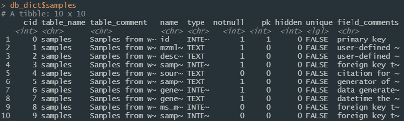
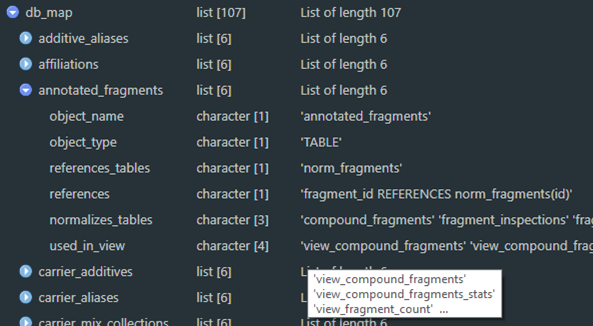
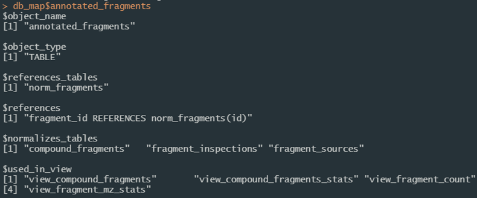
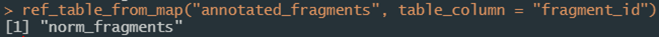
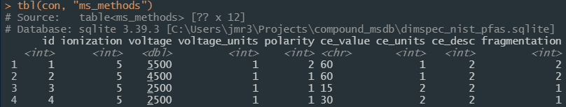

# Instructions {#instructions .unnumbered}

## Installation {#installation .unnumbered}

At the moment, this toolkit is only available outside of NIST through [GitHub](https://github.com/usnistgov/dimspec){target="_blank"} (the preference, either by fork, clone, or download) or directly from one of this book's authors. For now, this toolkit includes the NIST PFAS Spectral Library. It is best used as an R project which can be opened directly in the [RStudio Integrated Development Environment (IDE)](https://www.rstudio.com/){target="_blank"}[^2] which may be downloaded and installed free of charge if not already installed on a target system. Initial set up does require an internet connection to download software installers and dependencies; on a system which does not contain any software components this can take a considerable amount of time.

[^2]: Any mention of commercial products within NIST web pages is for information only; it does not imply recommendation or endorsement by NIST.

### System Requirements {#system-requirements .unnumbered}

DIMSpec has been tested on both Windows 10 and Ubuntu 20.0.4.3 LTS 64-bit[^3] platforms and should run on any system able to install R, Python, SQLite3, and a web browser, though installation details may vary for other operating systems. Follow the instructions for each requirement on the target operating system.

[^3]: This release was tested on a fresh VMWare build of Ubuntu 20.04 LTS which carries several additional system requirements. Prior to running DIMSpec, install or make sure the following are available using:<code>apt install -y build-essential libcurl4-openssl-dev libxml2-dev zlib1g-dev libssl-dev libsodium-dev ffmpeg libtiff-dev libpng-dev libblas-dev liblapack-dev libarpack2-dev gfortran libcairo2-dev libx11-dev libharfbuzz-dev libfribidi-dev libudunits2-dev libgeos-dev libgdal-dev libfftw3-3 libmagick++-dev</code>After following the R [installation instructions for Ubuntu](https://cran.r-project.org/bin/linux/ubuntu){target="_blank"}, ensure additional requirements using:<code>apt install -y --no-install-recommends r-cran-tidyverse r-cran-shiny</code>

**[REQUIRED]** **R 4.1+** ([download](https://cran.r-project.org/){target="_blank"}) and many packages are required (@R-base; various); necessary packages will be installed when the compliance file is sourced, which may take some time when the project is first installed. The RStudio IDE ([download](https://www.rstudio.com/products/rstudio/download/#download){target="_blank"};  @RStudio) is highly recommended for ease of use as this project is distributed as an R project.

**[STRONGLY RECOMMENDED]** **SQLite3** ([download](https://www.sqlite.com/download.html){target="_blank"}) and its command line interface (CLI; [download](https://www.sqlite.org/cli.html){target="_blank"}) provide the database engine in structured query language (SQL) and are not technically required as the build can be accomplished purely through R, but are highly recommended to streamline the process and manipulate the database. A lightweight database interface such as [DBeaver Lite](https://dbeaver.com/download/lite/){target="_blank"} is also suggested for interacting with the database in a classical sense. **Git** ([install instructions](https://git-scm.com/book/en/v2/Getting-Started-Installing-Git){target="_blank"}) is a repository manager which will make it much easier to install and update the project. The sqlite3 CLI and git executables must be available via PATH.

**[RECOMMENDED]** For chemical informatics support, both **Python 3.9+** and the **rdkit** [@RDKit] library are required for certain operations supporting display and calculations, primarily generation of machine-readable identifiers (e.g. InChI, InChIKey, SMILES, etc) but the full capabilities of rdkit are available (see the [RDKit documentation](https://www.rdkit.org/docs/index.html){target="_blank"} for details); these are turned on by default but are completely optional. An **anaconda** or **miniconda** installation is required. Python integration is not required for spinning up the basic database infrastructure. Users may need to add the conda executable to their PATH and, if conda is already installed, should pay close attention to the Python section of Technical Details. If these are not available, R will install miniconda (this requires user confirmation at the console) and create the necessary environment as part of automated setup during the compliance script. (Another option for chemical informatics is to use the Java-based R package rcdk instead; users will need to install the Java framework prior to installing rcdk (see [Windows](https://cimentadaj.github.io/blog/2018-05-25-installing-rjava-on-windows-10/installing-rjava-on-windows-10/){target="_blank"}; [Ubuntu](https://www.r-bloggers.com/2018/02/installing-rjava-on-ubuntu/){target="_blank"}). This package is not well supported in this project and rdkit is preferred.)

**[OPTIONAL]** It is helpful to have some data on hand to populate and evaluate the database. Every effort has been made to simplify the process of building databases using this tool, and data can be populated from CSV files of a defined structure; examples are provided but the process of generating them can be somewhat onerous as key relationships must be defined to automatically populate in this manner. Future work may be able to simplify this process further, if necessary, but for now, interested researchers are encouraged to contact the authors for guidance on how to transform data to fit this schema.

The following sections provide more detailed information on how to use the tools provided to interact with the database and customize it for other uses.

### Initial Setup {#quick-start-guide .unnumbered}

This section provides instructions in a "quick start" format. While every effort was made to make this as painless as possible, success may vary from system to system. This assumes that R v4.1 or later is installed. Several quick start guides offering more detail about aspects of the project, including [installation](https://pages.nist.gov/dimspec/docs/quick_install.pdf){target="_blank"}, are also available in the repository (listed in the project [README](https://github.com/usnistgov/dimspec){target="_blank"}) and for download from the online [User Guide](https://pages.nist.gov/dimspec/docs) by clicking the download icon in the header at the top of the User Guide to select your download of choice.

-   *If using RStudio:*
    1.  Open the project in RStudio.
    2.  Open the file at `"R/compliance.R"` in the editor.
    3.  Run the compliance script by clicking the "Source" button at the top right of the editor pane or typing `source("R/compliance.R")` in the console pane.
-   *If not using RStudio:*
    1.  Open an R session in the project directory or launch R and set your working directory to that of the project (e.g. `setwd(file.path("path", "to", "dimspec_dir")`).
    2.  Execute the command `source("R/compliance.R")`.

Using either method should in most cases establish the compute environment, activate logging and argument validation, bind to a python environment providing rdkit support, launch an API server, and list out the web applications available. The project is distributed with a database populated with high resolution mass spectrometry data for per- and polyfluoroalkyl substances (PFAS) for evaluation purposes both to distribute this data set and to evaluate capabilities for reuse in other projects.

## Project Directory {#project-directory .unnumbered}

The project directory contains the following directories of interest. Generally, the only modifications (if any) that should be necessary to operate DIMSpec projects are to environment establishment files located in the `/config` directory or in the `/inst` directory if extending the DIMSpec API or web applications.

-   `/config` Files pertaining to the build, description, and population of the underlying database, as well as certain compute environment settings and import settings. This serves for rapid rebuilding and reuse of the underlying database structure. Also included are environment establishment files for the project ("env_glob.txt"), the R session ("env_R.R") and the optional logging ("env_logger.R") functionality.

    -   `/sql_nodes` Files containing the sql scripts defining the database schema, as run by the "build.sql" script. Files are separated into database "nodes" with the hope that many can be repurposed or used a la carte in future projects. A graphical representation of the database schema, the [entity-relationship diagram (ERD)](assets/ERD.png){target="_blank"} is also available.

    -   `/data` Comma-separated-value (CSV) files which can be used to populate tables defined by their SQL nodes and which will be populated according to the chosen population script. This directory contains common data which should be applicable to all database produced by this tool (i.e. normalization tables, elements and isotopes, etc.) and subdirectories containing project-specific CSV files.

-   `/example` Files providing examples of (mainly) import files in JavaScript Object Notation (JSON) format. These are the files used to populate empirical data and were produced by the [NIST Non-Targeted Analysis Method Reporting Tool](https://github.com/usnistgov/NISTPFAS/tree/main/methodreportingtool){target="_blank"}.

-   `/images` If images of molecular models are produced using rdkit through this toolset, they will be housed here, named by the molecule's known structure identifier (e.g. SMILES, InChI, etc.). Other images may be produced during routine work and should also be placed in this directory, though user-produced images and graphics can be saved anywhere.

-   `/inst` Files for rdkit integration (`/rdkit`), the API service (`/plumber`), and Shiny applications (`/apps`).

    -   `/rdkit` Environment establishment and rdkit functions are located here. These will determine how R connects to the python environment to integrate rdkit into an R session as well as the files necessary to build the environment (e.g. "environment.yml"). Functions in the "py_setup.R" file should suffice for most use cases.

    -   `/plumber` Environment establishment and API definition functions are located here. These will determine how requests to the API are routed and functionality are provided through http protocols in a RESTful manner. It comes complete with Swagger documentation available when the server is running.

    -   `/apps` Environment establishment, general resources, and shiny application files are located here. Each application is contained within its own directory.

-   `/logs` If logging functionality is turned on, logs will be written here according to the namespace of the log (e.g. logs written to the "db" namespace will be written to `"logs/log_db.txt"`).

-   `/R` directory; most general R functions are housed here or in one of the subdirectories.

## Project Set Up {#project-set-up .unnumbered}

Running the compliance script at `"/R/compliance.R"` will establish the project for you in most cases. It leverages several files to determine project settings; these are detailed here for clarity and customization options, with further details provided in the [Compute Environments](#compute-environments) section. To accept the default settings, source the compliance file and move on to the [Using DIMSpec](#using-dimspec) section. This may take a while to resolve package dependencies. To customize your implementation, read on. Changing any of these settings is entirely optional.

### Step 1 - Customize global environment settings {#step-1---global-compute-environment-settings .unnumbered}

Several options are available to customize the use of DIMSpec to any given project component; settings are in the file `"/config/env_glob.txt"`. These values are not set at the system level to add flexibility across operating systems; they are instead session values that are available while a session is active.

+----------------+----------+------------------------------------------------------------------------------------------------------------------------------------------------------------------------------------------------------------------------------------------------------------+
| **Setting**    | **Type** | **Description**                                                                                                                                                                                                                                            |
+================+==========+============================================================================================================================================================================================================================================================+
| DB_TITLE       | String   | The title to use for this implementation.                                                                                                                                                                                                                  |
+----------------+----------+------------------------------------------------------------------------------------------------------------------------------------------------------------------------------------------------------------------------------------------------------------+
| DB_NAME        | String   | The name of the database to create or use. For SQLite this should be the name of the database file.                                                                                                                                                        |
+----------------+----------+------------------------------------------------------------------------------------------------------------------------------------------------------------------------------------------------------------------------------------------------------------+
| EXPLICIT_PATHS | Logical  | Whether or not file names are fully qualified with their path.                                                                                                                                                                                             |
+----------------+----------+------------------------------------------------------------------------------------------------------------------------------------------------------------------------------------------------------------------------------------------------------------+
| DB_BUILD_FILE  | String   | The .sql file name of the script used to build the database (e.g. "build.sql"; see [Database Schema](#database-schema).                                                                                                                                    |
+----------------+----------+------------------------------------------------------------------------------------------------------------------------------------------------------------------------------------------------------------------------------------------------------------+
| DB_BUILD_FULL  | String   | The .sql file name of the fallback build script that should be used if the sqlite3 command line interface (CLI) tool is not available (e.g. "build_full.sql"; see [Database Schema](#database-schema)).                                                    |
+----------------+----------+------------------------------------------------------------------------------------------------------------------------------------------------------------------------------------------------------------------------------------------------------------+
| DB_DATA        | String   | The .sql file name of the data population script to run when populating the database at build time (e.g. "populate_common.sql"; see [Populating Data](#populating-data-at-build)).                                                                         |
+----------------+----------+------------------------------------------------------------------------------------------------------------------------------------------------------------------------------------------------------------------------------------------------------------+
| SQLITE_CLI     | String   | The name of the terminal command to launch the sqlite shell (e.g. `sqlite3`). This must be available in your PATH.                                                                                                                                         |
+----------------+----------+------------------------------------------------------------------------------------------------------------------------------------------------------------------------------------------------------------------------------------------------------------+
| CONDA_CLI      | String   | The name of the terminal command to execute ana-/miniconda commands (e.g. `conda`). This must be available in your PATH.                                                                                                                                   |
+----------------+----------+------------------------------------------------------------------------------------------------------------------------------------------------------------------------------------------------------------------------------------------------------------+
| INIT_CONNECT   | Logical  | Whether or not to connect to the database when starting a session by sourcing the compliance script.                                                                                                                                                       |
+----------------+----------+------------------------------------------------------------------------------------------------------------------------------------------------------------------------------------------------------------------------------------------------------------+
| LOGGING_ON     | Logical  | Whether or not to establish an environment to perform action logging, which will carry additional information about what functions in the DIMSpec toolkit are doing (see [Logger](#logger)).                                                              |
+----------------+----------+------------------------------------------------------------------------------------------------------------------------------------------------------------------------------------------------------------------------------------------------------------+
| USE_API        | Logical  | Whether or not to activate the plumber application programming interface (API) for this session (see [Plumber](#plumber)). If this is set to `TRUE`, the plumber service will launch in a background process by default and return control to the console. |
+----------------+----------+------------------------------------------------------------------------------------------------------------------------------------------------------------------------------------------------------------------------------------------------------------+
| API_LOCALHOST  | Logical  | Whether or not to activate the plumber application programming interface (API) hosted on the local machine only. If this is set to `FALSE`, the API will be hosted and available on your network.                                                          |
+----------------+----------+------------------------------------------------------------------------------------------------------------------------------------------------------------------------------------------------------------------------------------------------------------+
| API_HOST       | String   | If `API_LOCALHOST` is set to `FALSE`, set this to the IP address or network path to the computer hosting the API.                                                                                                                                          |
+----------------+----------+------------------------------------------------------------------------------------------------------------------------------------------------------------------------------------------------------------------------------------------------------------+
| API_PORT       | Integer  | The hosting port on which to launch the plumber service. This must be an open port or the launch will fail. If `API_LOCALHOST` is `TRUE`, the API will launch at "localhost:API_PORT", otherwise at "API_HOST:API_PORT".                                   |
+----------------+----------+------------------------------------------------------------------------------------------------------------------------------------------------------------------------------------------------------------------------------------------------------------+
| INFORMATICS    | Logical  | Whether or not to establish an environment providing informatics support, primarily with RDKit. To streamline installation of only the database and R tools, set this to `FALSE.`                                                                          |
+----------------+----------+------------------------------------------------------------------------------------------------------------------------------------------------------------------------------------------------------------------------------------------------------------+
| USE_RDKIT      | Logical  | Whether or not to use RDKit for informatics (requires python). If set to `FALSE`, the packages `BiocManager`, `ChemmineR`, and `rcdk` will be installed if not available, though support for these is not provided at this time.                           |
+----------------+----------+------------------------------------------------------------------------------------------------------------------------------------------------------------------------------------------------------------------------------------------------------------+
| USE_SHINY      | Logical  | Whether or not to establish an environment providing support for web applications provided as part of the project (defaults to `TRUE`).                                                                                                                    |
+----------------+----------+------------------------------------------------------------------------------------------------------------------------------------------------------------------------------------------------------------------------------------------------------------+
| SHINY_BG       | Logical  | [PLANNED FEATURE] Whether or not to launch shiny apps as part of a background process, making them immediately available from a web browser when the compliance script is executed (defaults to `FALSE`).                                                  |
+----------------+----------+------------------------------------------------------------------------------------------------------------------------------------------------------------------------------------------------------------------------------------------------------------+

: Table 1: Customizing global settings in the "/config/env_glob.txt" file

### Step 2 - Customize R session settings in the "env_R.R" file {#step-2---customizing-r-session-settings-in-the-env_r.r-file .unnumbered}

More customization options that require R are available to set up the project specifically for your application. Open the file `"config/env_R.R"` to customize these for your use. These values are not set at the system level to add flexibility across systems; they are instead session values that are available during use of the project, and many depend on settings from the section above, which will be applied automatically if they are not already set.

+------------------+------------------+----------------------------------------------------------------------------------------------------------------------------------------------------------------------------------------------------------------------------------------------------------------------------------------------------------------------------------------------------------------------------------------------------------------------------------------------------------------------------------------------------------------------------------------------------------------------------------------------------------------------------------------------------------------------------------+
| **Setting**      | **Type**         | **Description**                                                                                                                                                                                                                                                                                                                                                                                                                                                                                                                                                                                                                                                                  |
+==================+==================+==================================================================================================================================================================================================================================================================================================================================================================================================================================================================================================================================================================================================================================================================================+
| DB_DATE          | Date             | The date the database file was last created, as determined by file properties. Override with a date value (e.g. `as.Date("2022-06-01")`)                                                                                                                                                                                                                                                                                                                                                                                                                                                                                                                                         |
+------------------+------------------+----------------------------------------------------------------------------------------------------------------------------------------------------------------------------------------------------------------------------------------------------------------------------------------------------------------------------------------------------------------------------------------------------------------------------------------------------------------------------------------------------------------------------------------------------------------------------------------------------------------------------------------------------------------------------------+
| DB_RELEASE       | String           | The major and minor release versions for this database.                                                                                                                                                                                                                                                                                                                                                                                                                                                                                                                                                                                                                          |
+------------------+------------------+----------------------------------------------------------------------------------------------------------------------------------------------------------------------------------------------------------------------------------------------------------------------------------------------------------------------------------------------------------------------------------------------------------------------------------------------------------------------------------------------------------------------------------------------------------------------------------------------------------------------------------------------------------------------------------+
| DB_VERSION       | Generated String | Combines the `DB_RELEASE` and `DB_DATE` (if built) values for a complete version of the database.                                                                                                                                                                                                                                                                                                                                                                                                                                                                                                                                                                                |
+------------------+------------------+----------------------------------------------------------------------------------------------------------------------------------------------------------------------------------------------------------------------------------------------------------------------------------------------------------------------------------------------------------------------------------------------------------------------------------------------------------------------------------------------------------------------------------------------------------------------------------------------------------------------------------------------------------------------------------+
| DB_PACKAGE       | String           | The name of the R package allowing connection to your database (e.g. `RSQLite` in most cases, but could be any database connection package).                                                                                                                                                                                                                                                                                                                                                                                                                                                                                                                                     |
+------------------+------------------+----------------------------------------------------------------------------------------------------------------------------------------------------------------------------------------------------------------------------------------------------------------------------------------------------------------------------------------------------------------------------------------------------------------------------------------------------------------------------------------------------------------------------------------------------------------------------------------------------------------------------------------------------------------------------------+
| DB_DRIVER        | String           | The name of the database driver function allowing connection to your database, which must be a function available in `DB_PACKAGE` (e.g. `SQLite`).                                                                                                                                                                                                                                                                                                                                                                                                                                                                                                                               |
+------------------+------------------+----------------------------------------------------------------------------------------------------------------------------------------------------------------------------------------------------------------------------------------------------------------------------------------------------------------------------------------------------------------------------------------------------------------------------------------------------------------------------------------------------------------------------------------------------------------------------------------------------------------------------------------------------------------------------------+
| DB_CLASS         | String           | The class of an R object resulting from a call to the function defined by `DB_PACKAGE::DB_DRIVER` (e.g. `SQLite`); this will be used to search for and manage connections in the session.                                                                                                                                                                                                                                                                                                                                                                                                                                                                                        |
+------------------+------------------+----------------------------------------------------------------------------------------------------------------------------------------------------------------------------------------------------------------------------------------------------------------------------------------------------------------------------------------------------------------------------------------------------------------------------------------------------------------------------------------------------------------------------------------------------------------------------------------------------------------------------------------------------------------------------------+
| DB_CONN_NAME     | String           | The name to be used for the R object database connection (e.g. `con` in most cases here); this defaults to a session variable named `DB_CONN_NAME` if it exists to facilitate independent management of multiple connections.                                                                                                                                                                                                                                                                                                                                                                                                                                                    |
+------------------+------------------+----------------------------------------------------------------------------------------------------------------------------------------------------------------------------------------------------------------------------------------------------------------------------------------------------------------------------------------------------------------------------------------------------------------------------------------------------------------------------------------------------------------------------------------------------------------------------------------------------------------------------------------------------------------------------------+
| DEPENDS_ON       | String Vector    | The list of packages required by your project. The list provided is the bare minimum required for functionality in the project as distributed. Add more to expand functionality for your use cases if necessary.                                                                                                                                                                                                                                                                                                                                                                                                                                                                 |
+------------------+------------------+----------------------------------------------------------------------------------------------------------------------------------------------------------------------------------------------------------------------------------------------------------------------------------------------------------------------------------------------------------------------------------------------------------------------------------------------------------------------------------------------------------------------------------------------------------------------------------------------------------------------------------------------------------------------------------+
| EXCLUSIONS       | String Vector    | The list of files and directories to exclude from automatic loading when the compliance script is run.                                                                                                                                                                                                                                                                                                                                                                                                                                                                                                                                                                           |
+------------------+------------------+----------------------------------------------------------------------------------------------------------------------------------------------------------------------------------------------------------------------------------------------------------------------------------------------------------------------------------------------------------------------------------------------------------------------------------------------------------------------------------------------------------------------------------------------------------------------------------------------------------------------------------------------------------------------------------+
| IMPORT_MAP       | String           | Imports the mapping file determining relationships between import files and the database structure (see [Importing Data](#importing-data)); change the name of the CSV file (change also the function calling it if using formats other than CSV) to point to a different map.                                                                                                                                                                                                                                                                                                                                                                                                   |
+------------------+------------------+----------------------------------------------------------------------------------------------------------------------------------------------------------------------------------------------------------------------------------------------------------------------------------------------------------------------------------------------------------------------------------------------------------------------------------------------------------------------------------------------------------------------------------------------------------------------------------------------------------------------------------------------------------------------------------+
| LOGGING_ON       | Logical          | Whether to activate logging functionality when a session begins. This defaults to the session variable named `LOGGING_ON` and, if not present, to `TRUE.` If `TRUE`, adds the `logger` package to the dependency list.                                                                                                                                                                                                                                                                                                                                                                                                                                                           |
+------------------+------------------+----------------------------------------------------------------------------------------------------------------------------------------------------------------------------------------------------------------------------------------------------------------------------------------------------------------------------------------------------------------------------------------------------------------------------------------------------------------------------------------------------------------------------------------------------------------------------------------------------------------------------------------------------------------------------------+
| VERIFY_ARGUMENTS | Logical          | Whether or not to activate function argument verification for this project. The default of `TRUE` will check arguments provided to many functions for compliance with function expectations and is good for development work, but also slows down execution times. Set to `FALSE` to turn this off.                                                                                                                                                                                                                                                                                                                                                                              |
+------------------+------------------+----------------------------------------------------------------------------------------------------------------------------------------------------------------------------------------------------------------------------------------------------------------------------------------------------------------------------------------------------------------------------------------------------------------------------------------------------------------------------------------------------------------------------------------------------------------------------------------------------------------------------------------------------------------------------------+
| MINIMIZE         | Logical          | If `TRUE`, turns off both `LOGGING_ON` and `VERIFY_ARGUMENTS` to speed up execution time.                                                                                                                                                                                                                                                                                                                                                                                                                                                                                                                                                                                        |
+------------------+------------------+----------------------------------------------------------------------------------------------------------------------------------------------------------------------------------------------------------------------------------------------------------------------------------------------------------------------------------------------------------------------------------------------------------------------------------------------------------------------------------------------------------------------------------------------------------------------------------------------------------------------------------------------------------------------------------+
| USE_API          | Logical          | Defaults to the global setting of `USE_API.` If `TRUE`, several options are provided to customize properties of the API. Set these as appropriate for advanced use cases; the defaults will make the API available on your local system at [http://127.0.0.1:8080](http://127.0.0.1:8080){target="_blank"}.                                                                                                                                                                                                                                                                                                                                                                      |
+------------------+------------------+----------------------------------------------------------------------------------------------------------------------------------------------------------------------------------------------------------------------------------------------------------------------------------------------------------------------------------------------------------------------------------------------------------------------------------------------------------------------------------------------------------------------------------------------------------------------------------------------------------------------------------------------------------------------------------+
| USE_SHINY        | Logical          | Defaults to the global setting of `USE_SHINY.` If `TRUE`, a list of installed shiny applications will be available to your session under the named character variable `SHINY_APPS` which contains absolute paths to the application directories. These are launchable (and should resolve their environment) at any time during a session from the console using `shiny::runApp(SHINY_APPS["app_name"])` where `"app_name"` is the name of a shiny app in the variable. See the [Mass Spectral Match for Non-Targeted Analysis (MSMatch)](#msmatch-home) application that ships with this project as an example to match user supplied mass spectral data against the library.   |
+------------------+------------------+----------------------------------------------------------------------------------------------------------------------------------------------------------------------------------------------------------------------------------------------------------------------------------------------------------------------------------------------------------------------------------------------------------------------------------------------------------------------------------------------------------------------------------------------------------------------------------------------------------------------------------------------------------------------------------+

: Table 2: Customizing settings specific to the R environment

### Step 3 - Customize logger settings in the "env_logger.R" file {#step-3---customizing-logger-settings-in-the-env_logger.r-file .unnumbered}

To provide support information about performance and support troubleshooting, a logging utility is provided with the project. Logs are managed by namespace and generated with the function [`log_it`](#fn_def_log_it){target="_blank"} which uses the `logger` package for additional functionality (see [Logger](#logger)). Customization options for the format of these logging messages are provided, though under most circumstances should be left as-is to support reading logs back into a session. These values are not set at the system level to add flexibility across systems; they are instead session values that are available during use of the project, and many depend on settings from the sections above, which will be applied automatically if they are not already set.

Three support functions are also provided in this file to update the logger settings during a session (`update_logger_settings`), read logs from a file back into the session (`read_log`), and convert a log file into a session data frame for deeper inspection (`log_as_dataframe`).

Environment set up files that follow the same approach are also provided for rdkit integration, the plumber API server, and shiny web applications; these are not detailed here and should only be changed when necessary. See those sections in Technical Details for more information.

+------------------+-----------------+-------------------------------------------------------------------------------------------------------------------------------------------------------------------------------------------------------------------------------------------------------------------------------------+
| **Setting**      | **Type**        | **Description**                                                                                                                                                                                                                                                                     |
+==================+=================+=====================================================================================================================================================================================================================================================================================+
| LOG_DIRECTORY    | String Path     | The relative path to the project directory housing logs. This defaults to the session variable named `LOG_DIRECTORY` and, if not present, to `"logs"`. If that directory is not present, it will be created.                                                                        |
+------------------+-----------------+-------------------------------------------------------------------------------------------------------------------------------------------------------------------------------------------------------------------------------------------------------------------------------------+
| layout_console   | Function String | The format to use when printing logs to the console, by default interpreted by `logger::layout_glue_generator`, but could be any `logger` generator.                                                                                                                                |
+------------------+-----------------+-------------------------------------------------------------------------------------------------------------------------------------------------------------------------------------------------------------------------------------------------------------------------------------+
| layout_file      | Function String | The format to use when printing logs to a file, by default interpreted by `logger::layout_glue_generator`, but could be any `logger` generator.                                                                                                                                     |
+------------------+-----------------+-------------------------------------------------------------------------------------------------------------------------------------------------------------------------------------------------------------------------------------------------------------------------------------+
| log_remove_color | Regex String    | A regular expression describing color formatting to strip out when reading logs back into a data frame. If printing to the console in RStudio, colors will be maintained. This should coordinate with the `layout_console` format.                                                  |
+------------------+-----------------+-------------------------------------------------------------------------------------------------------------------------------------------------------------------------------------------------------------------------------------------------------------------------------------+
| log_split_column | Regex String    | A regular expression describing the character formatting used to split log records into columns when reading logs back in as a data frame object with the `log_as_dataframe` function. This should always be coordinated with the `layout_file` format.                             |
+------------------+-----------------+-------------------------------------------------------------------------------------------------------------------------------------------------------------------------------------------------------------------------------------------------------------------------------------+
| LOGGING          | List            | A nested list object defining logging settings for different namespaces. Each must include the following named settings:                                                                                                                                                            |
|                  |                 |                                                                                                                                                                                                                                                                                     |
|                  |                 | -   ***log*** determines whether to log a given namespace (`TRUE`/`FALSE`);                                                                                                                                                                                                         |
|                  |                 | -   ***ns*** is the character scalar namespace called as part of [`log_it`](#fn_def_log_it){target="_blank"};                                                                                                                                                                       |
|                  |                 | -   ***to*** is the destination of the log message, one of `"file"`, `"console"`, or `"both"`;                                                                                                                                                                                      |
|                  |                 | -   ***file*** is the file path to the log file which will be created if it does not exist;                                                                                                                                                                                         |
|                  |                 | -   ***threshold*** determines what level at which to log messages (e.g. setting a threshold of `"info"` will not log messages at the `"trace"` level; see the logger [package documentation](https://daroczig.github.io/logger/articles/Intro.html){target="_blank"} for details). |
|                  |                 |                                                                                                                                                                                                                                                                                     |
|                  |                 | New namespaces can be added during the session if desired, but this list should define the most common ones. More information about the logging environment is provided in the [Logger](#logger) section of Technical Details.                                                      |
+------------------+-----------------+-------------------------------------------------------------------------------------------------------------------------------------------------------------------------------------------------------------------------------------------------------------------------------------+
| LOGGING_WARNS    | Logical         | Whether to log all warning messages generated during this session by default.                                                                                                                                                                                                       |
+------------------+-----------------+-------------------------------------------------------------------------------------------------------------------------------------------------------------------------------------------------------------------------------------------------------------------------------------+
| LOGGING_ERRORS   | Logical         | Whether to log all error messages generated during this session by default.                                                                                                                                                                                                         |
+------------------+-----------------+-------------------------------------------------------------------------------------------------------------------------------------------------------------------------------------------------------------------------------------------------------------------------------------+

: Table 3: Customizing logger settings; generally, these should not be changed, but LOGGING is easily extended for developing different applications of DIMSpec.

## Using DIMSpec {#using-dimspec .unnumbered}

There are several R packages required for this project, so initial set up may take some time. To streamline this process once set up is complete, a compliance script is available that will install and load required packages; run `source("R/compliance.R")` in the console to establish the runtime environment. See [References](#references) for the complete list of library dependencies. Based on project settings, components can be turned on or off as desired for lighter weight applications. In many cases helper functions are available to turn these components back on during an active session without interrupting the current environment. The following sections assume the compliance script has run and that all functions are available. At any time, use [`fn_guide()`](#fn_def_fn_guide){target="_blank"} or [`fn_help("fn")`](#fn_def_fn_help){target="_blank"} where `"fn"` is the name of a function (quoted or unquoted) to view function documentation from within R.

### Database Connections {#database-connections .unnumbered}

#### Connecting to an Existing Database {#connecting-to-an-existing-database .unnumbered}

This project uses SQLite by default as a portable database engine where the database is contained to a single file. To connect a project to a particular database (e.g. you have multiple databases for different projects), simply change the value of `DB_NAME` in "env_glob.txt" prior to sourcing the compliance file. The database distributed with the project contains mass spectral data for per- and polyfluoroalkyl substances as an example. It (and any databases created using this project), opens in [write-ahead logging](https://www.sqlite.org/wal.html){target="_blank"} (WAL) mode for speed and concurrency. This does generally require the database file to be present on the same machine as the project but allows installation on instrument controllers that may not comply with network security restrictions. As with all SQLite databases, foreign key enforcement must be turned on when connecting with `pragma foreign_keys = on;` the [`manage_connection`](#fn_def_manage_connection){target="_blank"} function takes care of this and other connection management aspects automatically and is the recommended way to connect and disconnect to DIMSpec databases. Call `manage_connection(reconnect = FALSE)` to close the connection. Calling [`manage_connection`](#fn_def_manage_connection){target="_blank"} calls `DBI::dbConnect` and `DBI::dbDisconnect` with certain checks and parameter defined side effects to manage the connection.

#### Creating a New Database {#creating-a-new-database .unnumbered}

Tooling to create a new SQLite database using this schema is built into the project; functions are in the "R/db_comm.R" file and help documentation is available from within the project using the [`fn_guide`](#fn_def_fn_guide){target="_blank"} and [`fn_help`](#fn_def_fn_help){target="_blank"} functions. When creating a new database, prior to sourcing the compliance file, set options in the "env_glob.txt" and "env_r.R" files appropriately. If the file identified by `DB_NAME` does not exist it will be created according to the SQL scripts selected as `DB_BUILD_FILE` and `DB_DATA`; edit those files if necessary for your use case. To build a new, empty database users need only set `DB_NAME` to a file that does not exist in the project directory, and `DB_DATA` to "populate_common.sql" which contains the majority of source data necessary to populate normalization tables (see the [Database Schema](#database-schema) and [Populating Data](#populating-data-at-build) sections for more detail).

Alternatively, once the compliance file has been sourced, a new database may be created directly from R with the [`build_db`](#fn_def_build_db){target="_blank"} function; this function takes as default values those provided in the environment, but you can at any time define different specifications. For example, to create a new database with a different SQL definition and population script use:

      build_db(
        db = “new_database.sqlite”,
        build_from = “this_file.sql”,
        populate = TRUE,
        populate_with = “new_data.sql”,
        connect = FALSE
      )

If a connection already exists that you wish to maintain in the session, be sure to call this with `connect = FALSE` in order to not drop the connection (see next section for managing multiple connections). If you do not wish to maintain a connection to the previous database, this can be safely called with `connect = TRUE` (the default) and the prior connection will be replaced with the new one.

#### Connecting to Multiple Databases {#connecting-to-multiple-databases .unnumbered}

If your project needs to connect to multiple databases, separate connections can be made and managed within a single R session. For convenience, the supplied [`manage_connection`](#fn_def_manage_connection){target="_blank"} function will apply to the database and connection object defined in the setup files (see [Project Set Up](#project-set-up)). Enable new connections alongside existing connections (e.g. the one created in the previous section) with `manage_connection(db = “new_database.sqlite”, conn_name = “con2”)` where `db` points to the new database file and `conn_name` does not exist in the current environment. There is no limit to the number of connections that can be made in this manner, and the WAL will be flushed each time this function is called if no other connections exist.

### Using a Database Connection in an R Session {#using-a-database-connection-in-an-r-session .unnumbered}

If `INIT_CONNECT = TRUE`, sourcing the compliance file will establish a connection to the database named in `DB_NAME` and make the connection available as an R session object with the name defined by `DB_CONN_NAME` (the default is `con`). Several convenience functions are available with those options set.

Functions from the [`dplyr`](https://dplyr.tidyverse.org/){target="_blank"} package support database operations as implemented in the [`dbplyr`](https://dbplyr.tidyverse.org/){target="_blank"} package, meaning you can work with database objects using the "tidyverse" as if they were local objects (e.g. `tbl(src = con, “contributors”)` where `con` is your database connection object and `“contributors”` is the name of a database table or view). Simple database operations (e.g. filters, joins, column selection, etc) are supported and the resulting object is an external pointer to a lazy database query; to pull data as a data frame (e.g. necessary to join a local data frame with a database query result) use `collect()` on the tbl object. There are, however, some tasks (e.g. complicated or programmatic queries) where that may prove insufficient. In that case, two options are available.

The connection object fully supports direct communication for SQL queries through the [`DBI`](https://dbi.r-dbi.org/){target="_blank"} package and is likely a familiar option for users comfortable with SQL. To continue the example, `dbGetQuery(con, “select * from contributors”)` will return the same data as in the tbl example above, except that it returns a data frame rather than a pointer object.

For users less familiar with SQL, the function [`build_db_action`](#fn_def_build_db_action){target="_blank"} is provided to support nearly all database operations. There may be edge cases where it fails. Results from the following function are equivalent to the `dbGetQuery` result but will construct the query programmatically, allowing for the passing of arguments and always returning a data frame:

      build_db_action(
        action = “select”,
        table_name = “contributors”
      )

As this function performs argument verification and SQL interpolation to protect queries from unintended side effects, this is the recommended manner to directly interact with the database for anything other than basic queries. It supports typical database actions (including `SELECT`, `INSERT`, `UPDATE`, and `DELETE`, as well as a custom `GET_ID` action that returns an integer vector of the `id` column for all records matching the query) and operations (`GROUP BY`, `ORDER BY`, `DISTINCT`, `LIMIT`). Search and filter options can be passed programmatically to `match_criteria` as a list and are parsed by the [`clause_where`](#fn_def_clause_where){target="_blank"} function.

Queries do not have to be executed; set the argument `execute = FALSE` to examine queries prior to execution or save common queries for reuse. See the full function reference with for advanced use of the [`build_db_action`](#fn_def_build_db_action){target="_blank"} and [`clause_where`](#fn_def_clause_where){target="_blank"} functions with [`fn_help`](#fn_def_fn_help){target="_blank"}.

### Inspecting Database Properties {#inspecting-database-properties .unnumbered}

Code decoration conventions used in the SQL files enable reading table definitions and properties from SQLite into R with the function [`pragma_table_info.`](#fn_def_pragma_table_info){target="_blank"} Supply the name of a database table or view to get information about that table; different connections can also be used for comparison if desired. This is the interactive version; a version in JSON format can be saved using [`save_data_dictionary.`](#fn_def_save_data_dictionary){target="_blank"} This saved file is loaded during the compliance script as object `db_dict` which is a named list of data frames; names correspond to database entities. This can be regenerated and brought back into the R session at any time (see [`data_dictionary`](#fn_def_data_dictionary){target="_blank"}) and should be updated if modifications are made to the underlying schema.

------------------------------------------------------------------------

{#fig02-01a style="width:100%;max-width:500px"}

------------------------------------------------------------------------

{#fig02-01b style="width:100%;max-width:500px"}

------------------------------------------------------------------------

Relationships between database entities can also be queried programmatically. Use the [er_map](#fn_def_er_map){target="_blank"} function to read the same decoration convention in the SQL definitions to extract relationships. An object is created during the compliance script as `db_map` to make it available to your session. This results in a nested list with names corresponding to database entities, and elements describing the object name, its type, which table(s) and column(s) it references, which table(s) reference it, which table(s) it normalizes, and which view(s) use it.

------------------------------------------------------------------------

{#fig02-02a style="width:100%;max-width:500px"}

------------------------------------------------------------------------

.](assets/fig02-02b_db_map2.png "Figure 2b. Details of the 'samples' table from the data entity map"){#fig02-02b style="width:100%;max-width:500px"}

### Using the Application Programming Interface (API) {#using-the-api .unnumbered}

------------------------------------------------------------------------

Application Programming Interfaces (APIs) enable software components to communicate with each other. Most modern machine communication happens through APIs. In the context of this project, an API server is launched using the [`plumber`](https://www.rplumber.io) package to reduce computational load on R sessions or shiny applications and ensure consistent results across multiple sessions. It does not have to be used (set `USE_API = FALSE` in "env_glob.txt" to turn it off) but is encouraged and is a requirement for all shiny applications that ship with this project.

The compliance script launches this in a background process by default at [http://localhost:8080](http://127.0.0.1:8080){target="_blank"}. Use [`api_open_doc`](#fn_def_api_open_doc){target="_blank"} to open the documentation page directly in a browser. To start the service manually from an interactive session and load the documentation immediately for exploration and testing, use `api_reload(background = FALSE)`; if it is already running in a background process and desirable to launch a second service (e.g. for testing new endpoints or changes to existing ones), set the `pr` parameter to a different name and the `on_port` parameter to an open port (it will fail if the port is already in use). Documentation is produced by [Swagger](https://swagger.io){target="_blank"} and is interactive, allowing for users to enter values and get both the return and the URL necessary to execute that endpoint ([Figure 3](#fig02-03)). See the [Plumber](#plumber) section in [Technical Details](#technical-details) for more information. If the compliance script is run with `USE_API = FALSE` and [`api_reload`](#fn_def_api_reload){target="_blank"} is not available, it may be more intuitive to use [`start_api`](#fn_def_start_api){target="_blank"}.

Endpoints for many predictable read and search interactions are available. Session variables define the connections, and communication and control functions default to those expected values for streamlining (e.g. functions like [`api_reload`](#fn_def_api_reload){target="_blank"}, [`api_open_doc`](#fn_def_api_open_doc){target="_blank"}, and [`api_endpoint`](#fn_def_api_endpoint){target="_blank"} may be called without referring explicitly to a session object or URL for the current project).

The main interactivity with the API from an R session or shiny application is through the [`api_endpoint`](#fn_def_api_endpoint){target="_blank"} function. The first argument (i.e. `path`) should always be the endpoint being requested. Additional named parameters are then passed to the API server; the same example endpoint result in [Figure 3](#fig02-03) called from the console would be

      api_endpoint(
        path = “compound_data”,
        compound_id = 2627,
        return_format = “data.frame”
      )

with an example of the results in [Figure 4](#fig02-04). Endpoints of most use to those using the service will vary according to needs and are detailed in the Plumber section in Technical Details. Call them with `api_endpoint(path = *X*)` and any other arguments required by the endpoint. Paths listed here are likely of most use:

-   **"\_ping"**, **"db_active"**, and **"rdkit_active"** indicate that the server is alive and able communicate with the database and rdkit, respectively;
-   **"list_tables"** and **"list_views"** return available tables and views respectively;
-   **"compound_data"** and **"peak_data"** return mass spectrometry data associated with a compound or peak and must be called with `compound_id` or `peak_id` equal to the database index of the request; in most cases these should be called with `return_format = "data.frame"`;
-   **"table_search"** is a generic database query endpoint analog for [`build_db_action`](#fn_def_build_db_action){target="_blank"} to construct `SELECT` queries and has the most parameters for flexibility; for more information see `fn_help(build_db_action)` for details; relevant parameters are summarized here:
    -   *table_name* should be the name of a single table or view;

    -   *column_names* determine which columns are returned;

    -   *match_criteria* should be a list of criteria for the search convertible between R lists and JSON as necessary; values should generally follow the convention `list(column_name = value)` and can be nested for further refinement using e.g. `list(column_name = list(value = search_value, exclude = TRUE))` for an exclusion search (see `fn_help(clause_where)` for additional details); when called via [`api_endpoint`](#fn_def_api_endpoint){target="_blank"} R objects can be passed programmatically;

    -   *and_or* should be either `"AND"` or `"OR"` and determines whether multiple elements of `match_criteria` should be combined in an AND or OR context (e.g. whether `list(column1 = 1, column2 = 2)` should match both or either condition);

    -   *limit* is exactly as in the SQL context; leave as `NULL` to return all results or provide a value coercible to an integer to give only that many results;

    -   *distinct* is exactly as in the SQL context and should be either TRUE or FALSE;

    -   *get_all_columns* should be either `TRUE` or `FALSE` and will ensure the return of all columns by overriding the `column_names` parameter;

    -   *execute* should be either `TRUE` or `FALSE` and determines whether the constructed call results are returned (`TRUE`) or just the URL (`FALSE`); and

    -   *single_column_as_vector* should be either `TRUE` or `FALSE` and, if `TRUE`, returns an unnamed vector of results if only a single column is returned.

These and other endpoints can be easily defined, expanded, or refined as needed to meet project requirements. Use [`api_reload`](#fn_def_api_reload){target="_blank"} to refresh the server when definitions change, or test interactively prior to deployment using Swagger by launching a separate server either by opening the plumber file and clicking the "Run API" button in RStudio, or using the [`api_start`](#fn_def_api_start){target="_blank"} or [`api_reload`](#fn_def_api_reload){target="_blank"} functions as described above. To support eventual network deployment, any number of API servers may be launched manually on predefined ports to allow for load balancing.

------------------------------------------------------------------------

. Click the 'Try It Out' button to activate the testing mode."){#fig02-03 style="width:100%;max-width:500px"}

------------------------------------------------------------------------

{#fig02-04 style="width:100%;max-width:500px"}

------------------------------------------------------------------------

### Using rdkit {#using-rdkit .unnumbered}

For chemometrics integration, `rdkit` is made available as part of the project. This user guide does not provide details about `rdkit`; users are instead directed to the [documentation](https://www.rdkit.org/docs/index.html){target="_blank"} for details. All functionality provided as part of `rdkit` is supported with some limitations through the [`reticulate`](https://rstudio.github.io/reticulate) package. In most cases the required environment should resolve during the compliance script. On certain systems it may be desirable to install the environment manually (instructions in the [Python](#python) section of [Technical Details](#technical-details)).

Once an R session has activated and bound to a python environment it cannot be deactivated, but instead must be terminated to drop this binding. Once bound to a session object, all `rdkit` functions are accessible as a list of functions (just as in any python integration using reticulate) following `rdkit` module structures (e.g. `rdk$Chem$MolFromSmiles("CN1C=NC2=C1C(=O)N(C(=O)N2C)C")`). Though these can be chained together or piped, for stability it is recommended to store the return of each call as a variable; returned objects may not always be readily used in further functions.

A few custom R functions are made available to assist with the process. The implementation will depend on the environment definition found in "inst/rdkit/env_py.R" but in the standard use case will result in a session object named `rdk` tied to a python environment named "nist_hrms_db" using packages built from conda forge. See the function reference guide using [`fn_guide()`](#fn_def_fn_guide){target="_blank"} for additional details, but the following functions are likely the most useful:

-   [`setup_rdkit`](#fn_def_setup_rdkit){target="_blank"} is a convenience function that should install and bind to python in a session;

-   [`rdkit_active`](#fn_def_rdkit_active){target="_blank"} is the main check to determine whether or not rdkit has been bound to the current session and allows for setting multiple bindings if desired by setting `rdkit_ref` to a different value, and will trigger `setup_rdkit` if called with `make_if_not = TRUE`;

-   [`molecule_picture`](#fn_def_molecule_picture){target="_blank"} creates a graphic of a molecular model from structural notation and is an example of `rdkit` functionality; and

-   [`rdkit_mol_aliases`](#fn_def_rdkit_mol_aliases){target="_blank"} generates machine-readable structural notation in a variety of formats (e.g. InChI and InChIKey) given a notation with a known format and can interchange between these to create molecular aliases; all formats supported by `rdkit` are attempted if `get_aliases = NULL` ([Figure 5](#fig02-05)) but generally these would be specific by project needs; results that fail or are blank are removed and the return is by default a data frame to support any number of identifiers with one pass.

------------------------------------------------------------------------

N(C(=O)N2C)C', get_aliases = NULL)`"){#fig02-05 width="500"}

------------------------------------------------------------------------

### Logging {#logging .unnumbered}

Logging messages for statuses, information, warnings and errors are provided throughout functions used in this project and is executed through the [`log_it`](#fn_def_log_it){target="_blank"} function. This function builds on top of the [logger](https://daroczig.github.io/logger/articles/r_packages.html) package to construct, decorate, and write to file any logging messages necessary, and offers console messages in case logger is unavailable. If logging is enabled and the `logger` package available, logs may also be written to files in the "`logs`" directory and later retrieved with the utility functions [`read_log`](#fn_def_read_log){target="_blank"} and [`log_as_dataframe`](#fn_def_log_as_dataframe){target="_blank"}, whose first parameter is the name of the file to read from the `/logs` directory. Logs written to disk by default are separated by namespace (e.g. `/logs/log_db.txt` vs `/logs/log_api.txt`) to facilitate support, but output files may be defined as any available .txt file path and will be appended to existing files. Logs may look odd if viewed directly as they include text decorations to display in the console.

Settings are available for five namespaces by default (see [Logger](#logger) and [Project Set Up](#project-set-up) for more details) as established by the "config/env_logger.R" file; more can be enabled at any time using the `add_unknown_ns` and `clone_settings_from` parameters of [`log_it`](#fn_def_log_it){target="_blank"}. Logs can then be generated from within any function using e.g.:

      log_it(
        log_level = “info”,
        msg = “Log message text”,
        log_ns = “global”
      )

where `log_level` is the category of message, `msg` is the message itself, and `log_ns` is the namespace. Settings defined in the `LOGGING` session variable determine how logs are processed. Each message produced with `log_it` includes the timestamp, namespace, status (i.e. `log_level`), function calling the message, and the message itself. While [`log_it`](#fn_def_log_it){target="_blank"} will print to the console messages of any level, `log_level` should be one of the supported logging levels (trace, debug, info, success, warn, error, or fatal) to integrate with `logger`, which is required if the logging message is to be written to a log file.

Users developing on top of this infrastructure are encouraged to take advantage of the logging functionality and make liberal use of the [`log_it`](#fn_def_log_it){target="_blank"} function to ease debugging and maintenance.

------------------------------------------------------------------------

{#fig02-06 style="width:100%;max-width:500px"}

------------------------------------------------------------------------

### Using Shiny Applications {#using-shiny-applications .unnumbered}

The [Shiny](https://shiny.rstudio.com){target="_blank"} package enables web applications written using R, which often meaningfully make custom processing code like that written for this project available to broader audiences. Additionally, inputs can easily be type verified and restricted to preset expectations. When the compliance script is run, a named vector of available shiny apps will be available as `SHINY_APPS`. These can be started with the `start_app(app_name = X)` where `X` is the name of the application as found in `names(SHINY_APPS)`. Shiny apps are fluid and responsive; will automatically arrange themselves to best fit your browser size and can be custom designed with any layout or functionality. By default all communication with the database is routed through the plumber API.

This allows environment resolution to launch applications directly from the console, without any need to run the compliance script. Launching an app is then possible directly from the console (or batch file shortcuts which could be included in later updates) using e.g.

    `shiny::runApp(“inst/apps/table_explorer”)`

from the project directory.

Three shiny applications ship with this project as of the time this document was written.

-   `table_explorer` allows users to explore database tables and views by selecting it from a drop-down list and details definitions and connections to other tables and views; this app should be amenable to any database created with DIMSpec and is detailed in its own [section](#table-explorer-home);

-   `msmatch` allows users to upload an mzML file of mass spectral data and search user-defined features of interest by mass to charge ratio and chromatographic retention time for matches in the database for both known compounds and annotated fragments, while providing contextual information about the method and samples used to generate reference spectra. The MSMatch application is detailed in its own [section](#msmatch-home).

-   `dimspec-qc` allows users to perform the quality control evaluation of potential imported data and generates the necessary JSON object to be incorporated into the database. The DIMSpec-QC application is detailed in its own [section](#dimspec-qc-home).

An application template is also included which should accelerate development of additional applications on top of the DIMSpec infrastructure to facilitate project needs.

### Importing Data {#importing-data .unnumbered}

For now, data imports are only supported from the command line using outputs generated by the NIST Non-Targeted Analysis Method Reporting Tool (NTA MRT). That tool is a macro-enabled Microsoft Excel® workbook available on [GitHub](https://github.com/usnistgov/NISTPFAS/tree/main/methodreportingtool){target="_blank"} that

> "...allows for the controlled ontology of method data reporting and the export of the data into a single concise, human-readable file, written in a standard JavaScript Object Notation (JSON)."

Users fill out the workbook annotating features of interest and associated fragmentation identities. Generated method files are submitted alongside the mzML file (converted from instrumentation output using [Proteowizard's](https://proteowizard.sourceforge.io/){target="_blank"} msConvert software [@adusumilli_data_2017]. After quality control checks are performed, the resulting JSON object holds everything necessary to import data into the database.

Data passing quality control checks (see the [DIMSpec Quality Control](#dimspec-qc-home) section for a shiny application to check quality control aspects of mzML files) are imported using functions found primarily in the `/R/NIST_import_routines.R` file. Field mapping is defined by the `/config/map_NTA_MRT.csv` file, which contains a list of import file elements and their properties, with connections for each to their destination tables and columns; individual elements are resolved by the [`map_import`](#fn_def_map_import){target="_blank"} function which does much of the transformation. New maps can be created and used in support of other import formats in the future, and as the import functions are heavily parameterized they may need to be customized.

The order of operations is controlled largely by the pipeline function [`full_import`](#fn_def_full_import){target="_blank"} which is the typical use case method for importing data. That function will check that the import file(s) include requirements and recommendations as defined in `/config/NIST_import_requirements.json` which is a JSON list of expected elements and headers within each element and whether the elements are required. When using the NTA MRT format and process to import data the default arguments to this function and the import map should not be changed, but flexibility is supported by [`full_import`](#fn_def_full_import){target="_blank"} having a nearly exhaustive list of parameters passed to underlying functions to resolve each database node in the required order (contributors, methods, descriptions, samples, chromatography, quality control, peaks, compounds, and fragments; see [SQL Nodes](#sql-nodes) in [Technical Details](#technical-details) for more details about schema nodes); parameters are passed largely by name matches for underlying functions using `do.call`. The import process is only available from the console, provides logging (if enabled) throughout, and fully supports batch imports from a list of import files read in via `jsonlite::fromJSON(readr::read_file(X))` where `X` is a vector of file paths. Files may alternatively be imported one at a time directly from JSON files using the `file_name` parameter and leaving the `import_object` parameter as `NULL`. A live connection to the database is required, and when additional information is needed (e.g. to resolve or add unknown controlled table entries), users will be prompted at the command line during the process.

Alternatively, data can be imported when a database is built or rebuilt from comma-separated value (CSV) files. This process is not likely amenable to many projects as it requires data indices be prepopulated and accurately cross-linked across CSV files, with one CVS file for each database table being populated; this should be considered if data are already in a database-like format and can be easily cross-linked, in which case only the table and column mappings need be solved. Several such files are used to populate a "clean" database install with certain controlled vocabulary and reference tables (see files `/config/populate_common.sql` and the `/config/data/` directory). Contact these authors for assistance with using the NTA MRT and msconvert process, or conversion of data into the DIMSpec schema if you feel a project's data would be amenable to the database structure described in this document.

### Ending Your Session {#ending-your-session .unnumbered}

Unclosed database connections can have unintended consequences. Generally, connections to the database during a session should be managed with [`manage_connection`](#fn_def_manage_connection){target="_blank"} which allows for both disconnect and reconnect (to flush the WAL and establish a new connection). The API server will need to be spun down separately using [`stop_api.`](#fn_def_stop_api){target="_blank"} Alternatively, and to preserve any data frame objects that may have been created as external pointers (i.e. as `dplyr tbls`), when users finish with their connection needs they may use the convenience function [`close_up_shop.`](#fn_def_close_up_shop){target="_blank"} Connections may not flush completely in all cases. If users notice the -shm and -wal files are still open in the directory, the best way to flush them is to establish a new connection and then disconnect from it, using either [`manage_connection`](#fn_def_manage_connection){target="_blank"} or `DBI::dbConnect/DBI::dbDisconnect`.

### Updating the Schema {#updating-the-schema .unnumbered}

At the time this book was written, the schema should be well defined for most use cases. Extensions can however be added at any time to suit project-specific needs. To avoid data loss, it is recommended that any table extensions be performed directly in SQL and those commands saved to an SQL script. Views can be added freely as required. If users of this database framework apply any schema extensions, the authors would be interested in learning about both the need and the implementation so it may be evaluated for inclusion in future versions.

This concludes the User Guide for the Database Infrastructure for Mass Spectrometry. The following section contains technical details about the implementation and user customization.

# Technical Details {#technical-details .unnumbered}

This section contains additional technical details that may be of interest to advanced users, and for future reference as DIMSpec schema and tools mature.

## Database Schema {#database-schema .unnumbered}

The schema for the underlying database is defined by a series of SQL scripts in the `config` directory. Data are structured in a series of "nodes" and are detailed in this section. If the sqlite3 CLI is available, these are created by a script using a series of `.read` commands, one for each node defined. See the file at `/config/build.sql` for the standard implementation.

Schema files are used from within R as part of the database build routine (see [`build_db`](#fn_def_build_db){target="_blank"}) using the `shell` (on Windows) or `system` (on Unix-likes) functions. If the sqlite3 CLI is not available, a fully qualified native SQL script (such as the one provided at `/config/build_full.sql`) can be generated by [`create_fallback_build`](#fn_def_create_fallback_build){target="_blank"} to build and populate in one step by parsing CLI commands in the SQL scripts to build underlying statements directly; this is less customizable and will take considerably longer but serves as a bridge for when CLI tools are not installed.

### SQL Nodes {#sql-nodes .unnumbered}

Each node file defines the tables and views necessary to store and serve data for a set of conceptually related entities in the database. Code decorations are used to facilitate translatability to R. Entity definitions (e.g. CREATE TABLE commands) are separated by the defined text string `/*magicsplit*/`, which is used as string split points by database communication functions to return information about the database. Headers are defined as a long `/*=== ... ===*/` SQL comment with equal signs delineating beginning and ending. Table and column comments are defined as `/* ... */` SQL comments; one must be present for each entity (i.e. one for the table or view, and one for each column in that table or view). Comments are ignored by SQL and can be used to parse table definitions and return information to an R session. This is what allows R to parse the SQL files for [Inspecting Database Properties](#inspecting-database-properties) by reading a table definition:

      /*magicsplit*/
      CREATE TABLE IF NOT EXISTS annotated_fragments
        /* Potential annotated fragment ions that are attributed to one or more mass spectra. */
        (
          id INTEGER NOT NULL PRIMARY KEY AUTOINCREMENT,
            /* primary key */
          mz REAL NOT NULL,
            /* m/z value for specific fragment, derived */
          fragment_id INTEGER NOT NULL,
            /* foreign key to fragments table */
          /* Check constraints */
          /* Foreign key relationships */
          FOREIGN KEY (fragment_id) REFERENCES
            norm_fragments(id) ON UPDATE CASCADE ON DELETE CASCADE
        );

to obtain entity properties ([Figure 7a](#fig02-07a)), pull column comments directly from the definition ([Figure 7b](#fig02-07b)), inspect mapping between entities ([Figure 7c](#fig02-07c); here `db_map` is an object created by [`er_map`](#fn_def_er_map){target="_blank"}), or pull information together into a formalized data dictionary ([Figure 7d](#fig02-07d); here `db_dict` is read from a JSON object created by [`save_data_dictionary`](#fn_def_save_data_dictionary){target="_blank"}) and available for all database tables and views.

This allows for programmatic accessibility, as R sessions can now understand the linkages between tables easily. One implementation example is checking for, resolving, and automatically adding new normalization values with [`resolve_normalization_value`](#fn_def_resolve_normalization_value){target="_blank"} for import resolutions, but could be as simple as understanding that `fragment_id` here references the `norm_fragments` table ([Figure 7e](#fig02-07e)). In addition, once relationships are in a structured format, applications like the [Table Explorer](#table-explorer-home) can be built to display to users in a more natural manner the structure of the underlying data tables ([Figure 8](#fig02-08)).

------------------------------------------------------------------------

{target="_blank"}` to explore table definitions.](assets/fig02-07a_mapping_dictionary_direct.png "Figure 7a. An example of using pragma_table_info to explore schema."){#fig02-07a style="width:100%;max-width:500px"}

------------------------------------------------------------------------

{#fig02-07b style="width:100%;max-width:500px"}

------------------------------------------------------------------------

{#fig02-07c style="width:100%;max-width:500px"}

------------------------------------------------------------------------

{#fig02-07d style="width:100%;max-width:500px"}

------------------------------------------------------------------------

{#fig02-07e style="width:100%;max-width:500px"}

------------------------------------------------------------------------

."){#fig02-08 style="width:100%;max-width:800px"}

------------------------------------------------------------------------

The following subsections contain summary information about each of the database nodes, its purpose, and the tables and views held within. Some of this information is subject to change as the database schema is refined and maintained. See the full database schema definition as a JSON object in the project directory as a file ending in `"_data_dictionary.json”`. Entities found in each node and snapshots of their structure from the [complete entity relationship diagram](assets/ERD.png){target="_blank"} (ERD) are provided (right click and open a diagram in a new tab to see it larger); generally, node tables are in a color, automatic views are in grey, and functional views are in white.

Some views are automatically generated (see the flag `“[autogenerated by sqlite_auto_view()]”` in the description) to display human-meaningful values instead of the index linkages for normalized columns, e.g. the `ms_methods` table can then be viewed in a "denormalized" way using the `view_ms_methods` view to get display values for normalized fields ([Figure 9](#fig02-09a)).

------------------------------------------------------------------------

{#fig02-09a style="width:100%;max-width:500px"}

------------------------------------------------------------------------

{#fig02-09b style="width:100%;max-width:500px"}

------------------------------------------------------------------------

#### The Analyte Node {#the-analyte-node .unnumbered}

This node contains information relevant to analytical targets. This node does not contain analytical data, but rather identifying information and views to compare that identifying information with measurements held in the "data" node and is also linked to the "contributors" node. It contains two sub-nodes. One describes compounds and one describes fragments. These are linked through the "compound_fragments" table (which includes a link outside this node to the "peaks" table of the [data node](#the-data-node) to allow for existence in either and flexible bidirectional linkages to be established for known links, without assuming presence in both. Both \*\_alias tables are normalized by `norm_analyte_alias_references`, and `fragment_sources` is normalized by `norm_generation_type` (described in the [data node](#the-data-node) but also generated here for modularity and not shown below).

+-------------------------------+------------------------------------------------------------------------------------------------------------------------------------------------------------------------------------------------------------+
| **Entity Name**               | **Description**                                                                                                                                                                                            |
+===============================+============================================================================================================================================================================================================+
| *Tables*                      |                                                                                                                                                                                                            |
+-------------------------------+------------------------------------------------------------------------------------------------------------------------------------------------------------------------------------------------------------+
| annotated_fragments           | Potential annotated fragment ions that are attributed to one or more mass spectra.                                                                                                                         |
+-------------------------------+------------------------------------------------------------------------------------------------------------------------------------------------------------------------------------------------------------+
| compound_aliases              | List of alternate names or identifiers for compounds                                                                                                                                                       |
+-------------------------------+------------------------------------------------------------------------------------------------------------------------------------------------------------------------------------------------------------+
| compound_categories           | Normalization table for self-hierarchical chemical classes of compounds.                                                                                                                                   |
+-------------------------------+------------------------------------------------------------------------------------------------------------------------------------------------------------------------------------------------------------+
| compound_fragments            | Bidirectional linkage table to tie peaks and compounds to their confirmed and annotated fragments.                                                                                                         |
+-------------------------------+------------------------------------------------------------------------------------------------------------------------------------------------------------------------------------------------------------+
| compounds                     | Controlled list of chemical compounds with attributable analytical data.                                                                                                                                   |
+-------------------------------+------------------------------------------------------------------------------------------------------------------------------------------------------------------------------------------------------------+
| fragment_aliases              | List of alternate names or identifiers for compounds                                                                                                                                                       |
+-------------------------------+------------------------------------------------------------------------------------------------------------------------------------------------------------------------------------------------------------+
| fragment_inspections          | Fragment inspections by users for ions that are attributed to one or more mass spectra.                                                                                                                    |
+-------------------------------+------------------------------------------------------------------------------------------------------------------------------------------------------------------------------------------------------------+
| fragment_sources              | Citation information about a given fragment to hold multiple identifications (e.g. one in silico and two empirical).                                                                                       |
+-------------------------------+------------------------------------------------------------------------------------------------------------------------------------------------------------------------------------------------------------+
| norm_analyte_alias_references | Normalization table for compound alias sources (e.g. CAS, DTXSID, INCHI, etc.)                                                                                                                             |
+-------------------------------+------------------------------------------------------------------------------------------------------------------------------------------------------------------------------------------------------------+
| norm_fragments                | Normalization list of annotated fragments                                                                                                                                                                  |
+-------------------------------+------------------------------------------------------------------------------------------------------------------------------------------------------------------------------------------------------------+
| norm_source_types             | Validation list of source types to be used in the compounds TABLE.                                                                                                                                         |
+-------------------------------+------------------------------------------------------------------------------------------------------------------------------------------------------------------------------------------------------------+
| *Views*                       |                                                                                                                                                                                                            |
+-------------------------------+------------------------------------------------------------------------------------------------------------------------------------------------------------------------------------------------------------+
| compound_data                 | View raw data from all peaks associated with compounds.                                                                                                                                                    |
+-------------------------------+------------------------------------------------------------------------------------------------------------------------------------------------------------------------------------------------------------+
| compound_url                  | Combine information from the compounds table to form a URL link to the resource.                                                                                                                           |
+-------------------------------+------------------------------------------------------------------------------------------------------------------------------------------------------------------------------------------------------------+
| view_annotated_fragments      | Measured fragments as compared with fixed masses                                                                                                                                                           |
+-------------------------------+------------------------------------------------------------------------------------------------------------------------------------------------------------------------------------------------------------+
| view_compound_aliases         | [autogenerated by sqlite_auto_view()] View of "compound_aliases" normalized by "norm_analyte_alias_references".                                                                                            |
+-------------------------------+------------------------------------------------------------------------------------------------------------------------------------------------------------------------------------------------------------+
| view_compound_fragments       | Fragments associated with compounds.                                                                                                                                                                       |
+-------------------------------+------------------------------------------------------------------------------------------------------------------------------------------------------------------------------------------------------------+
| view_compound_fragments_stats | [DRAFT] Summarization view of statistics associated with compound fragments, including the number of times they have recorded, their measured masses, and ppm error as compared with nominal exact masses. |
+-------------------------------+------------------------------------------------------------------------------------------------------------------------------------------------------------------------------------------------------------+
| view_compounds                | `[autogenerated by sqlite_auto_view()]` View of "compounds" normalized by "norm_source_types".                                                                                                             |
+-------------------------------+------------------------------------------------------------------------------------------------------------------------------------------------------------------------------------------------------------+
| view_fragment_aliases         | `[autogenerated by sqlite_auto_view()]` View of "fragment_aliases" normalized by "norm_analyte_alias_references".                                                                                          |
+-------------------------------+------------------------------------------------------------------------------------------------------------------------------------------------------------------------------------------------------------+
| view_fragment_count           | Number of fragments associated with compounds.                                                                                                                                                             |
+-------------------------------+------------------------------------------------------------------------------------------------------------------------------------------------------------------------------------------------------------+
| view_fragment_mz_stats        | [DRAFT] Mean measures of measured_mz values - a supplementary calculation table.                                                                                                                           |
+-------------------------------+------------------------------------------------------------------------------------------------------------------------------------------------------------------------------------------------------------+
| view_fragment_sources         | `[autogenerated by sqlite_auto_view()]` View of "fragment_sources" normalized by "norm_generation_type".                                                                                                   |
+-------------------------------+------------------------------------------------------------------------------------------------------------------------------------------------------------------------------------------------------------+

"){#fig02-010 style="width:100%;max-width:1000px"}

------------------------------------------------------------------------

#### The Contributors Node {#the-contributors-node .unnumbered}

This node contains information relevant to identifying data contributors, similar to a "users" table. It is used primarily to provide contribution statistics and tie data to data producers in the `samples` and `analytes` node, both of which are connected to the `peaks` node. When the database is built, a "sys" username with the affiliation "system" is automatically added as a default user.

+-------------------+-------------------------------------------------------------------------------------------------------------------+
| **Entity Name**   | **Description**                                                                                                   |
+===================+===================================================================================================================+
| *Tables*          |                                                                                                                   |
+-------------------+-------------------------------------------------------------------------------------------------------------------+
| contributors      | Contact information for individuals contributing data to this database                                            |
+-------------------+-------------------------------------------------------------------------------------------------------------------+
| affiliations      | Normalization table for contributor.affiliation                                                                   |
+-------------------+-------------------------------------------------------------------------------------------------------------------+
| *Views*           |                                                                                                                   |
+-------------------+-------------------------------------------------------------------------------------------------------------------+
| view_contributors | Readable version of the contributors table that can be expanded with counts of contributions from various places. |
+-------------------+-------------------------------------------------------------------------------------------------------------------+

"){#fig02-011 style="width:100%;max-width:600px"}

------------------------------------------------------------------------

#### The Data Node {#the-data-node .unnumbered}

This node contains mass spectral data, metadata about samples and the software used to generate it, identification confidence, and quality control measures, as well as views to consume it directly. It is linked to the `analyte` node through the `compound_fragments` table and to the `contributors` and `methods` nodes through the `samples` table. This node contains two sub-nodes and is the main location of analytical data. One describes `samples` and one describes `peaks` generated from those `samples` ([Figure 12](#fig02-12)).

+-----------------------------------+-----------------------------------------------------------------------------------------------------------------------------------------------------------------------------------------------------------+
| **Entity Name**                   | **Description**                                                                                                                                                                                           |
+===================================+===========================================================================================================================================================================================================+
| *Tables*                          |                                                                                                                                                                                                           |
+-----------------------------------+-----------------------------------------------------------------------------------------------------------------------------------------------------------------------------------------------------------+
| conversion_software_peaks_linkage | Linkage reference tying peaks with the conversion software settings used to generate them.                                                                                                                |
+-----------------------------------+-----------------------------------------------------------------------------------------------------------------------------------------------------------------------------------------------------------+
| conversion_software_settings      | Settings specific to the software package used to preprocess raw data.                                                                                                                                    |
+-----------------------------------+-----------------------------------------------------------------------------------------------------------------------------------------------------------------------------------------------------------+
| ms_data                           | Mass spectral data derived from experiments on a compound-by-compound basis. Empirical isotopic pattern.                                                                                                  |
+-----------------------------------+-----------------------------------------------------------------------------------------------------------------------------------------------------------------------------------------------------------+
| ms_spectra                        | Retained mass spectra associated with ms_data, unencoded from ms_data.measured_mz and .measured_intensity respectively.                                                                                   |
+-----------------------------------+-----------------------------------------------------------------------------------------------------------------------------------------------------------------------------------------------------------+
| norm_generation_type              | Normalization table for fragment generation source type                                                                                                                                                   |
+-----------------------------------+-----------------------------------------------------------------------------------------------------------------------------------------------------------------------------------------------------------+
| norm_ion_states                   | Normalization table for the measured ion state as compared with the molecular ion.                                                                                                                        |
+-----------------------------------+-----------------------------------------------------------------------------------------------------------------------------------------------------------------------------------------------------------+
| norm_peak_confidence              | Normalization levels for peak identification confidence                                                                                                                                                   |
+-----------------------------------+-----------------------------------------------------------------------------------------------------------------------------------------------------------------------------------------------------------+
| norm_sample_classes               | Normalization table linking to samples to hold controlled vocabulary.                                                                                                                                     |
+-----------------------------------+-----------------------------------------------------------------------------------------------------------------------------------------------------------------------------------------------------------+
| norm_qc_methods_name              | Normalization table for quality control types: controlled vocabulary.                                                                                                                                     |
+-----------------------------------+-----------------------------------------------------------------------------------------------------------------------------------------------------------------------------------------------------------+
| norm_qc_methods_reference         | Normalization table for quality control reference types: controlled vocabulary.                                                                                                                           |
+-----------------------------------+-----------------------------------------------------------------------------------------------------------------------------------------------------------------------------------------------------------+
| opt_ums_params                    | Table of optimal parameters for uncertainty mass spectra                                                                                                                                                  |
+-----------------------------------+-----------------------------------------------------------------------------------------------------------------------------------------------------------------------------------------------------------+
| instrument_properties             | Expandable properties describing performance properties of the mass spectrometer at the time a peak was measured, generally the same across a given sample and ms_method, but not always.                 |
+-----------------------------------+-----------------------------------------------------------------------------------------------------------------------------------------------------------------------------------------------------------+
| peaks                             | Peaks (or features) identified within the results from a sample.                                                                                                                                          |
+-----------------------------------+-----------------------------------------------------------------------------------------------------------------------------------------------------------------------------------------------------------+
| qc_data                           | Detailed quality control data as assessed by expert review (long format).                                                                                                                                 |
+-----------------------------------+-----------------------------------------------------------------------------------------------------------------------------------------------------------------------------------------------------------+
| qc_methods                        | References to quality control (QC) methods used to vet experimental results                                                                                                                               |
+-----------------------------------+-----------------------------------------------------------------------------------------------------------------------------------------------------------------------------------------------------------+
| sample_aliases                    | Alternative names by which this sample may be identified e.g. laboratory or repository names, external reference IDs, URIs, etc.                                                                          |
+-----------------------------------+-----------------------------------------------------------------------------------------------------------------------------------------------------------------------------------------------------------+
| samples                           | Samples from which analytical data are derived; physical artifacts that go into an analytical instrument. Deleting a contributor from the contributors table will also remove their data from the system. |
+-----------------------------------+-----------------------------------------------------------------------------------------------------------------------------------------------------------------------------------------------------------+
| *Views*                           |                                                                                                                                                                                                           |
+-----------------------------------+-----------------------------------------------------------------------------------------------------------------------------------------------------------------------------------------------------------+
| peak_data                         | View raw peak data for a specific peak                                                                                                                                                                    |
+-----------------------------------+-----------------------------------------------------------------------------------------------------------------------------------------------------------------------------------------------------------+
| peak_spectra                      | View archived and verified peak spectra for a specific peak                                                                                                                                               |
+-----------------------------------+-----------------------------------------------------------------------------------------------------------------------------------------------------------------------------------------------------------+
| view_masserror                    | Get the mass error information for all peaks                                                                                                                                                              |
+-----------------------------------+-----------------------------------------------------------------------------------------------------------------------------------------------------------------------------------------------------------+
| view_peaks                        | View of "peaks" with text values displayed from normalization tables.                                                                                                                                     |
+-----------------------------------+-----------------------------------------------------------------------------------------------------------------------------------------------------------------------------------------------------------+
| view_qc_methods                   | `[autogenerated by sqlite_auto_view()]` View of "qc_methods" normalized by "norm_qc_methods_name" and "norm_qc_methods_reference".                                                                        |
+-----------------------------------+-----------------------------------------------------------------------------------------------------------------------------------------------------------------------------------------------------------+
| view_sample_narrative             | Collapses the contents of view_samples and view_contributors into a single narrative string by ID                                                                                                         |
+-----------------------------------+-----------------------------------------------------------------------------------------------------------------------------------------------------------------------------------------------------------+
| view_samples                      | `[autogenerated by sqlite_auto_view()]` View of "samples" normalized by "norm_sample_classes", "norm_generation_type", and "norm_carriers".                                                               |
+-----------------------------------+-----------------------------------------------------------------------------------------------------------------------------------------------------------------------------------------------------------+

 showing the samples (top) and peaks (bottom) subnodes with node connections to the contributors node, the analyte node, and subnodes in the methods node (modified)."){#fig02-012 style="width:100%;max-width:800px"}

------------------------------------------------------------------------

#### The Methods Node {#the-methods-node .unnumbered}

This node contains data describing experimental settings, both for the chromatographic separation and the mass spectrometer. It is the largest node, composed of four subnodes. The mass spectrometer ("mass spec") subnode contains information about the mass spectrometer settings used to collect data for an experiment and is closely related to the "descriptions" node which contains vendor descriptions for all instrumentation used in the experiment, allowing a single mass spectrometric method to describe multiple detectors and chromatographic separators. The quality control subnode describes the quality control procedures that were applied. Finally, the "mobile phase" subnode describe chromatographic conditions, allowing for multiple chromatographic components to be described, and multiple stages of mobile phase conditions.

+-----------------------------+---------------------------------------------------------------------------------------------------------------------------------------------------------------------------------------------------------------------------------+
| **Entity Name**             | **Description**                                                                                                                                                                                                                 |
+=============================+=================================================================================================================================================================================================================================+
| *Tables*                    |                                                                                                                                                                                                                                 |
+-----------------------------+---------------------------------------------------------------------------------------------------------------------------------------------------------------------------------------------------------------------------------+
| additive_aliases            | List of common aliases for each entry in norm_additives                                                                                                                                                                         |
+-----------------------------+---------------------------------------------------------------------------------------------------------------------------------------------------------------------------------------------------------------------------------+
| carrier_additives           | Mobile phase additives mixture for a given carrier mix collection                                                                                                                                                               |
+-----------------------------+---------------------------------------------------------------------------------------------------------------------------------------------------------------------------------------------------------------------------------+
| carrier_aliases             | List of common aliases for each entry in TABLE norm_carriers                                                                                                                                                                    |
+-----------------------------+---------------------------------------------------------------------------------------------------------------------------------------------------------------------------------------------------------------------------------+
| carrier_mix_collections     | An intermediary identification table linking mobile_phases and carrier_mixes                                                                                                                                                    |
+-----------------------------+---------------------------------------------------------------------------------------------------------------------------------------------------------------------------------------------------------------------------------+
| carrier_mixes               | Mobile phase carrier mixture for a given elution method                                                                                                                                                                         |
+-----------------------------+---------------------------------------------------------------------------------------------------------------------------------------------------------------------------------------------------------------------------------+
| chromatography_descriptions | Full description of all chromatography types used for a given entry in ms_methods.                                                                                                                                              |
+-----------------------------+---------------------------------------------------------------------------------------------------------------------------------------------------------------------------------------------------------------------------------+
| mobile_phases               | Description of mobile phases used during a chromatographic separation.                                                                                                                                                          |
+-----------------------------+---------------------------------------------------------------------------------------------------------------------------------------------------------------------------------------------------------------------------------+
| ms_descriptions             | Full description of all mass spectrometer types used for a given entry in ms_methods.                                                                                                                                           |
+-----------------------------+---------------------------------------------------------------------------------------------------------------------------------------------------------------------------------------------------------------------------------+
| ms_methods                  | Mass spectrometer method settings.                                                                                                                                                                                              |
+-----------------------------+---------------------------------------------------------------------------------------------------------------------------------------------------------------------------------------------------------------------------------+
| norm_additive_units         | Normalization table for mobile phase additive units: controlled vocabulary                                                                                                                                                      |
+-----------------------------+---------------------------------------------------------------------------------------------------------------------------------------------------------------------------------------------------------------------------------+
| norm_additives              | Normalization table for the carrier additives list: controlled vocabulary.                                                                                                                                                      |
+-----------------------------+---------------------------------------------------------------------------------------------------------------------------------------------------------------------------------------------------------------------------------+
| norm_carriers               | Mobile phase carrier list: controlled vocabulary.                                                                                                                                                                               |
+-----------------------------+---------------------------------------------------------------------------------------------------------------------------------------------------------------------------------------------------------------------------------+
| norm_ce_desc                | Normalization table for collision energy description: controlled vocabulary.                                                                                                                                                    |
+-----------------------------+---------------------------------------------------------------------------------------------------------------------------------------------------------------------------------------------------------------------------------+
| norm_ce_units               | Normalization table for collision energy units: controlled vocabulary.                                                                                                                                                          |
+-----------------------------+---------------------------------------------------------------------------------------------------------------------------------------------------------------------------------------------------------------------------------+
| norm_chromatography_types   | Normalization table for chromatography types: controlled vocabulary.                                                                                                                                                            |
+-----------------------------+---------------------------------------------------------------------------------------------------------------------------------------------------------------------------------------------------------------------------------+
| norm_column_chemistries     | Normalization table for chromatographic column type: controlled vocabulary.                                                                                                                                                     |
+-----------------------------+---------------------------------------------------------------------------------------------------------------------------------------------------------------------------------------------------------------------------------+
| norm_column_positions       | Normalization table for chromatographic column position: controlled vocabulary                                                                                                                                                  |
+-----------------------------+---------------------------------------------------------------------------------------------------------------------------------------------------------------------------------------------------------------------------------+
| norm_duration_units         | Normalization table for mobile phase duration units: controlled vocabulary                                                                                                                                                      |
+-----------------------------+---------------------------------------------------------------------------------------------------------------------------------------------------------------------------------------------------------------------------------+
| norm_flow_units             | Normalization table for mobile phase flow rate units: controlled vocabulary                                                                                                                                                     |
+-----------------------------+---------------------------------------------------------------------------------------------------------------------------------------------------------------------------------------------------------------------------------+
| norm_fragmentation_types    | Normalization table for fragmentation type: controlled vocabulary.                                                                                                                                                              |
+-----------------------------+---------------------------------------------------------------------------------------------------------------------------------------------------------------------------------------------------------------------------------+
| norm_ionization             | Normalization table for mass spectrometer ionization source types: controlled vocabulary                                                                                                                                        |
+-----------------------------+---------------------------------------------------------------------------------------------------------------------------------------------------------------------------------------------------------------------------------+
| norm_ms_types               | Normalization table for types of ms_n experiments.                                                                                                                                                                              |
+-----------------------------+---------------------------------------------------------------------------------------------------------------------------------------------------------------------------------------------------------------------------------+
| norm_ms_n_types             | Normalization table for ionization polarity: controlled vocabulary.                                                                                                                                                             |
+-----------------------------+---------------------------------------------------------------------------------------------------------------------------------------------------------------------------------------------------------------------------------+
| norm_polarity_types         | Normalization table for ionization polarity: controlled vocabulary.                                                                                                                                                             |
+-----------------------------+---------------------------------------------------------------------------------------------------------------------------------------------------------------------------------------------------------------------------------+
| norm_vendors                | Normalization table holding commercial instrument vendor information: controlled vocabulary.                                                                                                                                    |
+-----------------------------+---------------------------------------------------------------------------------------------------------------------------------------------------------------------------------------------------------------------------------+
| norm_voltage_units          | Normalization table for ionization energy units: controlled vocabulary.                                                                                                                                                         |
+-----------------------------+---------------------------------------------------------------------------------------------------------------------------------------------------------------------------------------------------------------------------------+
| *Views*                     |                                                                                                                                                                                                                                 |
+-----------------------------+---------------------------------------------------------------------------------------------------------------------------------------------------------------------------------------------------------------------------------+
| view_additive_aliases       | `[autogenerated by sqlite_auto_view()]` View of "additive_aliases" normalized by "norm_additives".                                                                                                                              |
+-----------------------------+---------------------------------------------------------------------------------------------------------------------------------------------------------------------------------------------------------------------------------+
| view_carrier_additives      | View complete mobile phase used in a mixture                                                                                                                                                                                    |
+-----------------------------+---------------------------------------------------------------------------------------------------------------------------------------------------------------------------------------------------------------------------------+
| view_carrier_aliases        | `[autogenerated by sqlite_auto_view()]` View of "carrier_aliases" normalized by "norm_carriers".                                                                                                                                |
+-----------------------------+---------------------------------------------------------------------------------------------------------------------------------------------------------------------------------------------------------------------------------+
| view_carrier_mix            | View complete mobile phase used in a mixture                                                                                                                                                                                    |
+-----------------------------+---------------------------------------------------------------------------------------------------------------------------------------------------------------------------------------------------------------------------------+
| view_carrier_mix_collection | Tabular view of carrier mix components by mixture ID                                                                                                                                                                            |
+-----------------------------+---------------------------------------------------------------------------------------------------------------------------------------------------------------------------------------------------------------------------------+
| view_carrier_mixes          | `[autogenerated by sqlite_auto_view()]` View of "carrier_mixes" normalized by "norm_carriers".                                                                                                                                  |
+-----------------------------+---------------------------------------------------------------------------------------------------------------------------------------------------------------------------------------------------------------------------------+
| view_chromatography_types   | View all chromatography types in methods                                                                                                                                                                                        |
+-----------------------------+---------------------------------------------------------------------------------------------------------------------------------------------------------------------------------------------------------------------------------+
| view_column_chemistries     | Convenience view to build view_method_as by providing a single character string for column chemistries used in this method                                                                                                      |
+-----------------------------+---------------------------------------------------------------------------------------------------------------------------------------------------------------------------------------------------------------------------------+
| view_detectors              | Convenience view to build view_method_as by providing a single character string for detectors used in this method                                                                                                               |
+-----------------------------+---------------------------------------------------------------------------------------------------------------------------------------------------------------------------------------------------------------------------------+
| view_mass_analyzers         | View all mass analyzers used in methods                                                                                                                                                                                         |
+-----------------------------+---------------------------------------------------------------------------------------------------------------------------------------------------------------------------------------------------------------------------------+
| view_method                 | View mass spectrometer information and method settings                                                                                                                                                                          |
+-----------------------------+---------------------------------------------------------------------------------------------------------------------------------------------------------------------------------------------------------------------------------+
| view_method_narrative       | Collapses the contents of view_method into a single narrative string by ID                                                                                                                                                      |
+-----------------------------+---------------------------------------------------------------------------------------------------------------------------------------------------------------------------------------------------------------------------------+
| view_mobile_phase_narrative | A print convenience view creating a narrative from the elution profile of each ms_methods_id, with one row for each profile stage.                                                                                              |
+-----------------------------+---------------------------------------------------------------------------------------------------------------------------------------------------------------------------------------------------------------------------------+
| view_mobile_phases          | `[autogenerated by sqlite_auto_view()]` View of "mobile_phases" normalized by "norm_flow_units" and "norm_duration_units".                                                                                                      |
+-----------------------------+---------------------------------------------------------------------------------------------------------------------------------------------------------------------------------------------------------------------------------+
| view_ms_descriptions        | `[autogenerated by sqlite_auto_view()]` View of "ms_descriptions" normalized by "norm_ms_types" and "norm_vendors".                                                                                                             |
+-----------------------------+---------------------------------------------------------------------------------------------------------------------------------------------------------------------------------------------------------------------------------+
| view_ms_methods             | `[autogenerated by sqlite_auto_view()]` View of "ms_methods" normalized by "norm_ionization", "norm_voltage_units", "norm_polarity_types", "norm_ce_units", "norm_ce_desc", "norm_fragmentation_types", and "norm_ms_n\_types". |
+-----------------------------+---------------------------------------------------------------------------------------------------------------------------------------------------------------------------------------------------------------------------------+
| view_separation_types       | Convenience view to build view_method_as by providing a single character string for chromatography type                                                                                                                         |
+-----------------------------+---------------------------------------------------------------------------------------------------------------------------------------------------------------------------------------------------------------------------------+

*Figure 13. Methods node of the entity relationship diagram (modified) containing the mass spectrometer ("mass spec", [13a](#fig02-13a)), descriptions ([13b](#fig02-13b)), and mobile phase ([13d](#fig02-13c)) subnodes. Together these describe the chromatographic separation and mass spectrometric system used for a single entry in the "ms_methods" table.*

."){#fig02-13a style="width:100%;max-width:800px"}

."){#fig02-13b style="width:100%;max-width:800px"}

."){#fig02-13c style="width:100%;max-width:800px"}

------------------------------------------------------------------------

#### The Reference Node {#the-reference-node .unnumbered}

This node contains universally applicable reference information for chemical metrology. Data for elements, their exact masses, and their natural isotopic abundances are automatically added as part of the database build process. It also includes a configuration table that, when built, will contain the current datetime stamp and an 8-character HEX installation code that should assist with any later combinations or referencing across database installations. This node does not directly connect to any others but serves only for computational convenience.

+-----------------------+--------------------------------------------------------------------------------------------------------------------+
| **Entity Name**       | **Description**                                                                                                    |
+=======================+====================================================================================================================+
| *Tables*              |                                                                                                                    |
+-----------------------+--------------------------------------------------------------------------------------------------------------------+
| config                | Installation code to facilitate widespread usage.                                                                  |
+-----------------------+--------------------------------------------------------------------------------------------------------------------+
| elements              | Normalization list of periodic table elements 1-118.                                                               |
+-----------------------+--------------------------------------------------------------------------------------------------------------------+
| isotopes              | Elemental isotope abundance ratios for comparison and deconvolution.                                               |
+-----------------------+--------------------------------------------------------------------------------------------------------------------+
| *Views*               |                                                                                                                    |
+-----------------------+--------------------------------------------------------------------------------------------------------------------+
| view_exact_masses     | Exact monoisotopic masses for elements at their highest abundance.                                                 |
+-----------------------+--------------------------------------------------------------------------------------------------------------------+
| view_element_isotopes | A view of all elemental isotopes and their relative abundances joining reference tables "elements" and "isotopes". |
+-----------------------+--------------------------------------------------------------------------------------------------------------------+

"){#fig02-14 style="width:100%;max-width:900px"}

------------------------------------------------------------------------

#### The Logging Node {#the-logging-node .unnumbered}

This node is included for automatic logging within the database itself (a future development opportunity), with tables to store and normalize logs and store a database version history. It is not used by default, but rather serves as a placeholder in case logging should be enabled via triggers if required by the data management and quality control systems for a given project. As it is not in use and has not been tested, details are not included but can be queried like any other tables. For visualization purposes, it is included with the [reference node](#the-reference-node).

------------------------------------------------------------------------

#### Script Generated Views and Triggers {#script-generated-views-and-triggers .unnumbered}

Creation of "denormalization views" ([Figure 9](#fig02-09a)) and certain triggers can be accomplished in R with the [`sqlite_auto_view`](#fn_def_sqlite_auto_view){target="_blank"} and [`sqlite_auto_trigger`](#fn_def_sqlite_auto_trigger){target="_blank"} functions. These parse SQL definitions as demonstrated in [Figure 4](#fig02-04). For views, this results in a view of the table where foreign key indices are replaced by their human readable values where the linked normalization table is the simplest case of `id` and `value` columns.

Foreign key enforcement is provided for table columns linked to two-column normalization tables by automatically generated triggers. These triggers will examine the value of any supplied value to the column and replace it with the linked index. If a value does not exist, it will be added to the normalization table and the resulting index used. This is a crude data integrity measure for when the database is accessed without explicitly turning on foreign keys. Under normal circumstances the foreign key enforcement will take care of this issue but these are provided here as a backup.

To exclude automatic views and triggers, simply remove calls to those files in the `build.sql` file.

## Populating Data at Build {#populating-data-at-build .unnumbered}

Populating data can be accomplished automatically at build time from CSV or SQL files, allowing for rapid iteration and rebuild. Data population is defined by SQL scripts in the config directory. If the sqlite3 CLI is available (recommended) data are imported from CSV files using a series of `.import` commands, one for each table being populated. If the sqlite3 CLI is not available, instead use a fully qualified native SQL script such as the one provided at `“config/build_full.sql”` to build the schema and populate data in one step; this is less customizable but serves as a bridge for when CLI tools are not installed.

## Compute Environments {#compute-environments .unnumbered}

Several environment resolution options are available in this project depending on which aspects are requested by the user. The default setting in the R/compliance.R file creates an R session that (1) connects to a database, (2) turns on the logging functionality, (3) turns on argument validation for certain R functions, (4) makes rdkit available to that session, and (5) spins up an API server in a background process; this can take a considerable amount of time (e.g. up to 3 minutes on slower systems; more typically this is around 90 seconds) and may be slower than users are accustomed to when loading packages. Environment values are set by configuration files, most of which are described in the Project Set Up section. To increase system compatibility, these are not set at the system level, but rather kept at the session level.

Users likely will not need every aspect each time. Starting an R session that can (re)build or connect directly to a database, or simply launching the API server, does not require every aspect. Editing the environment files, primarily in "config/env_glob.txt" and "config/env_R.R" ([Table 1](#step-1---global-compute-environment-settings); [Table 2](#step-2---customizing-r-session-settings-in-the-env_r.r-file)) will determine which aspects are made available in the session.

Users may choose whether to connect to the database (and load all the database communication support) at load time; this generally is not a time intensive operation, but connection validation and loading of additional packages does increase load time somewhat. If the connect option is selected and a database file with the defined name does not exist, it will be built according to the build settings in [Project Set Up](#project-set-up).

Users similarly may choose whether to launch the API server which adds additional dependencies. This can be done in an active session at any time after loading using [`api_reload`](#fn_def_api_reload){target="_blank"} with the background parameter determining if it should be launched in the current session or in a background process; the default is to launch it in a background process and return control to the session. The same function will allow the service to reload if any changes are made to API functionality in the `"inst/plumber/plumber.R"` file.

Using `rdkit` slows down the load time considerably as the R session must resolve, activate, and bind to a python environment. While it is recommended it is not required; set `INFORMATICS` to `FALSE` to turn this feature off.

For developers, two convenience functions are available to jump to specific files within the project. These require RStudio to use but will open identified files for viewing and editing.

-   [`open_env`](#fn_def_open_env){target="_blank"} will open an environment file. The name parameter must be one of the six defined environments (i.e. "R", "global", "logging", "rdkit", "shiny", or "plumber"); the default is "R" (e.g. `open_env(“logging”)` to edit the logger environment settings). Name options are hard coded to specific paths for this version;

-   [`open_proj_file`](#fn_def_open_proj_file){target="_blank"} will open any file in the project, though its main use is for R script files. File identification is accomplished by regular expression matching on files in the project directory, and in the case of multiple matches it will instead return a list of those files. As always, functions can be viewed in the RStudio viewer with `View(fn)`.

To determine whether an environment has been established, boolean session variables are set when each file is sourced with the prefix `RENV_ESTABLISHED`, one for each aspect. Adding functionality during an active session will check for these and if they are required and do not exist, will automatically add necessary components to the current environment.

## Shiny Applications {#shiny-applications .unnumbered}

This user guide does not provide details on developing shiny applications. Shiny apps are enabled through the environment file at `inst/apps/env_shiny.R` and will load necessary packages (see [References](#references)). These are automatically installed if not present the first time the application is launched on any given system.

Applications are located in the `inst/apps` directory and are self-contained in subdirectories by app name. The three that ship with the project are in the "three file" format of `global.R`, `ui.R`, and `server.R` and make use of the API for database communication; they will launch the API server in a background process if it is not already running. To add a live database connection to a new app, simply add the connection object to `global.R` for that app and develop as normal.

A skeleton application making use of project tooling is also provided. Simply copy the `inst/apps/app_template` directory under a new name and begin developing any needed shiny app as normal. Additional helper functions are defined in the `inst/apps/shiny_helpers.R` file such as the ability to easily append tooltips to any given shiny widget.

This section lists out the three applications that ship with the project and gives a brief description of them. Each are detailed in their own chapters.

### Table Explorer {#app-table-explorer .unnumbered}

This Shiny application is simple example included with the project. It provides information about tables and views in an intuitive interface and details not only their contents but the entity definition and links to other entities in a human-readable format. Launch it after the compliance script has been run with `run_app(“table_explorer”)` or from the console or command line with `shiny::runApp(“inst/apps/table_explorer”)` which will solve the environment and launch the application. A developer mode is also available, allowing users to click the "Inspect" button to drop into an interactive R session to view (set `dev = TRUE` in `global.R` inside the app directory). The application includes only two screens, one ("Table Viewer") to preview data available there and to view structural information for an entity selected, and another to view a high-resolution picture of the entity relationship diagram that can be downloaded or examined in a separate browser tab with the right-click context menu option to open an image in a new tab.

This application served as proof-of-concept for environment resolution and API communication, and to provide DIMSpec users and developers a way to visualize connections between database entities.

The Table Explorer application is detailed in its own [section](#table-explorer-home).

------------------------------------------------------------------------

{#fig02-15 style="width:100%;max-width:1000px"}

------------------------------------------------------------------------

### Mass Spectral Match (MSMatch) {#app-msmatch .unnumbered}

This Shiny application could easily be considered the entire reason behind the genesis of the DIMSpec project. It was built specifically to accelerate non-targeted analysis projects by searching experiment result data in [mzML](https://www.psidev.info/mzML){target="_blank"} format for matches against a curated mass spectral library of compounds and annotated fragments. MSMatch is a web application built using the Shiny package in R and installs alongside DIMSpec. It is one example of a tool that can built on top of the DIMSpec toolkit. Launch it after the compliance script has been run with `run_app(“msmatch”)` or from the console or command line with `shiny::runApp(“inst/apps/msmatch”)` which will solve the environment and launch the application. Databases built and managed with DIMSpec are SQLite files used within a distributed R Project. Scripts for automated setup are included. For this initial release, DIMSpec is distributed with data populated for per- and polyfluorinated alkyl substances (PFAS); that effort has been primarily supported by the Department of Defense Strategic Environmental Research and Development Program ([DOD-SERDP](https://serdp-estcp.org/){target="_blank"}), project number [ER20-1056](https://www.serdp-estcp.org/projects/details/a0bb4198-02cd-44b9-9e73-9ef916e7f7e0/er20-1056-project-overview){target="_blank"}.

The MSMatch application is detailed in its own [section](#msmatch-home).

{#fig02-16 style="width:100%;max-width:1000px"}

### DIMSpec Quality Control (DIMSpec-QC) {#app-dimspec-qc .unnumbered}

This Shiny application serves as an automated application of quality control and assurance functions built to assess data contributions to DIMSpec. There is no "hard stop" based on these quality checks, but the results of the quality checks are included alongside data contributions when they are selected for addition to a DIMSpec database. Data in the mzML format and an associated JSON file produced by the NIST NTA-MRT tool are loaded into the application and then each may be selected to evaluate data quality. Specific conversion parameters must be used during conversion from the raw instrument output. For each peak within each raw file the following checks will be performed.

1. Is the reported precursor ion *m/z* value within the reported instrumental error of the calculated precursor ion *m/z* of the designated compound?
2. Does the MS1 isotopic pattern of the submitted data match the calculated isotopic pattern with a match score above an expected value?
3. Is the reported precursor ion *m/z* value present in the MS1 mass spectrum of the submitted data?
4. Are the reported annotated fragment ion *m/z* values present in the MS1 mass spectrum of the submitted data?
5. Are the reported annotated fragment ion *m/z* values value within the reported instrumental error of the fragment ion *m/z* of the designated fragment, calculated from the elemental formula?
6. If there is a SMILES structure provided for an annotated fragment, does the elemental formula of the SMILES structure match the elemental formula provided for the same annotated fragment?

Finally, optimized settings for the uncertainty mass spectrum of the MS1 and MS2 data are calculated to facilitate searches for submitted compounds.

The DIMSpec-QC application is detailed in its own [section](#dimspec-qc-home). Launch it after the compliance script has been run with `run_app(“dimspec-qc”)` or from the console or command line with `shiny::runApp(“inst/apps/dimspec-qc”)` which will solve the environment and launch the application.

## Logger {#logger .unnumbered}

Logging status and meaningful messages to both the console for interactive sessions and to disk allows for more efficient troubleshooting and debugging, as well as status reports on performance. Logging is enabled by default in the project and implemented by custom functions on top of the logger package. That package supports namespaced logging at various levels and prints nicely to the console if provided with a formatter function. This user guide does not go into detail about the logger package, but [documentation is readily available online](https://daroczig.github.io/logger/){target="_blank"}.

Logging parameters are set when the compliance script is sourced (see [Project Set Up](#project-set-up)). Settings are stored in a session list `LOGGING` with each element named for a namespace. Turn off logging by setting `LOGGING_ON = FALSE` in the set up process. At any time during a session, you may change the logging settings and run the [`update_logger_settings`](#fn_def_update_logger_settings){target="_blank"} function to change the way to logging functions are working. Setting the `$log` property to `FALSE` will cease printing and recording of log messages for that namespace. Options for the `$to` property include "file", "console", and "both" and, if this is either "file" or "both", logs will be written to the path in the `$file` property. The threshold must be one of the valid options in logger, which is a ranked vector (i.e. one of `“trace” < “debug” < “info” < “success” < “warn” < “error” < “fatal”`); the `$threshold` property represents the minimum level at which to record logs. If, for example, the threshold is set to "info" then "trace" and "debug" messages will be ignored.

{style="width:100%;max-width:700px"}

Users may then issue logging statements directly through `logger` using the `$ns` property namespace. The primary manner of issuing logging messages in the project however is the [`log_it`](#fn_def_log_it){target="_blank"} function which works without `logger` to display messages in the console and includes an abstraction and validation layer that provides the benefits of argument validation, ignoring certain function calls, inclusion of the function from which [`log_it`](#fn_def_log_it){target="_blank"} was called, and setting up new namespaces by cloning the settings from an existing one. If `logger` is available, logs will print nicely to the console and be saved to disk if set to do so. Logs written to disk can at any time be read back into the session either printed to the console ([`read_log`](#fn_def_read_log){target="_blank"}) or to a data frame ([`log_as_dataframe`](#fn_def_log_as_dataframe){target="_blank"}) for examination.

Logs are not tracked in the git repository for the project as each installation should have isolated logs. The `logger` package supports rollover past a certain size. The log directory (or any directory, though that is not recommended except in the case of a directory of temporary files) can be flushed at any time with the included function [`flush_dir`](#fn_def_flush_dir){target="_blank"}`(directory = “logs”, pattern = “.txt”)` where `directory` is the name of an available directory and `pattern` is a regular expression used to match files to remove. Matching files will be removed by default but can be archived with the current date suffixed to the file name by setting `archive = TRUE`.

## Plumber {#plumber .unnumbered}

Communication with the underlying database is performed by default using a background process through the plumber package, which produces a RESTful API and offloads processing to a separate R process. It is recommended to communicate with the API using the [`api_endpoint`](#fn_def_api_endpoint){target="_blank"} function which takes as arguments mainly the endpoint path and any named criteria necessary to execute the endpoint, however, the plumber service can be used with any API query method (e.g. httpuv, httr, curl, etc.). The [`api_endpoint`](#fn_def_api_endpoint){target="_blank"} function accepts any server address and path (if the path includes the address it will ignore the `server_addr` argument), accepts any additional arguments needed to use the endpoint with the ellipsis (including advanced parameters for other APIs), will return the constructed call rather than executing it with `execute = FALSE`, will return values to the session (the default) or in a browser window with `open_in_browser = TRUE`, and can return results in a variety of formats. Plumber APIs communicate in JSON strings. Set the `return_type` and `return_format` appropriately for what you expect back from the server; the default is a vector.

The environment for the API is defined at `inst/plumber/env_plumb.R`; package requirements are resolved as part of the environment. When launched as a background process the name of the resulting object is drawn from the `env_plumb.R` file, by default `plumber_service`. During launch the server will add several R scripts from defined files in the project directory; more can be added by modifying the `r_scripts` variable. Logging is turned on by default for the API as no interactive session is available. Finally, `rdkit` integration is enabled and a connection is established with the project database as defined elsewhere. Any of these settings can be customized for use.

Certain options which may also be changed are set at the project level in `"config/env_R.R"`, which is necessary to share values and keep sessions connected appropriately. Those options include the `PLUMBER_VERSION` (if you are iterating for development, testing, or deployment), `PLUMBER_HOST`, `PLUMBER_PORT`, and `PLUMBER_FILE.` These should generally not be changed, but certain network configurations may require alterations to the host and port. It is recommended in that case to set options (e.g. `getOption("plumber.host")` and `getOption("plumber.port")`) in the project or user `.Renviron` file or in the session prior to running the compliance script to set other values; the compliance script will honor those settings. The default listening port is `http://127.0.0.1:8080`; Swagger documentation will be available at `http://127.0.0.1:8080/__docs__` until the server stops.

To restart the API server from an R session, use the [`api_reload`](#fn_def_api_reload){target="_blank"} function. This will close and relaunch the service in a background process and return control to your session. Call it with `background = FALSE` to launch it directly within the current session, which will automatically launch a browser pointing to the Swagger documentation. By default [`api_reload`](#fn_def_api_reload){target="_blank"} pulls its parameters from the current compute environment. To launch a second API server with different endpoints under a different name, use [`api_reload`](#fn_def_api_reload){target="_blank"} with different parameters, e.g.:

    api_reload(
      pr = "api_service2",
      plumber_file = "new_plumber.R",
      on_host = "127.0.0.1",
      on_port = 8085
    )

The background process is launched using `callr::r_bg` and the health of resulting object can be checked with the `api_service2$is_alive()` property for the example above. With the server running, call [`api_open_doc`](#fn_def_api_open_doc){target="_blank"} with the API URL (e.g. `http://127.0.0.1:8085` for the example above) to launch a browser with the documentation.

Plumber endpoints are decorated R functions available to a routing server managing transactions for request and response. Endpoint specifications that ship with the project are defined in the `inst/plumber/plumber.R` file. Plumber uses the OpenAPI specification and provides interactive [Swagger](https://swagger.io/){target="_blank"} documentation once the server is active. Any R function can be turned into a plumber endpoint, or an endpoint can be defined that uses an existing R function if that function is available in the environment. The latter case is the one used most often in this project; a modified version of the function is created and then redirected as needed. This allows flexibility to be able to handle any preprocessing necessary (e.g. unpacking JSON or argument verification) before calling the underlying function while keeping that function available for interactive use. Several endpoints are provided in the project and are described in the following paragraphs.

Two filters are defined that will ensure a database connection is alive and log incoming requests prior to forwarding to their destination path.

Three health endpoints are defined:

-   **"\_ping"** checks to make sure the server is ready to respond to requests and returns "Ok" if so; if the server is not yet ready (e.g. it is still resolving its environment) calling with api_endpoint("\_ping") will try a number of times (20 is the default) before it times out;

-   **"db_active"** and **"rdkit_active"** return Boolean values for whether the API can communicate with the database and **rdkit,** respectively.

Four inspection endpoints are defined to assist with debugging:

-   "**version"** returns the value defined by `PLUMER_VERSION` to ensure the running version meets expectations;

-   **"support_info"** endpoint returns a nested list of system and project properties drawn from the environment files and server information; it is roughly equivalent to the [`support_info`](#fn_def_support_info){target="_blank"} project function intended to facilitate support tasks during deployment;

-   **"exists"** returns a Boolean value for whether a function exists in the server environment;

-   **"formals"** returns the names of formal arguments for a function by name as defined in the server environment and is roughly equivalent to the base R function **"formals"** when called as a list.

| Both **"exists"** and **"formals"** must be called with the function name appended to the path (e.g. **"formals/build_db"**).

The remaining twelve endpoints perform database queries or actions:

-   **"compound_data"** returns mass spectral data for a compound by its internal ID number;

-   **"list_tables"** and **"list_views"** lists tables and views, respectively, in the database;

-   **"method_narrative"** returns the mass spectroscopic method narrative for a peak, sample, or method by its database primary key id;

-   **"molecular_model/file"** and **"molecular_model/png"** use `rdkit` to generate and return either (**"/file"**) a file path to a molecular ball-and-stick plot of a compound or fragment in portable-network-graphics (png) format or (**"/png"**) the graphic itself. If notation is provided, it must match the `notation_type` provided;

-   **"peak_data"** returns mass spectral data for a peak by its internal ID number;

-   **"sample_narrative"** returns the plain text narrative for a sample by its database primary key id;

-   **"search_compound"** uses [`search_precursor`](#fn_def_search_precursor){target="_blank"} or [`search_all`](#fn_def_search_all){target="_blank"} to find matching compounds for a processed mass spectrum object in JSON notation. This does no preprocessing of the [`search_ms`](#fn_def_search_ms){target="_blank"} item and only executes the defined search on the database. The serialized version of the object created from [`create_search_ms`](#fn_def_create_search_ms){target="_blank"} is much smaller than that of serializing the entire mzML object;

-   **"search_fragments"** uses [`get_compound_fragments`](#fn_def_get_compound_fragments){target="_blank"} and additional processing to find matching fragments from the database for a list of fragment mass-to-charge ratios;

-   **"table_search"** is equivalent to [`build_db_action`](#fn_def_build_db_action){target="_blank"} for SELECT queries and is the most flexible way to query the database.

More information about these endpoints is available using the Swagger documentation, which includes live testing for endpoints. New endpoints can be defined easily, and the server can be quickly relaunched at any time with [`api_reload`](#fn_def_api_reload){target="_blank"}.

## Python {#python .unnumbered}

Python is an open-source general programming language with similar aspects to R. Packages are controlled by environment management programs, the most common of which is the "conda" package manager available through installing either Anaconda or Miniconda. Integrating R and Python requires the `reticulate` R package which allows for miniconda to be installed independently. If no installation can be identified, the compliance script of this project will install miniconda through R. Python environments are sets of packages tied to a python distribution and must be established prior to use; when using `reticulate` to integrate R and Python that environment must include the `r-reticulate` python library. Environment resolution should in most cases be left to the compliance script but is described below for both completeness and to support and inform non-standard installations of python and package management solutions. There are several settings in the `“inst/rdkit/env_py.R”` environment script that may be changed to comply with systems using advanced or non-standard python package management approaches.

+-------------------+---------------+-----------------------------------------------------------------------------------------------------------------------------------------------------------------------------------------------------------------------------------------------------------------------------------------------------------------------------------------------------------------------+
| **Setting**       | **Type**      | **Description**                                                                                                                                                                                                                                                                                                                                                       |
+===================+===============+=======================================================================================================================================================================================================================================================================================================================================================================+
| PYENV_NAME        | String        | The name of the python environment (`conda` preferred) to use. It must contain `rdkit` and `r-reticulate` and can be solved using the provided .yml file; defaults to `"nist_hrms_db"` but can be easily customized for any installation. This is only a name reference to activate and, if necessary, build a python environment (be default a `conda` environment). |
+-------------------+---------------+-----------------------------------------------------------------------------------------------------------------------------------------------------------------------------------------------------------------------------------------------------------------------------------------------------------------------------------------------------------------------+
| PYENV_REF         | String        | The name of the R session object which will be tied with `rdkit` functions; defaults to `"rdk"`.                                                                                                                                                                                                                                                                      |
+-------------------+---------------+-----------------------------------------------------------------------------------------------------------------------------------------------------------------------------------------------------------------------------------------------------------------------------------------------------------------------------------------------------------------------+
| USE_PY_VER        | Numeric       | The version of Python to install into the `PYENV_NAME` environment; defaults to 3.9.                                                                                                                                                                                                                                                                                  |
+-------------------+---------------+-----------------------------------------------------------------------------------------------------------------------------------------------------------------------------------------------------------------------------------------------------------------------------------------------------------------------------------------------------------------------+
| INSTALL_FROM      | String        | For stability, this should be `"local"` in most cases which will build from the file located at `INSTALL_FROM_FILE`.                                                                                                                                                                                                                                                  |
+-------------------+---------------+-----------------------------------------------------------------------------------------------------------------------------------------------------------------------------------------------------------------------------------------------------------------------------------------------------------------------------------------------------------------------+
| INSTALL_FROM_FILE | String Path   | The file path to a local environment.yml file to be used to build the python environment using functions provided in this project.                                                                                                                                                                                                                                    |
+-------------------+---------------+-----------------------------------------------------------------------------------------------------------------------------------------------------------------------------------------------------------------------------------------------------------------------------------------------------------------------------------------------------------------------+
| PYENV_LIBRARIES   | String Vector | A fall-back list of python packages required if `INSTALL_FROM_FILE` fails on your system, assists with manual creation using `reticulate`.                                                                                                                                                                                                                            |
+-------------------+---------------+-----------------------------------------------------------------------------------------------------------------------------------------------------------------------------------------------------------------------------------------------------------------------------------------------------------------------------------------------------------------------+
| PYENV_MODULES     | String Vector | Module names that must be present and available in the environment; defaults to `"rdkit"` which is the only required library for this project.                                                                                                                                                                                                                        |
+-------------------+---------------+-----------------------------------------------------------------------------------------------------------------------------------------------------------------------------------------------------------------------------------------------------------------------------------------------------------------------------------------------------------------------+
| PYENV_CHANNELS    | String Vector | Channels from which to install python libraries; defaults to `"conda-forge"` for consistency. Other channels can be added for customization and non-conda package distributions.                                                                                                                                                                                      |
+-------------------+---------------+-----------------------------------------------------------------------------------------------------------------------------------------------------------------------------------------------------------------------------------------------------------------------------------------------------------------------------------------------------------------------+
| CONDA_PATH        | String Path   | Under most circumstances, this should always be left as the default `"auto"` though advanced set ups may have other requirements and, in that case, (e.g. multiple installations) this should be a file path to a `conda` executable that will be used for this project.                                                                                              |
+-------------------+---------------+-----------------------------------------------------------------------------------------------------------------------------------------------------------------------------------------------------------------------------------------------------------------------------------------------------------------------------------------------------------------------+

Several project functions exist to create, activate, and manage python environments through reticulate. These are housed in the `“inst/rdkit/py_setup.R”` file and documentation is available with `fn_help(fn)` where `fn` is the name of the function either quoted or unquoted. The most user friendly of these is: [`rdkit_active`](#fn_def_rdkit_active){target="_blank"} which wraps the other function calls in a flexible arrangement pulling from environment settings and has the following arguments inheriting the above settings:

+-------------+-------------------------------------------------------------------------------------------------------------------------------------------------------------------------+
| rdkit_ref   | defaults to PYENV_REF (see above)                                                                                                                                       |
+-------------+-------------------------------------------------------------------------------------------------------------------------------------------------------------------------+
| rdkit_name  | defaults to PYENV_NAME (see above)                                                                                                                                      |
+-------------+-------------------------------------------------------------------------------------------------------------------------------------------------------------------------+
| log_ns      | the logging namespace to use, defaults to "rdk"                                                                                                                         |
+-------------+-------------------------------------------------------------------------------------------------------------------------------------------------------------------------+
| make_if_not | must be a TRUE/FALSE value indicating whether an rdkit environment as defined in the table above should be installed if it is not already available (defaults to FALSE) |
+-------------+-------------------------------------------------------------------------------------------------------------------------------------------------------------------------+

Chemometric operations are performed by the `rdkit` package (as built into this python environment) which is a wrapper for the underlying C library and is used here primarily by the plumber server with the `reticulate` package. This ROA does not include a tutorial for rdkit.

The first time the project is used, sourcing the `"R/compliance.R"` script should automatically set up the compute environment. The python module is published to the conda registry as `"rdkit"` in the `"conda-forge"` channel. To minimize package conflicts, it is recommended that it be installed with packages only from the `"conda-forge"` channel and forced to python 3.9 for the current version of this project. With conda installed and available in your PATH environment, there are two options to manually create the required environment. (If miniconda is installed through R this will not be available.) In a terminal prompt open at the project directory, this can be created from the provided environment file with:

      conda create -n nist_hrms_db -f inst/rdkit/environment.yml

or created directly from any directory with:

      conda create -n nist_hrms_db -c conda-forge python=3.8 reticulate=1.24 rdkit=2021.09.4

Again, functions in the project should take care of the set up as part of the environment resolution but may fail on certain systems. Note that the environment name `"nist_hrms_db"` is only a recommended environment name and could be anything, but in either case must match that provided in the configuration file at `inst/rdkit/env_py.R` as variable `PYENV_NAME`. There is no need to activate this environment, but testing it is considered good practice. Once the compliance script is run and `rdkit` is available (typically as the R object `rdk`), all `rdkit` functionality can be used (e.g. create a mol file from the SMILES string for hexane using `rdkit$Chem$MolFromSMILES("CCCCCC")`.

## Importing Data {#importing-data-td .unnumbered}

For now, importing data is only supported at the command line using JSON mzML files generated by the NTA MRT tool. For other uses, import routines will need to be developed to translate source data into the database schema. Several import file examples are provided in the example directory. Import requirements are defined in the file `“config/NIST_import_requirements.json”` and each file is screened against this list. During the import process, files are parsed with the import map defined in `“config/map_NTA_MRT.csv”`

The easiest way to demonstrate the import routines (which are largely described in [Importing Data](#importing-data)) from within an R session (the following requires that packages `magrittr` and `stringr` be loaded) is to create a list of files to import (e.g.)

    f_dir     <- file.path("example")
    # here “example” could also be a network path
    f_names   <- list.files(f_dir, ".JSON$", full.names = TRUE)
    to_import <- lapply(
      f_names,
      function(x) fromJSON(read_file(x))
    ) %>%
      setNames(
        str_remove_all(
          f_names,
          sprintf("(example%s|.JSON$)", .Platform$file.sep)
        )
      )

verify these files meet import requirements and expectations:

    obj_check <- verify_import_requirements(to_import)
    cat(
      sprintf("Required data are %spresent.\n",
              ifelse(all(obj_check$has_all_required), "", "not ")),
      sprintf("Full detail data are %spresent.\n",
              ifelse(all(obj_check$has_full_detail), "", "not ")),
      sprintf("Extra data are %spresent.\n",
              ifelse(any(obj_check$has_extra), "", "not "))
    )

and examine the resulting `obj_check` session object, a data frame of verification checks which can be filtered and searched as normal [Figure 17](#fig02-17). The missing_requirements, missing_detail, and extra_cols columns in the resulting data frame are list columns detailing any number of verification failures and which elements were missing or not in the import mapping definition.

------------------------------------------------------------------------

{#fig02-17 width="750"}

------------------------------------------------------------------------

This verification check is run automatically as part of the [`full_import`](#fn_def_full_import){target="_blank"} pipeline, with the following parameterized options to determine behavior based on verification of individual components of the import object:

-   *exclude_missing_required*
    -   defaults to `FALSE`
    -   Rather than the import pipeline failing, set this to TRUE to ignore and exclude (and get a list of failures) files that do not meet import requirements.
-   *stop_if_missing_required*
    -   defaults to `TRUE`
    -   Stops the import process if files do not include all requirements. This is forced to `TRUE` when `exclude_missing_required` is `FALSE` to ensure integrity.
-   *include_if_missing_recommended*
    -   defaults to `FALSE`
    -   By default, files missing recommended information are skipped from the import process, under the assumption that data may be missing. Set to `TRUE` to include these.
-   *stop_if_missing_recommended*
    -   defaults to `TRUE`
    -   Stops the import process if files do not include all recommended data.
-   *ignore_extra*
    -   defaults to `TRUE`
    -   Rather than the import pipeline failing, set this to `TRUE` to ignore and exclude (and get a list of failures) data in files that are not expected given defined import requirements.
-   *ignore_insert_conflicts*
    -   defaults to `TRUE`
    -   Rather than the import pipeline failing, set this to `TRUE` to ignore and exclude (and get a list of failures) insert conflicts during database write operations.

This user guide does not completely detail all of the parameters for the [`full_import`](#fn_def_full_import){target="_blank"} function as most are schema specific and passed to underlying action functions. See the full function documentation if interested. The import pipeline resolves each of the [SQL Nodes](#sql-nodes) in order and makes liberal use of console feedback during the process when it cannot automatically resolve:

1.  **Contributors** are resolved under the expectation that this may be often repeated for a given set of import files; a temporary data frame is created that maps provided contributor identifiers to known contributors and, where resolution fails, prompts the user to either create a new contributor record or map that value to an existing contributor which is then maintained for the remainder of the import process.
2.  **Methods** are resolved by examining the mass spectrometric method properties (i.e. ionization type, voltage, polarity, collision energy, etc.) and matching against known methods, allowing for deep linking of data that were generated using the same mass spectrometry method; additional instrument properties are also recorded in a linked table allowing for an unlimited number of records to be attached.
3.  **Descriptions** are resolved for the models and properties for any number of mass spectrometer and chromatographic separation system configurations used to generate data; conceptually, this could result in conflicts if the exact same method settings are used across multiple systems, but collisions are highly unlikely.
4.  **Sample** properties and the mzML file used to generate data are resolved and can have attached any number of aliases for a single sample including external identifiers and links to those data sources; similarly to the methods node, sample properties are first matched against known samples to enable deep linking and for data from samples to be reanalyzed while maintaining linkages to previous data.
5.  **Chromatography** condition descriptions for sample and method are resolve to an open-ended collection of carrier information including flow rates and carrier mixes with individual components and additives.
6.  **Quality control** descriptions resolve to QC methods and open-ended result data used for a given sample and method with references to defined QC.
7.  **Peak** information about features of interest measured in a sample is resolved including retention time, precursor ions, the number of points measured across a peak, and any identification confidence associated with it; conversion software settings (e.g. from processing with msconvert) are also linked as are optimal uncertainty mass spectra parameters to assist with spectral matching; measured m/z and intensity values are housed here, typically in a format describing all m/z and intensity values in a single row; for highly trusted spectra needing more advanced or rapid search capabilities, these data can also be unpacked into a long form table of the same data;
8.  **Compound** reference information is resolved for known analytes including where data originated, known or calculated exact mass and molecular other properties, their common and machine-readable aliases, and optionally chemical categorization; when data from an identified compound are submitted, compounds are matched by all known aliases prior to being added into the table and resolved to the known internal identifier.
9.  **Fragments** annotated in the data submission either with or without a known structure are resolved for known fragments and is matched to known aliases to firmly identify fragment identity and limit size creep and are normalized (fragments with a known structure are kept separate from those with only elemental formula notations); inspection records are also available for future annotation notes of known fragments.
10. **Peak**, **fragments**, and **compound** linkages are resolved in the `compound_fragments` table providing flexible linkages for peaks representing only known compounds (no fragment annotation), peaks with only annotated fragment information (no compound identification), and compounds with known annotated fragments but no peak data yet in the system, allowing for any combination of known information to be populated *a priori* mass spectrometric data are collected.

Each node is resolved using a specific function that is called during the [`full_import`](#fn_def_full_import){target="_blank"} pipeline. Normalization resolution is accomplished using the [`resolve_normalization_value`](#fn_def_resolve_normalization_value){target="_blank"} function which checks known values in a normalization table and, when encountering an unknown entry, prompts the user to either map it to a known value or to add a record to that table. This is leveraged heavily throughout and is the main reason the import process (for now) is only available for interactive console sessions. This is what allows the pipeline to maintain identifiers throughout the import process while populating individual data tables.

## Future Development {#future-development .unnumbered}

Both the R/Shiny and python code are fully extensible and community stakeholder feedback will be important for the future success of this project. Future development may include deployment of and to a Shiny server to host shiny applications, extending the python code to analyze data of various formats from different instruments, and adding analysis features and functionality (e.g. high resolution plot generation and download, or supporting the full workflow from instrument through import and to report generation) requested by stakeholders.

# Conclusions {#conclusions .unnumbered}

The Database Infrastructure for Mass Spectrometry (DIMSpec) project provides a new way to rapidly create and iterate databases to combine data from mass spectrometry experiments and associated metadata about the analytical methods and samples used to generate those data. It is hoped that this toolkit makes a standard schema easily accessible to both internal and external stakeholders and that it can potentially be reused for any projects within the Chemical Sciences Division that generate mass spectrometric data; by structuring such data in a common schema the Division will be one step closer to a shared data environment allowing for federated data management while supporting customized add on tools for data processing and display. For one example of how this structure can be used, we highlight the "Mass Spectral Match (MSMatch) for Non-Targeted Analysis" application, which demonstrates how new data in mzML format can be used to interrogate a version of this database populated with high resolution non-targeted mass spectral data of per- and polyfluorinated alkyl substances to match both compounds and annotated fragments and accelerate NTA projects.
