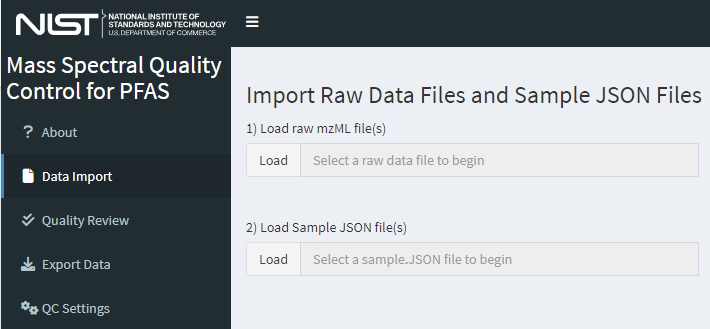

# DIMSpec Quality Control (DIMSpec-QC) {#dimspec-qc-home .unnumbered}

## Introduction {#dimspec-qc-intro .unnumbered}

One goal of the Data Infrastructure for Mass Spectrometry (DIMSpec) project is to provide a database that can be easily retasked to support individual projects within the Chemical Sciences Division to manage data coherently and accelerate analyte identification, screening, and annotation processes for non-targeted analysis projects. Databases built and managed with DIMSpec are SQLite files used within a distributed R Project. A DIMSpec mass spectral database incorporates empirical mass spectral data from analytical standards and complex mixtures with relevant analytical method metadata and mass spectral annotation. Algorithms have been developed in R to validate the quality of new experimental data.

For ease of use, the DIMSpec Quality Control (DIMSpec-QC) application was developed that incorporates the R functions into a R/Shiny application. Scripts for automated setup are included. For this initial release, DIMSpec is distributed with data populated for per- and polyfluorinated alkyl substances (PFAS); that effort has been primarily supported by the Department of Defense Strategic Environmental Research and Development Program ([DOD-SERDP](https://serdp-estcp.org/){target="_blank"}), project number [ER20-1056](https://www.serdp-estcp.org/projects/details/a0bb4198-02cd-44b9-9e73-9ef916e7f7e0/er20-1056-project-overview){target="_blank"}.

## Instructions {#dimspec-qc-instructions .unnumbered}

The DIMSpec-QC application installs alongside DIMSpec. If there is continued (or expanded) interest, the project could be turned into an R package installable directly from GitHub with additional development or this tool can be deployed to a hosted shiny server for use without the need for launching or maintaining it locally. For now, this application is distributed for demonstration and evaluation with an implementation of NIST DIMSpec containing high resolution accurate mass spectrometry data for per- and polyfluorinated alkyl substances (PFAS). The R project can be opened in [RStudio](https://www.rstudio.com/){target="_blank"}[^6] which may be downloaded and installed free of charge if not already installed. Initial set up does require an internet connection to install dependencies; on a system which does not contain any software components this can take a considerable amount of time.

[^6]: Any mention of commercial products within NIST web pages is for information only; it does not imply recommendation or endorsement by NIST.

Refer to the [System Requirements](#system-requirements) section for installation details.

### Input File Format Requirements {#dimspec-qc-input-format .unnumbered}

To use DIMSpec-QC, raw data files produced by a mass spectrometer must be converted into mzML format [@deutsch_mass_2010] using [Proteowizard's](https://proteowizard.sourceforge.io/){target="_blank"} msConvert software [@adusumilli_data_2017]. There are specific parameters that must be used during conversion.

    Filter: Threshold peak filter
    Threshold type: absolute
    Orientation: most intense
    Value: 1
    Filter: Peak picking
    Algorithm: vendor
    MS levels: 1-2

A more detailed user guide for converting the files is provided as a [vignette](assets/file_convert.pdf){target="_blank"}.

### Non-Targeted Analysis Method Reporting Tool {#dimspec-qc-ntamrt .unnumbered}

A macro-enabled Microsoft Excel workbook, called the Non-Targeted Analysis Method Reporting Tool (NTA-MRT), is used for the systematic collection of sample, method, and compound information related to chemicals identified in a sample. The most up-to-date version of NTA-MRT is publicly available at [GitHub](https://github.com/usnistgov/NISTPFAS/tree/main/methodreportingtool){target="_blank"}.

The instructions for completing the NTA-MRT are contained within the tool itself. In order to use the DIMSpec-QC application, a `sample.JSON` file must be generated using the “Export to JSON file output” button on the first tab of the NTA-MRT.

<caption>The file name entered in the NTA-MRT under the Sample tab must exactly match (case-sensitive) the paired mzML file name to be used for the DIMSpec-QC.</caption>


### Launching DIMSpec-QC {#dimspec-qc-launching-dimspec-qc .unnumbered}

Launch this tool similarly to other "shiny"-based tools as part of DIMSpec. In brief, this can be done from a terminal or the R console, though the preferred method is to use RStudio [@RStudio]. The following commands are typical given an existing installation of R or RStudio and should always be run from the project directory. The shiny package [@R-shiny] and other necessary R packages will be installed if it not already available by running the script at `R/compliance.R`, but shiny is the only package required to start the application. When first run, it may take a moment to install necessary dependencies and launch the application programming interface (API) server.

*Terminal*[^7]

[^7]: Requires R.exe is available in your system PATH

> R.exe "shiny::runApp('inst/apps/dimspec-qc')"

*R console*

> `shiny::runApp(‘inst/apps/dimspec-qc’)`

*RStudio*

> Open the ".Rproj" project file in RStudio, navigate to the "inst/apps/msmatch" directory, open one of the "global.R," "server.R," or "ui.R" files, and click the "Run App" button. Files open in an RStudio project will remain open by default when RStudio is closed, allowing users to quickly relaunch by simply loading the project. For best performance, ensure "Run External" is selected from the menu "carrot" on the right to launch the application in your system's default web browser. This application has been tested on Chrome, Edge, and Firefox.

Alternatively, once the compliance script has been executed MSMatch can be launched using `start_app("dimspec-qc")`.

Once launched the API server will remain active until stopped, allowing users to freely launch, close, and relaunch any shiny apps dependent upon it much more quickly. The application is fluid and will dynamically resize to fit the dimensions of a browser window. By default, the server does not stop when the browser is closed. This means that, once started, it is available by navigating a web browser back to the URL where it launched until the server is shut down.

If anything is needed from the user, interactive feedback will occur in the console from which it was launched. Install any packages required if prompted by the application. Once the package environment requirements have been satisfied and the server has spun up, which may take a moment, the tool will launch and display the "About" screen ([Figure 1](#fig05-01)) either in the RStudio viewer or the browser. The navigation panel on the left will control which page is currently being viewed; click an entry to navigate to that page.

While this version of DIMSpec includes analytical data for PFAS, DIMSpec-QC can be tailored for any given database name. See [Technical Details](#dimspec-qc-technical-details)>[Application Settings](#dimspec-qc-application-settings) for customization options.

{#fig05-01 style="width:100%;max-width:1200px"}

### Using DIMSpec-QC {#dimspec-qc-using-dimspec-qc .unnumbered}

Every effort has been made to make using the DIMSpec-QC application as intuitive to use as possible. Generally the user interface will adjust to the current needs and highlight the next step. Some steps (e.g. 2 and 3) can be used interchangeably.

#### Step 0 - Modify quality control settings (optional) {#dimspec-qc-step0 .unnumbered}

Prior to file processing, verify or set parameters to be used for quality control analysis can be modified. On the left menu, select “QC Settings” to navigate to the settings dashboard shown in [Figure 2](#fig05-02). The default settings are recommended, but can be modified if needed.

{#fig05-02 style="width:100%;max-width:500px"}

#### Step 1 - Import mzML and Sample JSON Files {#dimspec-qc-step1 .unnumbered}

Upload paired mzML and sample JSON files (conventionally named “filename_mzml_sample.JSON” by the NTA-MRT macros). First, select “Data Import” on the left menu or the “Click Here to get Started” button from the “About” page to bring up the Data Import page [Figure 3](#fig05-03). Multiple files may be uploaded; the limit of number and size of files is dependent on system memory. By default the maximum size of a single file is 250 MB, but this limit can be increased by changing the setting of `file_MB_limit` in the `global.R` file.

First, load the mzML files of interest using the top “Load” button or by dragging the data file(s) to the input widget labeled *1) Load raw mzML file(s)*.

Second, load the paired sample JSON files using the second “Load” button or by dragging the JSON file(s) to the input widget labeled *2) Load Sample JSON file(s)*. The sample JSON files do not need to be selected in the same order as the mzML files and will be matched by name when processed.

{#fig05-03 style="width:100%;max-width:600px"}

Once mzML and Sample JSON files are uploaded, the application will automatically check to see if there are valid pairs of mzML and Sample JSON files. A successful upload will give a screen similar to [Figure 4](#fig05-04). If multiple files are loaded, only files with verified matches will be included in the table and available for further processing.

{#fig05-04 style="width:100%;max-width:1000px"}

#### Step 2 - Process Data {#dimspec-qc-step2 .unnumbered}

After files have been loaded and matched, a button will appear on the “Data Import” window that is labeled “Process Data”. Click the “Process Data” button and it will sequentially process each mzML file. This can take up to 5 minutes per raw file depending on the number of compounds per file, so a large number of files may take a long time to process. Progress indicators are provided. Once complete, the text under “QC Data Import Status” will read: “Data processing complete.”

If a raw file does not have a valid Sample JSON, the files can still be processed, but the invalid rows will be excluded.

#### Step 3 - Review QC Results {#dimspec-qc-step3 .unnumbered}

Once processed, the QC results can be reviewed by selecing “Quality Review” in the left menu or clicking the “Quality Review” button that appears below the “Process Data” button.

The top table, which is the only visible table when starting a new review, shows the raw files that have been processed and the respective quality control check results ("PassCheck"). If all compounds in the raw file passed all QC checks, the PassCheck result will be true. If any compound in the raw file failed any of the QC checks, the PassCheck result will be false.

To review the compounds within a single raw file, select the row of the raw file you want to review in the table labeled *1) Click a row to select an mzML file*. This will display a second table of all compounds within the selected raw file. The PassCheck result for each compound is displayed in this table. If all QC checks for each compound in the raw file passed all QC checks, the PassCheck result will be true for that compound. If a compound in the raw file failed any of the QC checks, the PassCheck result will be false for that compound.

To review the individual QC checks (described in the [Technical Details](#dimspec-qc-technical-details)>[Quality Control Evaluation](#dimspec-qc-quality-control-evaluation) section), select a row for the peak to review in the table labeled *2) Click a row to see metrics for that peak*. This will display boxes to the right containing all QC checks for that compound. Expand a specific QC check by clicking on the box header to display the results of the QC check as a table. An example view of the quality control review page is shown in [Figure 5](#fig05-05). A note below the two tables on the left will indicate whether any QC checks failed.

{#fig05-05 width="100%;max-width:1200px"}

#### Step 4 - Export Data {#dimspec-qc-step4 .unnumbered}

Once data are processed, all data can be exported (regardless of quality review status) by selecting “Export Data” in the left menu. Additional options may be added in the future to refine the export process such as selecting only peaks and files that pass all defined quality checks.

Clicking the button labeled “Export all data”, will write the peak JSON files and download them in a single .zip file. This file can be unzipped and the peak JSONs can be directly incorporated into the DIMSpec database using the import routine described in the [Importing Data](#importing-data) section.

#### Step 5 - Closing Down {#dimspec-qc-step5 .unnumbered}

When finished using the application, typing the escape key at the R console is the simplest way to stop the server and exit the application. If using RStudio there is a "stop sign" button at the top right of the console pane that will also stop it. When finished completely with the project, users also need to shut down the API server.

-   Loading the entire project from the compliance script (i.e. MSMatch was launched using `start_app("msmatch")`) provides additional actions and includes a live database connection with the ability to read data into tables and preserve them for further analysis. Use the function [`close_up_shop()`](#fn_def_close_up_shop) with the argument `back_up_connected_tbls` set to `TRUE` to preserve these, or the default FALSE to simply close all connections including the API server).
-   If launching the app directly and using the default settings there will be a session object named `plumber_service` connected to that server. To stop it, use the [`api_stop`](#fn_def_api_stop) function from the console or stop the service directly using `plumber_service\$kill()`; it will also generally stop when the calling R process closes (e.g. when RStudio is closed), but it is highly recommended to stop it manually to prevent hanging connections.
-   After closing all connections, a hanging connection may be indicated by the presence of "-shm" and "-wal" files in the project directory. Flushing these hanging connections is not required but is recommended.
    -   If launching MSMatch with the compliance script, run [`close_up_shop()`] again.

    -   Otherwise flush those connections by directly connecting and disconnecting with the DBI package:

        ``` r
        con <- DBI::dbConnect(RSQLite()::SQLite, "nist_pfas_nta_dev.sqlite")
        DBI::dbDisconnect(con)
        ```

Feature requests, suggestions, and bug reports are most conveniently submitted as issues via GitLab but may also be submitted by contacting the authors of this ROA. New functionality suggestions are encouraged as the project tooling develops. Likewise, if the functionality demonstrated here is of interest to projects outside of PFAS, this is only one example implementation of the underlying technology stack (i.e. DIMSpec); contact the authors to see if your mass spectrometry data would be amenable to that framework as other implementation suggestions are encouraged and a larger goal of the project to cohesively manage mass spectrometry data for non-targeted analysis within the Chemical Sciences Division.

This concludes the User Guide for the DIMSpec Quality Control (DIMSpec-QC) web application. The following section contains technical details about the implementation and user customization of this digital assistant.

## Technical Details {#dimspec-qc-technical-details .unnumbered}

Implementation and environment details for the DIMSpec-QC application largely follow those for DIMSpec. See the sections on [System Requirements](#system-requirements), [Environment Resolution](#compute-environments), [Shiny Applications](#shiny-applications), [Plumber](#plumber) for the API implementation which is required for this application, and [Python Integration](#python) for chemometrics support.

Technical details in this section will describe only the DIMSpec-QC application found in the `inst/apps/dimspec-qc` directory and, unless otherwise noted, all files referred to hereafter refer to that directory.

### JSON Schema {#dimspec-qc-json-schema .unnumbered}

There are two types of JavaScript Object Notation (JSON) files used for the data import and quality control process:

1.    *Sample JSON*: these files (conventionally labeled “[mzmlfilename]_mzml_sample.JSON”) are exported from the Non-Targeted Analysis – Method Reporting Tool (NTA-MRT) and contain sample, method, and compound information related to a paired mzML file. A visual representation of the Sample JSON schema is shown in Appendix A.

2.    *Peak JSON*: these files are exported from the DIMSpec-QC application (conventionally labeled “[mzmlfilename]_mzml_cmpd[compoundreferencenumber].JSON”) and contain sample, method, compound information with mass spectral data related to the specified compound. The Peak JSON schema is shown in Appendix B.

### Quality Control Evaluation {#dimspec-qc-quality-control-evaluation .unnumbered}

Upon running the quality control data processing there are seven individual checks that are performed. Within the DIMSpec-QC app, the different checks are represented by parameter names. The QC checks with their named parameters are as follows. Most settings for these checks may be changed in the [QC Settings](#dimspec-qc-step0) page. 

-   _measurederror_: is the reported precursor ion *m/z* value within the reported instrumental error of the calculated precursor ion *m/z* of the designated compound? This calculation uses the instrument relative mass error contained in Sample JSON file, the absolute minimum mass error (default: **0.01 Da** - see the setting labeled *Minimum m/z error of instrument*), and the monoisotopic mass of the designated compound in the DIMSpec database.

-   _ms1_isotopepattern_: does the MS1 isotopic pattern of the submitted data match the calculated isotopic pattern with a match score above an expected value? This calculation uses the Minimum MS1 isotopic match score (default: **0.5** - see the setting labeled *Minimum MS1 isotopic match score*), the lower MS1 window value (default: **1** - see the setting labeled *Lower MS1 window value*), and the upper MS1 window value (default: **4** - see the setting labeled *Upper MS1 window value*).

-   _ms1precursor_detected_: is the reported precursor ion *m/z* value present in the MS1 mass spectrum of the submitted data? This calculation uses the instrument relative mass error contained in Sample JSON file and the absolute minimum mass error (default: **0.01 Da** - see the setting labeled *Minimum m/z error of instrument*).

-   _annfragments_detected_: are the reported annotated fragment ion *m/z* values present in the MS1 mass spectrum of the submitted data? This calculation uses the instrument relative mass error and annotated fragment ion list contained in Sample JSON file and the absolute minimum mass error (default: **0.01 Da** - see the setting labeled *Minimum m/z error of instrument*).

-   _annfragment_accuracy_: are the reported annotated fragment ion *m/z* values value within the reported instrumental error of the fragment ion *m/z* of the designated fragment, calculated from the elemental formula? This calculation uses the instrument relative mass error and fragment elemental formulas contained in the Sample JSON file and the absolute minimum mass error (default: **0.01 Da** - see the setting labeled *Minimum m/z error of instrument*).

-   _annfragments_subset_: are the reported annotated fragment elemental formulas a subset of the elemental formula of the designated compound? For example, is the fragment “C3F7” a subset of the designated compound elemental formula “C8F15O2H”? In this example, the result would be true. This calculation uses the elemental formula contained in the Sample JSON file and the elemental formula of the designated compound in the DIMSpec database.

-   _annfragment_elementalmatch_: if there is a SMILES structure provided for an annotated fragment, does the elemental formula of the SMILES structure match the elemental formula provided for the same annotated fragment. This calculation uses the SMILES structure and the elemental formula contained in the Sample JSON file.

-   _optimized_ums_parameters_: this is not a quality check, but occurs during the same data processing step. Optimized settings for the uncertainty mass spectrum of the MS1 and MS2 data is calculated using the function [`optimal_ums`](#fn_def_optimal_ums) for import into the DIMSpec database.

At any time necessary, these settings may be changed on the [QC Settings](#dimspec-qc-step0) page and QC checks run again by clicking "Process Data".

### Application Settings {#dimspec-qc-application-settings .unnumbered}

Many global application settings are customizable by modifying the `global.R` file. Changes to those listed here should not cause issues, but other settings in this file may result in instability. Anywhere a `TRUE` or `FALSE` value is indicated should only be `TRUE` or `FALSE.` The most germane user settings include:


### Future Development {#dimspec-qc-future .unnumbered}

Both the R/Shiny and python code bases are fully extensible for future functionality needs, as is the underlying database infrastructure for custom tables and views. Future development may include deployment of and to a Shiny server to serve this as a hosted web application, extending the python code to analyze data of various formats from different instruments, and adding analysis features and functionality (e.g. high resolution plot generation and download or supporting the full workflow from instrument through import and to report generation) requested by stakeholders.

This concludes the technical details section for the DIMSpec Quality Control (DIMSpec-QC) application.

## Conclusions {#dimspec-qc-conclusions .unnumbered}

The DIMSpec Quality Control application provides a new way to make NTA tools developed at NIST on top of the Database Infrastructure for Mass Spectrometry accessible to both internal and external stakeholders. It is the first demonstration of tools that can be built on top of databases conforming to the [DIMSpec project](#intro-start) which can be repurposed for any class of chemicals or project of interest.

## Appendices {#dimspec-qc-appendices .unnumbered}

### Example Sample JSON Schema {#dimspec-qc-appendix-a .unnumbered}

The javascript object notation (JSON) schema describing samples is minimal for flexibility and extensibility as it is produced by visual basic for applications (VBA) scripts in the [Non Targeted Analysis Method Reporting Tool (NTA-MRT)](#dimspec-qc-ntamrt), and is not fully defined in a machine readability sense allowing for automatic schema verification.

This definition is intended only to facilitate transfer and assessment of data through the NTA-MRT into the DIMSpec schema, and sufficient for that purpose.

Any number of schema harmonization efforts could connect DIMSpec with larger schema development efforts within the community to increase machine readability and transferability in line with the FAIR principles. This is an area where the DIMSpec project can be improved and schema mapping efforts can serve to connect data with larger projects outside of this project. NIST welcomes collaborative efforts to harmonize schema with larger efforts; reach out with an [email to the PFAS program at NIST](mailto:pfas@nist.gov) to start a collaboration.

```
{
  "sample": {
    "name",
    "description",
    "sample_class",
    "data_generator",
    "source"
  },
  "chromatography": {
    "ctype",
    "cvendor",
    "cmodel",
    "ssolvent",
    "mp1solvent",
    "mp1add",
    "m2solvent",
    "mp2add",
    "mp3solvent",
    "mp3add",
    "mp4solvent",
    "mp4add",
    "gcolvendor",
    "gcolname",
    "gcolchemistry",
    "gcolid",
    "gcollen",
    "gcoldp",
    "colvendor",
    "colname",
    "colchemistry",
    "colid",
    "collen",
    "coldp",
    "source"
  },
  "massspectrometry": {
    "msvendor",
    "msmodel",
    "ionization",
    "polarity",
    "voltage",
    "vunits",
    "massanalyzer1",
    "massanalyzer2",
    "fragmode",
    "ce_value",
    "ce_desc",
    "ce_units",
    "ms2exp",
    "isowidth",
    "msaccuracy",
    "ms1resolution",
    "ms2resolution",
    "source"
  },
  "qcmethod": [
    {
      "name",
      "value",
      "source":
    }
  ],
  "peaks": {
    "peak": {
      "count":,
      "name",
      "identifier",
      "ionstate",
      "mz",
      "rt",
      "peak_starttime",
      "peak_endtime",
      "confidence"
    }
  },
  "annotation": {
  "compound": {
      "name",
      "fragment": {
          "fragment_mz",
          "fragment_formula",
          "fragment_SMILES",
          "fragment_radical",
          "fragment_citation"
          }
      }
  }
}
```

### Example Peak JSON Schema Extension {#dimspec-qc-appendix-b .unnumbered}

The javascript object notation (JSON) schema describing peak data and quality control metrics is a minimal extension of the [sample schema](#dimspec-qc-appendix-a) and is produced by the DIMSpec-QC tool and associated R functions used as part of the QC evaluation process. It is not fully defined in a machine readability sense allowing for automatic schema verification.

DIMSpec-QC uses this extension to split the provided sample schema by peak, maintaining the sample metadata, attach the "msdata" element containing anlytical results, and attach resulting QC data. This results in one file per peak for import into the DIMSpec schema, and is sufficient for that purpose. 

Any number of future schema harmonization efforts could connect DIMSpec with larger schema development efforts within the community to increase machine reading and transferability in line with the FAIR principles. This is an area where the DIMSpec project can be improved and schema mapping efforts can serve to connect data with larger projects outside of this project. NIST welcomes collaborative efforts to harmonize schema with larger efforts; reach out with an [email to the PFAS program at NIST](mailto:pfas@nist.gov) to start a collaboration.

```
{
  ...,
  "msdata": [
    {
      "scantime",
      "ms_n",
      "baseion",
      "base_int",
      "measured_mz",
      "measured_intensity"
    }
  ],
  "qc": [
    [
      {
        "parameter",
        ...,
        "value",
        "limit",
        "result"
      }
    ]
  ]
}
```
