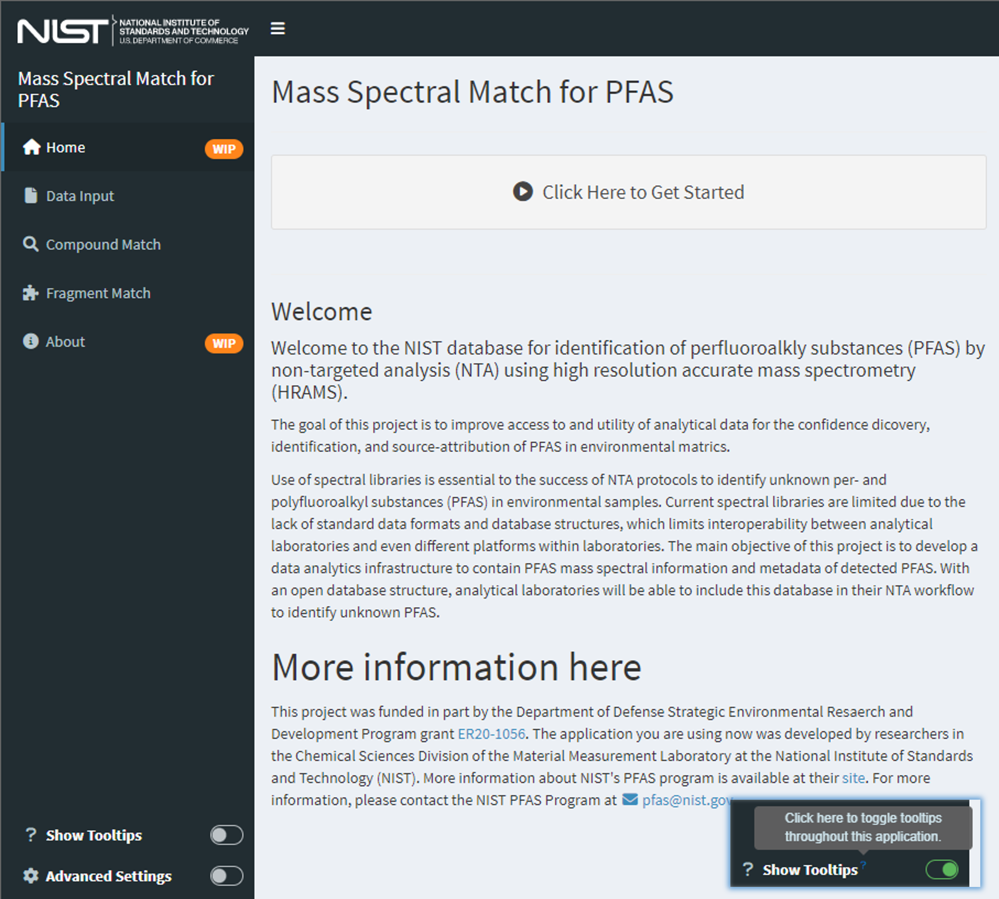
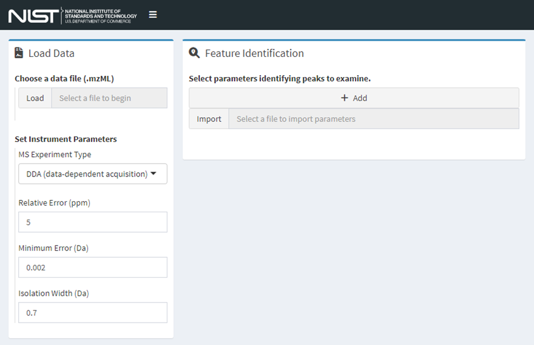
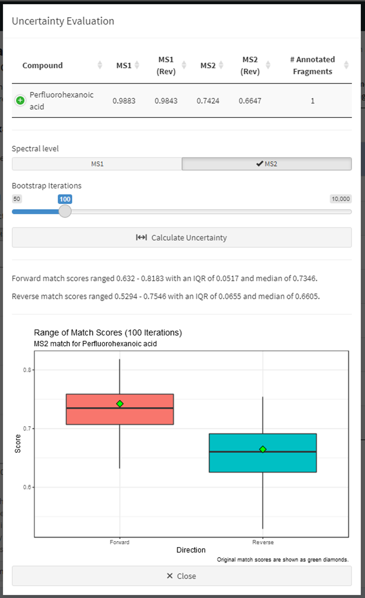
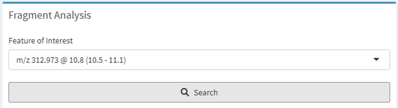
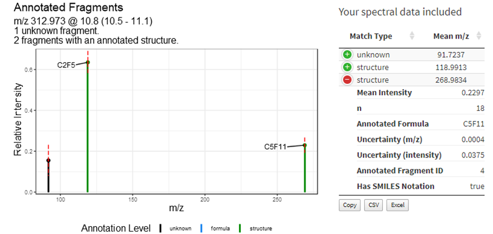

# Mass Spectral Match (MSMatch) {#msmatch-home .unnumbered}

## Introduction {#msmatch-intro .unnumbered}

One goal of the Data Infrastructure for Mass Spectrometry (DIMSpec) project is to provide a database that can be easily built to support individual projects within the Chemical Sciences Division to manage data coherently and accelerate analyte identification, screening, and annotation processes for non-targeted analysis projects. Toward that end, the Mass Spectral Match for Non-Targeted Analysis (MSMatch) application was built to accelerate non-targeted analysis projects by searching experiment result data in [mzML](https://www.psidev.info/mzML) format for matches against a curated mass spectral library of compounds and annotated fragments. MSMatch is a web application built using the Shiny package in R and installs alongside DIMSpec and is one example of a tool that can built on top of the DIMSpec toolkit. Databases built and managed with DIMSpec are SQLite files used within a distributed R Project. Scripts for automated setup are included. For this initial release, DIMSpec is distributed with data populated for per- and polyfluorinated alkyl substances (PFAS); that effort has been primarily supported by the Department of Defense Strategic Environmental Research and Development Program ([DOD-SERDP](https://serdp-estcp.org/){target="_blank"}), project number [ER20-1056](https://www.serdp-estcp.org/projects/details/a0bb4198-02cd-44b9-9e73-9ef916e7f7e0/er20-1056-project-overview){target="_blank"}.

This section serves as a user guide for using the MSMatch application.

## Instructions {#msmatch-instructions .unnumbered}

The MSMatch application installs alongside DIMSpec. If there is continued (or expanded) interest, the project could be turned into an R package installable directly from GitHub with additional development or this tool can be deployed to a shiny server to avoid the need for launching or maintaining it locally. For now, this application is distributed for demonstration and evaluation with an implementation of NIST DIMSpec containing high resolution accurate mass spectrometry data for per- and polyfluorinated alkyl substances (PFAS). The R project can be opened in [RStudio](https://www.rstudio.com/){target="_blank"}[^4] which may be downloaded and installed free of charge if not already installed. Initial set up does require an internet connection to install dependencies; on a system which does not contain any software components this can take a considerable amount of time.

[^4]: Any mention of commercial products within NIST web pages is for information only; it does not imply recommendation or endorsement by NIST.

Refer to the [System Requirements](#system-requirements) section for installation details.

### Input File Format Requirements {#msmatch-file-format .unnumbered}

To use MSMatch, raw data files produced by a mass spectrometer must be converted into mzML format [@deutsch_mass_2010] using [Proteowizard's](https://proteowizard.sourceforge.io/){target="_blank"} msConvert software [@chambers_cross-platform_2012]. There are specific parameters that must be used during conversion.

    Filter: Threshold peak filter
    Threshold type: absolute
    Orientation: most intense
    Value: 1
    Filter: Peak picking
    Algorithm: vendor
    MS levels: 1-2

A more detailed user guide for converting the files is provided as a [vignette](file_convert.pdf).

### Launching MSMatch {#msmatch-launching-msmatch .unnumbered}

Launch this tool similarly to other "shiny"-based tools provided as part of DIMSpec. In brief, this can be done from a terminal or the R console, though the preferred method is to use RStudio [@RStudio]. The following commands are typical given an existing installation of R or RStudio and should always be run from the project directory. The shiny package [@R-shiny] and other necessary R packages will be installed if it not already available by running the script at `R/compliance.R`, but shiny is the only package required to start the application. When first run, it may take a moment to install necessary dependencies and launch the application programming interface (API) server.

*Terminal*[^5]

[^5]: Requires R.exe is available in your system PATH

> R.exe "shiny::runApp('inst/apps/msmatch')"

*R console*

> `shiny::runApp(‘inst/apps/msmatch’)`

*RStudio*

> Open the ".Rproj" project file in RStudio, navigate to the
> "inst/apps/msmatch" directory, open one of the "global.R,"
> "server.R," or "ui.R" files, and click the "Run App" button. Files
> open in an RStudio project will remain open by default when RStudio is
> closed, allowing users to quickly relaunch by simply loading the
> project. For best performance, ensure "Run External" is selected from
> the menu "carrot" on the right to launch the application in your
> system's default web browser. This application has been tested on
> Chrome, Edge, and Firefox.

Alternatively, once the compliance script has been executed MSMatch can be launched using `start_app("msmatch")`.

Once launched the API server will remain active until stopped, allowing users to freely launch, close, and relaunch any shiny apps dependent upon it much more quickly. The application is fluid and will dynamically resize to fit the dimensions of a browser window. By default, the server does not stop when the browser is closed. This means that, once started, it is available by navigating a web browser back to the URL where it launched until the server is shut down.

If anything is needed from the user, interactive feedback will occur in the console from which it was launched. Install any packages required if prompted by the application. Once the package environment requirements have been satisfied and the server has spun up, which may take a moment, the tool will launch (Figure 1) either in the RStudio viewer or the browser.

### Using MSMatch {#msmatch-using-msmatch .unnumbered}

Every effort has been made to make MSMatch as intuitive for users as possible. Set up may require a bit of effort on certain systems, but once the application launches it should be straightforward; please contact the authors directly or email [pfas\@nist.gov](mailto:pfas@nist.gov) for support, or with any questions or suggestions.

Hints in the form of tooltips are provided throughout; hover over question mark icons or controls to see them. These can be toggled on and off at any time using the "Show Tooltips" toggle button at the bottom left of the application window (see [Figure 1](#fig04-01) inset at bottom right). If enabled, advanced search settings can be similarly toggled on and off for the session (see [Application Settings](#msmatch-application-settings) for instructions on how to set default accessibility and settings for tooltips and advanced settings). The "hamburger" (three short horizontal lines stacked on top of one another) icon at the top left of the screen will collapse the left-hand navigation panel to provide more horizontal room on smaller screens, though the application will rearrange itself when screens are smaller than a minimum width.

------------------------------------------------------------------------

{#fig04-01 style="width:100%;max-width:800px"}

------------------------------------------------------------------------

Click the "Click Here to Get Started" button to begin. This will activate the "Data Input" page. Example data files are provided in the project directory ("example/PFAC30PAR_PFCA2.mzML" and "example/example_peaklist.csv").

------------------------------------------------------------------------

{#fig04-02 style="width:100%;max-width:800px"}

------------------------------------------------------------------------

All input values are validated against expectations and will flag the user if invalid values are used.

#### Step 1. Load an mzML Data File {#msmatch-step1 .unnumbered}

MSMatch accepts files in the mzML format, see the previous section [Input file format requirements](#msmatch-file-format) for more details. Either click the "Load" button to select a local file or click and drag one from your file system to that widget. Only .mzML files are accepted using this release. Set instrument parameters to match those used in the experiment using the controls provided.

#### Step 2. Identify Features of Interest {#msmatch-step2 .unnumbered}

Two methods ([Figure 3](#fig04-03)) are supported to identify features of interest by mass-to-charge ratio and retention time properties. Either use case is fully supported. Users may:

1.  import a file (either .csv, .xls, or .xlsx, though workbooks should have relevant data in the first worksheet) and identify which columns contain the correct information ([Figure 3, left](#fig04-03)).
    -   Click "Import" and select a file of interest from your local
        computer or drag and drop a file to this input.
    -   Use this method if you have a file containing features of
        interest from other procedures or software outputs to quickly
        import many feature properties.
    -   Select a column that corresponds to each property.
    -   To append to the current list, keep the checkbox checked. To
        overwrite, uncheck this box.
    -   Click "Load Parameters" to validate and add parameters or
        "Cancel" to abort this operation.
    -   Repeat until all files are imported.
    
AND/OR

2.  click the "Add" button and enter search parameters one at a time
    ([Figure 3, left](#fig04-03)); repeat this process to add more.
    -   Add numeric values for all items.
    -   Click "Save Parameters" to validate and add or "Cancel" to abort
        this operation

-   Users receive feedback on the form if values are left blank or if
    they do not meet expectations (e.g. centroid is after peak start and
    before peak end).
-   Values should all be numeric in nature.
-   This list may be edited after import ([Figure 4](#fig04-04)).

Data are ready to be processed once features of interest are added. Selecting any row in the resulting table makes two additional functions available ([Figure 4, right](#fig04-04)). With a row selected, click "Remove" to delete it or "Edit" to bring up the same form as above ([Figure 3, right](#fig04-03)), change the values, and click "Save Parameters." All records remaining in the feature of interest list will be available to search widgets on subsequent pages.

------------------------------------------------------------------------

 or manually by clicking the Add button (right)."){#fig04-03 style="width:100%;max-width:500px"}

------------------------------------------------------------------------

 interactively by adding, editing, or removing features as needed (right) by selecting a row from the table and clicking the appropriate button."){#fig04-04 width="100%" style="width:100%;max-width:900px"}

------------------------------------------------------------------------

#### Step 3. Generate the Search Object {#msmatch-step3 .unnumbered}

Click the "Process Data" button ([Figure 5](#fig04-05)) to filter and recast data in the .mzML file according to defined feature properties. (In further screenshots the manually added row [m/z 327.4586] has been removed. This will unlock mass spectral matching actions; click one of the buttons or navigate to the desired page using the navigation panel on the left.

------------------------------------------------------------------------

{#fig04-05 style="width:100%;max-width:600px"}

------------------------------------------------------------------------

#### Step 4. Explore Results {#msmatch-step4 .unnumbered}

Algorithmic matching of provided mass spectral data for features of interest are matched against data stored in the attached database. Matching algorithms are described in detail in [Compound and Fragment Match Algorithms](#msmatch-algorithms). In brief, data meeting properties of a feature of interest are extracted from the provided .mzML file given the reported mass accuracy settings of the experiment and mass-to-charge ratios for known compounds and fragments are searched within an uncertainty boundary range and returned from the database. Results are then stored in the application server and displayed to the user.

##### Match Compounds {#msmatch-compounds .unnumbered}

Click the "Compound Match" button from the previous page or select "Compound Match" from the left-hand navigation menu to match features of interest from the mzML file to known compounds in the database.

------------------------------------------------------------------------

{#fig04-06 style="width:100%;max-width:800px"}

------------------------------------------------------------------------

Select a feature of interest from the drop-down box and click the "Search" button.

In most cases the "Precursor Search" option should remain selected; the other option is "All" which takes a considerable amount of time and may yield poor matches. The "Use Optimized Search Parameters" checkbox will utilize a set of predefined properties for known compounds to accelerate the search; uncheck this box to perform a wider search.

Narrative results are provided regarding the top match and the match currently being viewed, including a method summary for how the reference was measured. The spectral comparison is visualized in a "butterfly plot" showing measurements in black and the comparison (database) spectrum in red; toggle the different fragmentation levels (e.g. MS1 vs MS2) to view those independently ([Figure 7](#fig04-07)).

The table at the right displays compound match identities and their match scores. Click the green plus icon to expand any given row of the table or click a different row to examine that match and update the plot and method narrative ([Figure 8](#fig04-08)). This table may be downloaded using the buttons at the bottom left of the table.

------------------------------------------------------------------------

"){#fig04-07 width="100%" style="width:100%;max-width:1000px"}

------------------------------------------------------------------------

)."){#fig04-08 style="width:100%;max-width:1000px"}

------------------------------------------------------------------------

Evaluation of match score uncertainty is also provided. Click the "Estimate Match Score Uncertainty" button below the butterfly plot ([Figure 7](#fig04-07)) to evaluate the spread in match scores for the currently selected match ([Figure 9](#fig04-09)). Results from a bootstrapped version of the match algorithm are displayed as boxplots for both forward and reverse matches. Toggle the different fragmentation levels (e.g. MS1 vs MS2) to view each. Change the number of bootstrap iterations to use and click "Calculate Uncertainty" to run the estimation again. Click the "Close" button to return to the compound match screen and change the match being evaluated. The calculation of mass spectral uncertainty and estimation of the distribution of the match scores is described in @place_development_2021.

------------------------------------------------------------------------

{#fig04-09 style="width:100%;max-width:400px"}

------------------------------------------------------------------------

The match result table (Figures [7](#fig04-07) and [8](#fig04-08)) offers several options.

-   Sort using the column headers (results are by default ordered by MS1 score and MS2 score, with ties being decided by reverse match scores and the number of annotated fragments).

-   Download the resulting match table by either copying it to the clipboard ("Copy") or downloading in either CSV or XLS file formats using the buttons at the bottom left of the table (see Figure 6).

-   Select any row in the table to update the narratives and plots or evaluate match score uncertainty for that match.

If no compound matches are found, users are flagged to that effect. Proceed to Match Fragments using the navigation menu to identify fragments matching known annotations.

##### Match Fragments {#msmatch-fragments .unnumbered}

Click the "Fragment Match" button from the data input page ([Figure 5](#fig04-05)) or select "Fragment Match" from the left-hand navigation menu to match analytical fragments within features of interest from the .mzML file with previously annotated fragments in the database.

Select a feature of interest from the drop-down box just as with compounds (features are defined in Step 2: Identify Features of Interest) and click the "Search" button ([Figure 10](#fig04-10)).

------------------------------------------------------------------------

{#fig04-10 style="width:100%;max-width:800px"}

------------------------------------------------------------------------

Fragments measured within the feature of interest will be matched against database fragments with known annotations. Complicated spectra may take a moment but generally completes within 30 seconds yielding a variety of results to indicate possible compound identity. Results are presented as an annotated mass spectral uncertainty plot ([Figure 11 left](#fig04-11)) and additional information about measured spectra are provided in an expanding table ([Figure 11 right](#fig04-11)).

------------------------------------------------------------------------

{#fig04-11 style="width:100%;max-width:800px"}

------------------------------------------------------------------------

Matched fragment annotations and associated metadata are provided below this output ([Figure 12](#fig04-12)). Match records are located in the expandable table to the left. As matches may have structural annotation or not, these are separated to indicate confidence and annotations with structural notation are displayed at the top. Select a row in the table (the top record is selected by default) to update the following displays.

-   A human readable measurement narrative about the known fragment.

-   If structural notation is present a molecular model is displayed (requires rdkit to be active in the API server)

-   Compounds and peaks within which this fragment has been previously annotated appear in the table to the right. Select the tab to switch between compounds and peaks.

------------------------------------------------------------------------

{#fig04-12 style="width:100%;max-width:800px"}

------------------------------------------------------------------------

Two options are available for more contextual information regarding compounds and peaks.

-   Click **More Compound Information** to list other known or generated aliases for a compound and provides links to those resources if available. These aliases have either been collated from existing locations or, in the case of most machine-readable identifiers, generated using rdkit.

------------------------------------------------------------------------

{#fig04-13 style="width:100%;max-width:300px"}

------------------------------------------------------------------------

-   Click **More Peak Information** to provide a human readable narrative regarding measurement methods and sample information provided as part of the database accession process. Narratives are constructed directly from the underlying linked data tables by the database and stored as a database view.

------------------------------------------------------------------------

{#fig04-14 style="width:100%;max-width:300px"}

------------------------------------------------------------------------

#### Step 5. Closing Down {#msmatch-step5 .unnumbered}

When finished using the application, typing the escape key at the R console is the simplest way to stop the server and exit the application. If using RStudio there is a "stop sign" button at the top right of the console pane that will also stop it. When finished completely with the project, users also need to shut down the API server.

-   Loading the entire project from the compliance script (i.e. MSMatch was launched using `start_app("msmatch")`) provides additional actions and includes a live database connection with the ability to read data into tables and preserve them for further analysis. Use the function [`close_up_shop()`](#fn_def_close_up_shop) with the argument `back_up_connected_tbls` set to `TRUE` to preserve these, or the default FALSE to simply close all connections including the API server).
-   If launching the app directly and using the default settings there will be a session object named `plumber_service` connected to that server. To stop it, use the [`api_stop`](#fn_def_api_stop) function from the console or stop the service directly using `plumber_service$kill()`; it will also generally stop when the calling R process closes (e.g. when RStudio is closed), but it is highly recommended to stop it manually to prevent hanging connections.
-   After closing all connections, a hanging connection may be indicated by the presence of "-shm" and "-wal" files in the project directory. Flushing these hanging connections is not required but is recommended.
    -   If launching MSMatch with the compliance script, run [`close_up_shop()`](#fn_def_close_up_shop) again.
    -   Otherwise flush those connections by directly connecting and disconnecting with the DBI package:

        ``` r
        con <- DBI::dbConnect(RSQLite()::SQLite, "nist_pfas_nta_dev.sqlite")
        DBI::dbDisconnect(con)
        ```

Feature requests, suggestions, and bug reports are most conveniently submitted as issues via GitHub but may also be submitted by contacting the authors. New functionality suggestions are encouraged as the project tooling develops. Likewise, if the functionality demonstrated here is of interest to projects outside of PFAS, this is only one example implementation of the underlying technology stack (i.e. DIMSpec); contact the authors to see if your mass spectrometry data would be amenable to that framework as other implementation suggestions are encouraged and a larger goal of the project is to cohesively manage mass spectrometry data for non-targeted analysis within the Chemical Sciences Division and external stakeholders alike.

This concludes the User Guide for the Mass Spectral Match (MSMatch) web application. The following section contains technical details about the implementation and user customization of this digital assistant.

## Technical Details {#msmatch-technical-details .unnumbered}

Implementation and environment details for the MSMatch application largely follow those for DIMSpec. See the sections on [System Requirements](#system-requirements), [Environment Resolution](#compute-environments), [Shiny Applications](#shiny-applications), [Plumber](#plumber) for the API implementation which is required for this application, and [Python Integration](#python) for chemometrics support.

Technical details in this section will describe only the MSMatch application found in the `inst/apps/msmatch` directory and, unless otherwise noted, all files referred to hereafter refer to that directory.

### Mass Spectral Search Object {#msmatch-search-object .unnumbered}

In order to use the functions related to the database searching, library matching, and fragment matching, a *Mass Spectral Search Object* must be generated. A *Mass Spectral Search Object* is a nested list in the R environment that contains the following:

-   Peak search parameters input in Step 1, including instrument performance parameters, in a `search_df` dataframe;

-   MS1 and MS2 (if available) mass spectra peak tables, nested lists with names `ms1_pt` and `ms2_pt` respectively. Each peak table contains:

    -   `peaktable_mass`: a dataframe of *m/z* values with rows
        representing binned *m/z* values and columns representing
        individual scans

    -   `peaktable_int`: a dataframe of intensity values with the same
        shape and organization as the `peaktable_mass` dataframe

    -   `EIC`: dataframe containing paired `time` and `int` (intensity)
        values corresponding to the MS1 extracted ion chromatogram (EIC)
        of the precursor ion stated in the peak search parameters

    -   `ms1scans`: integer vector that indicates the scan number of the
        MS2 scans

    -   `ms2scans`: integer vector that indicates the scan number of the
        MS2 scans

The *Mass Spectral Search Object* is converted into uncertainty mass spectra (MS1 and MS2, if available) through the
[`get_ums`](#fn_def_get_ums){target="_blank"} function for subsequent analysis.

### Compound and Fragment Match Algorithms {#msmatch-algorithms .unnumbered}

All relevant functions for compound and fragment match algorithms are in the `R/spectral_analysis` directory. Currently, the compound search tool of MSMatch can search the database using the precursor ion *m/z* of the unknown compound ([`search_precursor`](#fn_def_search_precursor){target="_blank"} function) to reduce the processing time and compare only reference mass spectra with the same (defined below) precursor ion *m/z* or compare the mass spectra of the unknown compound to all compounds in the database ([`search_all`](#fn_def_search_all){target="_blank"} function). The [`search_precursor`](#fn_def_search_precursor){target="_blank"} function first identifies all peaks that have precursor ion m/z values that are within a range, as dependent on the type of MS2 experiment used:

**Data-Dependent Acquisition** (DDA, TopN), reference precursor ion *m/z* range:
$$(m_p\ -\ \max⁡(error,\ min.error),\ m_p\ +\ \max⁡(error,\ min.error))$$
**Sequential Windows of All Theoretical Masses** (SWATH, SONAR), range:
$$(m_p\ -\ \frac{1}{2}\ error,\ \ \ m_p\ +\ \frac{1}{2}\ error)$$
**Data-Independent Acquisition** (DIA, AIF), range:
$$(0,\ \ \ ∞)$$
Where m<sub>p</sub> is the precursor ion *m/z* of the unknown compound, *error* is the instrument relative error (in ppm) for DDA and the width of the window in SWATH, and *min.error* is the instrument absolute minimum error (in Da). For DIA, the range is all possible positive masses so that, functionally, the [`search_precursor`](#fn_def_search_precursor){target="_blank"} function is no different than the [`search_all`](#fn_def_search_all){target="_blank"} function.

To determine the match score between the unknown compound mass spectra (MS1 and MS2) and the reference mass spectra, the dot product of the mean mass spectra is calculated using the [`compare_ms`](#fn_def_compare_ms){target="_blank"} function, which uses the respective mass errors and minimum mass errors of the unknown mass spectra and reference mass spectra. To determine the uncertainty distribution of the match score, the [`bootstrap_compare_ms`](#fn_def_bootstrap_compare_ms){target="_blank"} function is used. The application of this function is described in @place_development_2021.

For the fragment search tool, the function [`get_annotated_fragments`](#fn_def_get_annotated_fragments){target="_blank"} is used, where all *m/z* values in the MS2 mass spectrum of the unknown compound are searched against all annotated fragments in the `norm_fragments` view using the instrument relative mass error and absolute minimum mass error as boundary conditions. Annotated fragments are fragment *m/z* values that have elemental formulas assigned; SMILES structural notation can also be assigned but is not required for annotation.

### Application Settings {#msmatch-application-settings .unnumbered}

Many global application settings are customizable by modifying the `global.R` file within the application directory. Changes to those listed here should not cause issues, but other settings in this file may result in instability. Anywhere a `TRUE` or `FALSE` value is indicated should only be `TRUE` or `FALSE.` The most germane user settings include:

**Table 4.** Example application settings in the `global.R` file.

+--------------------+--------------------------------+-----------------------------------------------------------------------------------------------------------------------------------------------------------------------------------------------------------------------------------------------------------+
| Setting            | Default Value                  | Description                                                                                                                                                                                                                                               |
+====================+================================+===========================================================================================================================================================================================================================================================+
| APP_TITLE          | "Mass Spectral Match for PFAS" | Set the application title which will appear in the browser tab when running.                                                                                                                                                                              |
+--------------------+--------------------------------+-----------------------------------------------------------------------------------------------------------------------------------------------------------------------------------------------------------------------------------------------------------+
| default_title      | `APP_TITLE`                    | The application name that will display inside the page. Overrides the default of APP_TITLE if desired.                                                                                                                                                    |
+--------------------+--------------------------------+-----------------------------------------------------------------------------------------------------------------------------------------------------------------------------------------------------------------------------------------------------------+
| app_ns             | `paste0(“app_”, app_name)`     | The namespace to direct logging messages.                                                                                                                                                                                                                 |
+--------------------+--------------------------------+-----------------------------------------------------------------------------------------------------------------------------------------------------------------------------------------------------------------------------------------------------------+
| dev                | `FALSE`                        | Whether to launch the application in development mode, which will allow for interactive interrogation of application  state by unlocking a button, provide the opportunity to pre-load data for testing, and display most hidden elements for inspection. |
+--------------------+--------------------------------+-----------------------------------------------------------------------------------------------------------------------------------------------------------------------------------------------------------------------------------------------------------+
| enable_adv_use     | `TRUE`                         | Whether to launch the application with a toggle to display advanced controls available to the user.                                                                                                                                                       |
+--------------------+--------------------------------+-----------------------------------------------------------------------------------------------------------------------------------------------------------------------------------------------------------------------------------------------------------+
| advanced_use       | `FALSE`                        | Whether to launch the application with advanced controls visible by default.                                                                                                                                                                              |
+--------------------+--------------------------------+-----------------------------------------------------------------------------------------------------------------------------------------------------------------------------------------------------------------------------------------------------------+
| enable_more_help   | `TRUE`                         | Whether to launch the application with a toggle to display tooltips to the user.                                                                                                                                                                          |
+--------------------+--------------------------------+-----------------------------------------------------------------------------------------------------------------------------------------------------------------------------------------------------------------------------------------------------------+
| advanced_use       | `FALSE`                        | Whether to launch the application with tooltips by default.                                                                                                                                                                                               |
+--------------------+--------------------------------+-----------------------------------------------------------------------------------------------------------------------------------------------------------------------------------------------------------------------------------------------------------+
| tooltip_text       | "www/tooltips.csv"             | A data source for populating tooltips. This should point to a readable file (e.g.  www/tooltips.csv) that is coerced to a named vector.                                                                                                                   |
+--------------------+--------------------------------+-----------------------------------------------------------------------------------------------------------------------------------------------------------------------------------------------------------------------------------------------------------+
| toy_data           | `FALSE`                        | Whether to launch the application with "toy" data for testing purposes. This loads data from "src_toy_data" and "src_toy_parameters" during application spin up so the tester does not have to manually upload files or add data.                         |
+--------------------+--------------------------------+-----------------------------------------------------------------------------------------------------------------------------------------------------------------------------------------------------------------------------------------------------------+
| src_toy_data       | "toy_data.RDS"                 | Name of the RDS file housing "toy" data from a previously processed mzML file.                                                                                                                                                                            |
+--------------------+--------------------------------+-----------------------------------------------------------------------------------------------------------------------------------------------------------------------------------------------------------------------------------------------------------+
| src_toy_parameters | "toy_parameters.RDS"           | Name of the RDS file housing "toy" data describing features of interest to use for testing.                                                                                                                                                               |
+--------------------+--------------------------------+-----------------------------------------------------------------------------------------------------------------------------------------------------------------------------------------------------------------------------------------------------------+
| need_files         | Character vector               | File paths for files containing  application functions.                                                                                                                                                                                                   |
+--------------------+--------------------------------+-----------------------------------------------------------------------------------------------------------------------------------------------------------------------------------------------------------------------------------------------------------+
| app_settings       | Named list                     | Properties used to populate controls within the application, by name (e.g. min, max, value, etc.).                                                                                                                                                        |
+--------------------+--------------------------------+-----------------------------------------------------------------------------------------------------------------------------------------------------------------------------------------------------------------------------------------------------------+
| jscode             | Text/HTML/Javascript           | Custom javascript functions which either execute automatically or by calling the function server side.                                                                                                                                                    |
+--------------------+--------------------------------+-----------------------------------------------------------------------------------------------------------------------------------------------------------------------------------------------------------------------------------------------------------+
| file_MB_limit      | Numeric                        | The maximum size in megabytes for a single uploaded file. Shiny's built-in default is 5 MB.                                                                                                                                                               |
+--------------------+--------------------------------+-----------------------------------------------------------------------------------------------------------------------------------------------------------------------------------------------------------------------------------------------------------+

### Future Development {#msmatch-future .unnumbered}

Both the R/Shiny and python code bases are fully extensible for future functionality needs, as is the underlying database infrastructure for custom tables and views. Future development may include deployment of and to a Shiny server to serve this as a hosted web application, extending the python code to analyze data of various formats from different instruments, and adding analysis features and functionality (e.g. high resolution plot generation and download or supporting the full workflow from instrument through import and to report generation) requested by stakeholders.

## Conclusions {#msmatch-conclusions .unnumbered}

The Mass Spectral Match for Non-Targeted Analysis application provides a new way to make NTA tools developed at NIST accessible to both internal and external stakeholders using the Database Infrastructure for Mass Spectrometry project toolkit. It is the first demonstration of tools that can be built on top of databases conforming to the [DIMSpec project](#intro-start), which can be repurposed for any class of chemicals or project of interest using mass spectrometry data.
