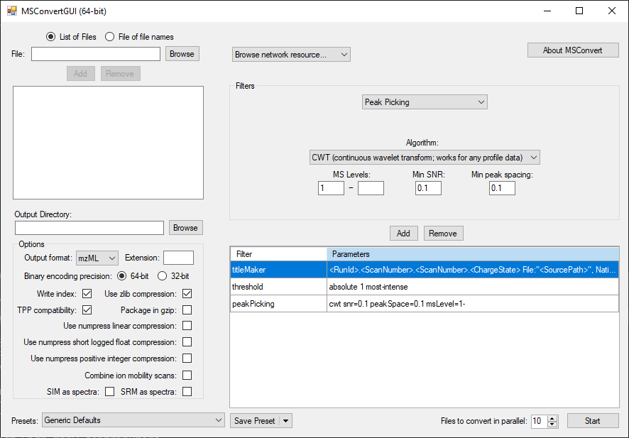
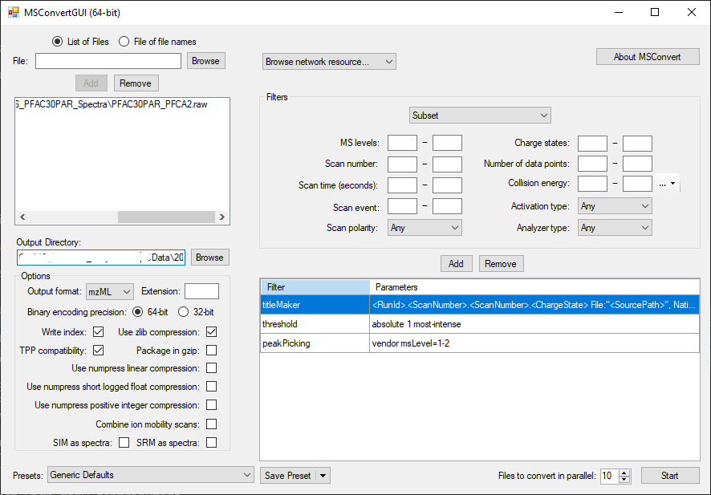
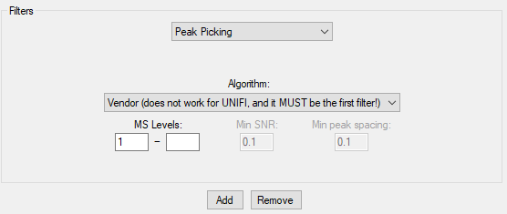
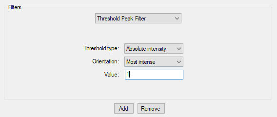
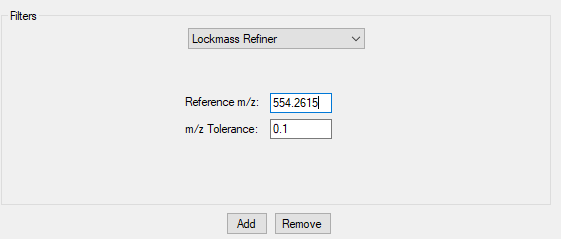
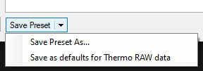

## Converting To The mzML Format

To use DIMSpec tools, raw data files produced by vendor software must be converted into \*.mzML files. The easiest way to convert data files is to download and install the most recent version of ProteoWizard[^1] from https://proteowizard.sourceforge.io/ to use the MSConvert tool [@adusumilli_data_2017]. Once installed, follow the next steps to convert the raw file(s) to \*.mzML format.

[^1]: Any mention of commercial products is for information only; it does not imply recommendation or endorsement by NIST.

### 1) Start MSConvert

From the Proteowizard main page, start the MSConvert program with Menu > Proteowizard > MSConvert[^2]

[^2]: MSConvert includes a command line interface for advanced use cases; settings must be the same as described in this guide.

{width=85%}

\newpage

### 2) Select the files to be converted

The MSConvert software can convert to mzML data files from the the following vendor formats at the time this guide was written: Thermo Fisher Scientific (\*.raw); Waters (\*.raw); SCIEX (\*.wiff2); Agilent (\*.D); Shimadzu (\*.LCD); and  Bruker (\*.D)
    
1. Select the files to be converted using the **Browse** button at the top left (Fig 2A). 

    **Note**: If selecting only one file at a time, instead click the *Add* button to include the file in the list.

1. Select the *Output Directory* to save files by clicking the **Browse** button at the center left (Fig 2B).

    **Note**: It will default to the same directory as the original file.

After loading the file, the program should look similar to Figure 2.

### 3) Adjust the mzML file parameters in the **Options** box (Fig 2C).

1. Select **mzML** from the *Output format* input and make sure the *Extension* input is blank.

1. Select **64-bit** under *Binary encoding precision*.

1. Ensure boxes are checked next to *Write Index*, *TPP Compatibility*, and *Use zlib compression*; leave all other boxes unchecked.

The proper selections have been made in Figure 2.

### 4) Add conversion filters (Fig 2D)

Apply the following data conversion filters; to adhere to current NIST practice the following settings *must* be used. Select the filter to be applied from the drop down menu at the top of the **Filters** box. Do this sequentially as described here. After setting each parameter click the **Add** button. To remove a parameter (in case of an entry or selection error), select that filter in the table below Fig 2D and click the **Remove** button.

1. Select the *Peak Picking* filter and apply the following parameters:

   - **Algorithm**: Vendor or CWT
   
      **Note**: Vendor filter does not work for Waters files, you must use CWT
    
   - **MS Levels**: 1 - _ (leave the second box blank)
   
   - If using CWT:
   
     - **Min. SNR**: 0.1
     
     - **Min. peak spacing**: 0.1
     
     
    Parameters should match those in Figure 3.
   
    Click the **Add** Button

{width=75%}

2. Select the *Threshold Peak Filter* and include the following parameters:

   - **Threshold type**: Absolute intensity
   
   - **Orientation**: Most intense
   
   - **Value**: 1
   

    Parameters should match those in Figure 4 (next page)
   
    Click the **Add** Button
    
\newpage

{width=75%}

- If the raw data is from a **Waters Corporation** mass spectrometer, apply the *Lockmass Refiner* filter.

  - **Reference m/z**: use the mass-to-charge ratio of the lockmass, for Leucine-Enkephalin (most common), the negative ionization *m/z* is 554.2615 and the positive ionization *m/z* is 556.2771.
     
  - **m/z Tolerance**: 0.1
  
  Parameters should match those in Figure 5
 
  Click the **Add** Button

{width=75%}
  
Selected filter parameters should be very similar to those in Figure 2 prior to conversion to \*.mzML.

**Note**: The TitleMaker filter is automatically selected upon opening MSConvert; this can be included and will not affect the data analysis. However, peakPicking must still be the first line in the filters.

**Note**: Waters Corporation instruments should have the lockmass refiner filter in the as well.

\newpage

### 5) Convert data files to the \*.mzML format.

Once all settings are as required, click the **Start** button at the bottom right (Fig 2E). This will convert all added files to \*.mzML format and put them in the assigned Output directory. Wait for the conversions to finish.

### 6) (Optional) Save the settings as a preset

Use the **Save Preset** drop down menu to use the same settings in the future (Fig 6) by selecting *Save Preset As...*. To apply a preset profile to future files, select it from this same drop down menu.

---

Once all files have been converted to the \*.mzML format they are ready for use in other data tools.

**This concludes the Quick Guide to Converting Raw LC-HRMS/MS Files into mzML files.**

---

## References

