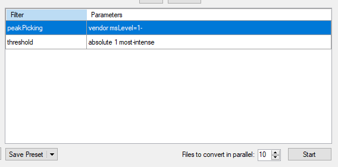

In order to use the data analysis tools, all files must be converted into \*.mzML files. In order to convert proprietary vendor files, all users *must* download ProteoWizard MSConvert tool, which can be acquired by going to https://proteowizard.sourceforge.io/ and downloading the most recent version of ProteoWizard.

Once downloaded and install, follow the next steps to convert the raw file(s) to \*.mzML format.

## 1) Run ProteoWizard MSConvert program

Select the program from the start Menu > Proteowizard > MSConvert

## 2) Select the files to be converted

The MSConvert software can convert the following vendors:

|   Thermo (\*.raw), Waters (\*.raw), SCIEX (\*.wiff2), Agilent (\*.D), Shimadzu (\*.LCD,) Bruker (\*.D)

+ Select the files using the **Browse** button. 

|   **Note**: If selecting only one file at a time, you must press the *Add* button to include the file in the list.

+ Select the *Output Directory* Folder

|   **Note**: It will default to the same directory as the original file.

After loading the file, the program should look like the below image.

\newpage

## 3) Adjust the mzML file parameters

* Select **mzML** from the *Output format* input and make sure the *Extension* input is blank
* Select **64-bit** under *Binary encoding precision*
* Check the box next to *Write Index*, *TPP Compatibility*, and *Use zlib compression* and leave all other boxes unchecked.

See the image above for the proper selection

## 4) Add the conversion filters

To use the data analysis tool the following filters *must* be used, after selecting the proper parameters click the **Add** button:

#### Select the *Peak Picking* filter and include the following parameters:

* **Algorithm**: Vendor or CWT

|   **Note**: Vendor filter does not work for Waters files

* **MS Levels**: 1 - 

If using CWT:

* **Min. SNR**: 0.1
* **Min. peak spacing**: 0.1

Parameters should look as follows

Press the **Add** Button

#### Select the *Threshold Peak Filter* and include the following parameters:

* **Threshold type**: Absolute intensity
* **Orientation**: Most intense
* **Value**: 1

Parameters should look as follows

Press the **Add** Button

|   **Note**: The TitleMaker filter shows up upon opening MSConvert every time, this can be included and will not affect the data analysis.

\newpage

## 5) Press **Start** Button

This will convert all added files to \*.mzML format and put them in the assigned Output directory.

## 6) Save the settings as a preset using the *Save Preset* dropdown menu (optional)

