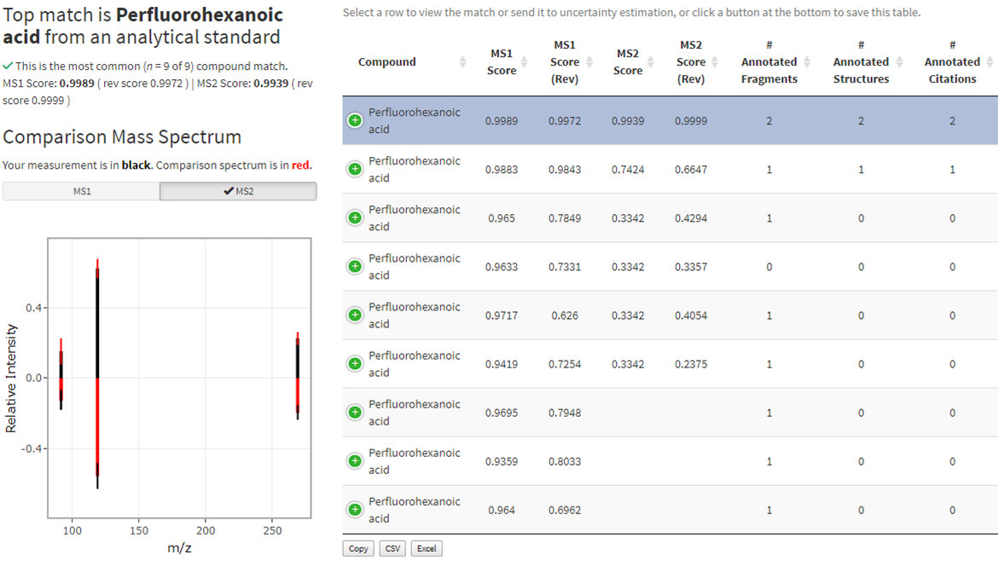
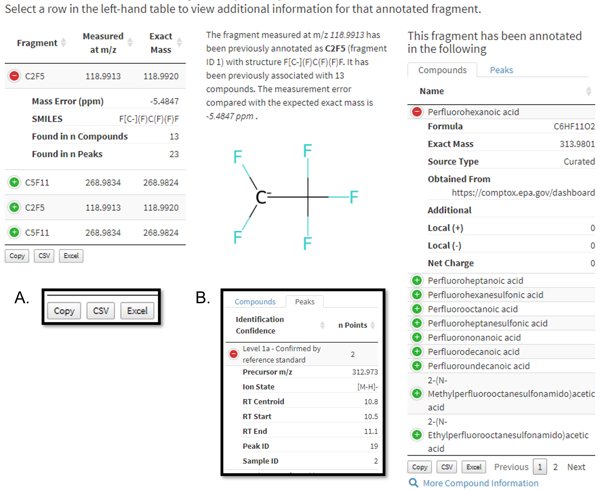

## The Shiny platform and DIMSpec

A driving goal of the Database Infrastructure for Mass Spectrometry (DIMSpec) project is to provide a database that can be easily retasked to support individual projects to manage data coherently and accelerate analyte identification, screening, and annotation processes for non-targeted analysis projects. A DIMSpec mass spectral database incorporates empirical mass spectral data from analytical standards and complex mixtures with relevant analytical method metadata and mass spectral annotation.

For many users, the majority of their interaction with the DIMSpec project will be through graphical user interfaces providing access to the underlying data and functionality. This simplifies their experience and increases the value of the project tremendously. Web applications in the DIMSpec project are powered by the [`shiny`](https://shiny.rstudio.com) R package. Provided applications communicate with the database through the application programming interface (API) provided by the [`plumber`](https://www.rplumber.io) R package, though others can be readily developed that connect directly to the database if desired.

This quick guide introduces the three web applications that ship with the project, and the application template designed to accelerate development of new applications. Refer to the [DIMSpec User Guide](https://pages.nist.gov/dimspec/docs) for installation and other details of each application introduced here; information contained here is a selected subset of the DIMSpec User Guide and does not provide an introduction to the `shiny` platform.

## DIMSpec Web Applications

The following subsections provide an introduction to web applications provided in the DIMSpec project.

1. [Table Explorer](#table-explorer)
1. [DIMSpec Quality Control (DIMSpec-QC)](#dimspec-qc)
1. [Mass Spectral Match (MSMatch)](#ms-match)
1. [Application Template](#application-template)

Every effort has been made to make launch of web applications as straight forward as possible. Toward that end, all applications that ship with the project can be launched directly from the command line and will establish all necessary aspects automatically. From an R console opened at the project directory, issue the command `shiny::runApp(file.path("inst", "apps", "X"))`[^1] where `"X"` is the name of the directory containing an application. This is even simpler if the compliance file has been sourced in the current session; use the helper function `start_app("X")` to launch the app in directory `"X"`[^2].

[^1]: Apps are also launchable on your local network by using `shiny::runApp(file.path("inst", "apps", "X"), host = "0.0.0.0", port = Y)` where `Y` is an integer corresponding to an open port on the hosting machine. This does require that other computers on your network can connect to the host machine.

[^2]: A list of recognized shiny applications is available in the session environment as the named vector `SHINY_APPS` after the compliance file has been sourced.

\newpage

### Table Explorer{#table-explorer}

Often, one of the friction points in using a database is understanding its schema. For this reason, the DIMSpec project ships with the "Table Explorer" app to facilitate visual exploration of the DIMSpec database schema. It also served as proof-of-concept for the database/API/shiny approach and was used as the basic skeleton of the [template app](#application-template) that ships with the project.

Table Explorer is a simple entity viewer for the attached database. Combining the comment decorations in DIMSpec and reading of entity definitions from the database (see [Inspecting Database Properties in the DIMSpec User Guide](https://pages.nist.gov/dimspec/docs/user_guide/instructions.html#inspecting-database-properties) for details) allows for R to expose a wealth of information about the underlying schema and quickly change which entity is being viewed. See above for details of how to launch this app, but the easiest method is after the `compliance.R` script has been executed, use `start_app("table_explorer")` to launch it in your preferred browser.

There is only one page for interactive content, named "Table Viewer" ([Figure 1](#fig1)). A navigation bar on the left controls the current page being viewed; collapse the bar using the “hamburger” icon at the top next to the NIST logo. Click the drop down box to change the database table or view being displayed. This will update the definition narrative immediately below the selection box and display the contents of that table to the right.

A graphic of the entity relationship diagram is provided on the second page. Click it in the navigation panel to the left. This can be viewed in full resolution by right clicking the diagram and opening it in a new browser tab (language varies by browser).

{#fig1}

\newpage

### DIMSpec Quality Control (DIMSpec-QC){#dimspec-qc}

Quality control and assessment is key for trust and ensuring data integrity. Algorithms were developed for the DIMSpec project to validate the quality of new experimental data and build files suitable for database import. The DIMSpec Quality Control (DIMSpec-QC) application was developed to accelerate this quality review process and installs alongside DIMSpec.

1. Two preprocessing steps are required to use DIMSpec-QC. First, raw data files produced by a mass spectrometer must be converted into mzML format using [Proteowizard's](https://proteowizard.sourceforge.io/) MSConvert software [@adusumilli_data_2017] There are specific parameters that must be used during conversion. A more detailed user guide for converting the files is provided as another [quick guide](https://pages.nist.gov/dimspec/docs/file_convert.pdf).

      Filter: Threshold peak filter
      Threshold type: absolute
      Orientation: most intense
      Value: 1
      Filter: Peak picking
      Algorithm: vendor
      MS levels: 1-2

1. The second step prior to using DIMSpec-QC is to use a macro-enabled Microsoft Excel workbook, called the Non-Targeted Analysis Method Reporting Tool (NTA-MRT) for the systematic collection of sample, method, and compound information related to chemicals identified in a sample. The most up-to-date version of NTA-MRT is publicly available at [GitHub](https://github.com/usnistgov/NISTPFAS/tree/main/methodreportingtool). Instructions for completing the NTA-MRT are contained within the tool itself. In order to use the DIMSpec-QC application, a `sample.JSON` file must be generated using the “Export to JSON file output” button on the first tab of the NTA-MRT.

  **The file name entered in the NTA-MRT under the Sample tab must exactly match (case-sensitive) the paired mzML file name to be used for the DIMSpec-QC.**

See above for details of how to launch this app; the easiest method is from the console after the `compliance.R` script has been executed, use `start_app("dimspec-qc")` to launch it in your preferred browser. The "About" screen will appear when the DIMSpec-QC application is available ([Figure 2](#fig2)). The navigation panel on the left will control which page is currently being viewed; click an entry to navigate to that page. The app itself should guide you through the process in a straightforward manner. Click the "Click Here to get Started" button on the "About" page or click "Data Import" in the navigation panel on the left to get started.

---

{#fig2}

---

#### Step 0 (Optional) - Set QC Parameters
\
\
Prior to file processing, verify or set parameters to be used for quality control analysis from the “QC Settings” page. The default settings are recommended, but can be modified if needed.

#### Step 1 - Import Data
\
\
From the "Data Import" page, upload paired mzML and sample JSON files (conventionally named “filename_mzml_sample.JSON” by the NTA-MRT macros).  Multiple files not exceeding 250 MB may be uploaded; see the [shiny documentation](https://shiny.rstudio.com/articles/upload.html) for details on changing file size limits if necessary.

   1. Load the mzML files of interest using the top “Load” button or by dragging the data file(s) to the input widget labeled *1) Load raw mzML file(s)*.
   
   1. Load the paired sample JSON files using the second “Load” button or by dragging the JSON file(s) to the input widget labeled *2) Load Sample JSON file(s)*. The sample JSON files do not need to be selected in the same order as the mzML files and will be matched by name when processed.
   
   - Once mzML and Sample JSON files are uploaded, the application will automatically check to see if there are valid pairs of mzML and Sample JSON files. A successful upload will update the current screen. If multiple files are loaded, only files with verified matches will be included in the resulting table and available for further processing.
   
#### Step 2 - Process Quality Control Metrics
\
\
After files have been loaded and matched, a button will appear on the “Data Import” window that is labeled “Process Data”. Click the “Process Data” button and it will sequentially process each mzML file. This can take up to 5 minutes per raw file depending on the number of compounds per file, so a large number of files may take a long time to process. Progress indicators are provided. If a raw file does not have a valid Sample JSON, the files can still be processed, but the invalid rows will be excluded.

#### Step 3 - Evaluate Data Quality
\
\
Once processed, the QC results can be reviewed by selecing “Quality Review” in the left menu or clicking the “Quality Review” button that appears below the “Process Data” button. The top table, which is the only visible table when starting a new review, shows the raw files that have been processed and the respective quality control check results ("PassCheck"). If all compounds in the raw file passed all QC checks, the PassCheck result will be true. If any compound in the raw file failed any of the QC checks, the PassCheck result will be false. To review the compounds within a single raw file:

   1. Click a row in the table at the top left to select an mzML file. This will display a second table of all compounds within the selected raw file. The PassCheck result for each compound is displayed in this table. If all QC checks for each compound in the raw file passed all QC checks, the PassCheck result will be true for that compound. If a compound in the raw file failed any of the QC checks, the PassCheck result will be false for that compound. To review the individual QC checks (described in the [DIMSpec User Guide](https://pages.nist.gov/dimspec/docs/technical-details.html#app-dimspec-qc)), select a row for the peak to review in the table labeled
   
   1. Click a row in the second table on the left to see metrics for that peak. This will display boxes to the right containing all QC checks for that compound. Expand a specific QC check by clicking on the box header to display the results of the QC check as a table. A note below the two tables on the left will indicate whether any QC checks failed.
   
#### Step 4 - Export Data
\
\
Once data are processed, all data can be exported (regardless of quality review status) by selecting “Export Data” in the left menu. Additional options may be added in the future to refine the export process such as selecting only peaks and files that pass all defined quality checks. Clicking the button labeled “Export all data”, will write the peak JSON files and download them in a single .zip file. This file can be unzipped and the peak JSONs can be directly incorporated into the DIMSpec database using the import routine described in the [DIMSpec User Guide](https://pages.nist.gov/dimspec/docs/technical-details.html#importing-data) or the [Quick Guide - Importing Data](https://pages.nist.gov/dimspec/docs/docs/quick_guides/quick_import.pdf).

Using the DIMSpec-QC application greatly accelerates the process of performing quality control and assurance tasks for non-targeted data and ensures checks are performed consistently across data files. It serves as a key component of using the DIMSpec project in an active research lab setting when adding to the mass spectral library.

---

### Mass Spectral Match for Non-Targeted (MSMatch){#ms-match}

A common user need addressed by DIMSpec is identification of analytes in a sample measured by high resolution mass spectrometry. Often the components are unknown but may be suspected. Ability to identify not only an analyte from its mass spectra, but to identify known fragments for unknown analytes is a key need; when the analyte itself cannot be identified, non-targeted analysis workflows make use of fragmentation patterns to determine or reconstruct its identity. The Mass Spectral Match for Non-Targeted Analysis (MSMatch) application was built to accelerate non-targeted analysis projects by searching experiment result data in [mzML](https://www.psidev.info/mzML) format for matches against a curated mass spectral library of both compounds and annotated fragments.

As with the DIMSpec-QC app application, raw data files produced by a mass spectrometer must be converted into mzML format using [Proteowizard's](https://proteowizard.sourceforge.io/) msConvert software. There are specific parameters that must be used during conversion.

      Filter: Threshold peak filter
      Threshold type: absolute
      Orientation: most intense
      Value: 1
      Filter: Peak picking
      Algorithm: vendor
      MS levels: 1-2

A more detailed user guide for converting the files is provided as another [quick guide](https://pages.nist.gov/dimspec/docs/file_convert.pdf). This data format conversion step is the same as for the [DIMSpec-QC application](#dimspec-qc).

See above for details of how to launch this app, but the easiest method is after the `compliance.R` script has been executed, use `start_app("msmatch")` to launch it in your preferred browser. The "Home" screen will appear when the MSMatch application is available ([Figure 3, next page](#fig3)). The navigation panel on the left will control which page is currently being viewed; click an entry to navigate to that page. The app itself should guide you through the process in a straightforward manner. Click the "Click Here to get Started" button on the "Home" page or click "Data Input" in the navigation panel on the left to get started.

Every effort has been made to make using MSMatch as intuitive as possible. Hints in the form of tooltips are provided throughout; hover over question mark icons or controls to see them. These can be toggled on and off at any time using the "Show Tooltips" toggle button at the bottom left of the application window (see [Figure 3 inset at bottom right]({#fig3}). If enabled, advanced search settings can be similarly toggled on and off for the session (see the [DIMSpec User Guide](https://pages.nist.gov/dimspec/docs) for instructions on how to set default accessibility and settings for tooltips and advanced settings). The "hamburger" icon at the top left of the screen will collapse the left-hand navigation panel to provide more horizontal room on smaller screens, though the application will rearrange itself when screens are smaller than a minimum width.

Click the "Click Here to Get Started" button to begin ([Figure 3](#fig3), top). This will activate the "Data Input" page ([Figure 4](#fig4), next page). Example data files are provided in the project directory ("/example/PFAC30PAR_PFCA2.mzML" and "/example/example_peaklist.csv").

---

{#fig3}

---

#### Step 1 - Load an mzML Data File
\
\
MSMatch only accepts files in the mzML format (see the note on preprocessing above for details). Either click the "Load" button to select a file or click and drag one from your file system to that widget. Set instrument parameters to match those used during data collection using the controls provided. Files must be less than 250 MB; see the [shiny documentation](https://shiny.rstudio.com/articles/upload.html) for details on changing file size limits with `shiny.maxRequestSize` if necessary.

\newpage

---

{#fig4}

---
   
#### Step 2 - Identify Features of Interest
\
\
Add features of interest from the Data Input page ([Figure 4](#fig4)) by providing the mass-to-charge ratio and retention time start/centroid/end values for each feature. Two methods ([Figure 5](#fig5)) are supported to identify features of interest by mass-to-charge ratio and retention time properties. Either use case is fully supported. Users may:
   
   1.  Import a file ([Figure 5](#fig5), left; either .csv, .xls, or .xlsx, though workbooks should have relevant data in the first worksheet) and identify which columns contain the correct information.
   
       -   Click "Import" and select a file of interest from your local computer or drag and drop a file to this input.
       
       -   Use this method if you have a file containing features of interest from other procedures or software outputs to quickly import many feature properties.
       
       -   Select a column that corresponds to each property.
       
       -   To append to the current list, keep the checkbox checked. To overwrite, uncheck this box.
       
       -   Click "Load Parameters" to validate and add parameters or "Cancel" to abort this operation.
       
       -   Repeat until all files are imported. OR
       
   1.  Click the "Add" button and enter search parameters one at a time ([Figure 5](#fig5), right, next page); repeat this process to add more.
   
       -   Add numeric values for all items.
       
       -   Click "Save Parameters" to validate and add or "Cancel" to abort this operation

   -   Users receive feedback on the form if values are left blank or if they do not meet expectations (e.g. centroid is after peak start and before peak end).
   
   -   Values should all be numeric in nature.
   
   -   This list may be edited after import by clicking the "Edit" button Figure 6 (next page).

---

 or manually by clicking the Add button (right)."){#fig5 width="66%"}

---

\newpage

---

 interactively by adding, editing, or removing features as needed (right) by selecting a row from the table and clicking the appropriate button."){#fig6}

---

Data are ready to be processed once features of interest are added. Selecting any row in the resulting table makes two additional functions available ([Figure 6, right, next page](#fig6)). With a row selected, click "Remove" to delete it or "Edit" to bring up the same form as above ([Figure 5, right](#fig5)), change the values, and click "Save Parameters." All records remaining in the feature of interest list will be available to search widgets on subsequent pages.

#### Step 3 - Generate the Search Object
\
\
Clicking the "Process Data" button. Buttons will appear to navigate to the "Compound Match" and "Fragment Match" pages once processing is complete.

#### Step 4 - Explore Results
\
\
Navigate to the desired search page. Algorithmic matching of provided mass spectral data for features of interest is performed against data stored in the attached database. Matching algorithms are described in detail in the [DIMSpec User Guide](https://pages.nist.gov/dimspec/docs/msmatch-home.html#msmatch-search-object)). Both the "Compound Match" and "Fragment Match" pages are laid out in similar fashion. Select a feature of interest from the drop down box at the top of the page and click the "Search" button. Continue with your investigation of matches for the selected features.

The Compound Match page will search features of interest for known mass spectral pattern matches against the attached database ([Figure 7, next page](#fig7); [Figure 8, next page](#fig8)).

Use the Fragment Match page to explore fragmentation patterns in more detail for features of interest with compound matches. This page, however, is of more use when features do not match with a known compound. It will identify and label identifiable fragments, assisting with the NTA process of fragment annotation. It also provides information about the sample and compound(s) from which identified fragments were obtained ([Figure 9, next pages](#fig9); [Figure 10, next pages](#fig10)).

\newpage

 {#fig7 width=77%}

---

)."){#fig8 width=77%}

\newpage

{#fig9 width=75%}

---

{#fig10 width=75%}

---

\newpage

### Application Template{#application-template}

The Table Explorer, DIMSpec-QC, and MSMatch web applications serve to increase utility and usability of the DIMSpec project by making data and code available for casual users. They can be launched locally from the project, or hosted on a network. These are not, however, intended to provide exhaustive functionality for potential users.

The underlying infrastructure enabling these apps has been constructed as to make adding new ones as easy as possible. Toward that end, the Table Explorer app served as a proof-of-concept to develop the application template at `/inst/apps/app_template`. It is in the "3 file" format and contains subdirectories for data, modal dialogs, and app resources (in the `www` subdirectory). To start developing a new app within the project, simply copy and rename the entire `app_template` folder. The new app will benefit from the same environment establishment routines used elsewhere. Simply edit the `/global.R` file as needed, add any data and image or resource files, set `need_files` in `/global.R` to include any .R files you want available when the app is launched, and begin development with an assured connection either directly to a database or by leveraging the plumber API. An isolated `/app_functions.R` file is also provided for custom functions the new app will require.

## A Note on Settings

In order to set up the project to use shiny applications, the environment variable `USE_SHINY` must be set to `TRUE` (the default) in `/config/env_glob.txt`. Shiny apps are then enabled through the environment file at `/inst/apps/env_shiny.R` and will load necessary packages. These are automatically installed if not present the first time the application is launched on any given system. By default, a logging environment is also enabled to assist with metrics and debugging.

Applications are located in the `/inst/apps` directory and are self-contained in subdirectories by application name. The three that ship with the project are in the "three file" format of `global.R`, `ui.R`, and `server.R` and make use of the API for database communication; they will launch the API server in a background process if it is not already running. To add a live database connection to a new app, simply add the connection object to `global.R` for that app and develop as normal.

Pay close attention to the settings in the `/config/env_glob.txt` file as these will determine whether you are using the project in "local" mode or "network" mode. Once the `/R/compliance.R` file has been sourced, these settings are available in your environment for reference, and applications are available to be launched locally with `start_app("X")`.

- To launch the project solely for access to the web applications listed here, it is recommended to use the following settings and launch them directly from the command line with `shiny::runApp(file.path("inst", "apps", "X"))` from the project directory (assuming shiny has been installed previously):

        INIT_CONNECT   = FALSE  
        LOGGING_ON     = FALSE  
        USE_API        = FALSE  
        API_LOCALHOST  = TRUE  
        API_PORT       = 8080  
        INFORMATICS    = FALSE  
        USE_SHINY      = FALSE  

- To launch the project in development mode, it is recommended to use the following settings:

        INIT_CONNECT   = TRUE  
        LOGGING_ON     = TRUE  
        USE_API        = TRUE  
        API_LOCALHOST  = TRUE  
        API_PORT       = 8080  
        INFORMATICS    = TRUE  
        USE_SHINY      = TRUE  

These will launch the project in "local" mode enabling, respectively:

1. a minimal footprint session with only what is necessary to run the application requested; and

1. a live database connection (by default at `con`), logging, an API hosted on your local machine at port `API_PORT`, `rdkit` integration, and shiny apps.
    
If you want the application to be available on your network, use the following settings and launch the application with `shiny::runApp("X", host = "0.0.0.0")` and, for consistency, set the `port` argument to a predetermined port (otherwise a random open port will be used):

      API_LOCALHOST  = FALSE
      API_HOST       = "host.address"
      # host.address must be a resolveable network path to the hosting machine, either an IP
      address or a "name.domain" path

Settings in other environment resolution files should, in most cases, not be changed.

---

## References

